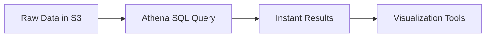

# AWS Service Integration with Amazon Athena - Comprehensive Guide

## Table of Contents
1. [Introduction to Amazon Athena](#introduction-to-amazon-athena)
2. [Getting Started](#getting-started)
3. [AWS Service Integrations](#aws-service-integrations)
4. [Practical Examples](#practical-examples)
5. [Key Takeaways](#key-takeaways)

---

## Introduction to Amazon Athena

**Definition**: Amazon Athena is an interactive, serverless query service that enables SQL analysis of data directly in Amazon S3 without ETL processes.

**Key Characteristics**:
- **Serverless Architecture**: No infrastructure to manage
- **Pay-per-Query Pricing**: $5 per TB of data scanned
- **Fast Performance**: Parallel query execution
- **Format Support**: CSV, JSON, ORC, Avro, Parquet

**Technical Advantages**:


**Cost Example**:
- Querying 50GB of Parquet data: $0.25 per execution
- Same query on uncompressed CSV: $2.50 (10x more)

---

## Getting Started

### Step-by-Step Setup:

1. **Prepare S3 Data**:
   ```bash
   aws s3 cp local-data.csv s3://my-athena-bucket/raw-data/
   ```

2. **Create Database**:
   ```sql
   CREATE DATABASE security_analysis;
   ```

3. **Define Table Schema** (CloudTrail example):
   ```sql
   CREATE EXTERNAL TABLE cloudtrail_logs (
     eventVersion STRING,
     userIdentity STRUCT<
       type:STRING,
       principalId:STRING,
       arn:STRING,
       accountId:STRING,
       userName:STRING>,
     eventTime STRING,
     eventSource STRING,
     eventName STRING,
     awsRegion STRING,
     sourceIpAddress STRING,
     userAgent STRING,
     requestParameters STRING,
     responseElements STRING
   )
   PARTITIONED BY (year STRING, month STRING, day STRING)
   ROW FORMAT SERDE 'com.amazonaws.glue.serde.CloudTrailSerde'
   LOCATION 's3://my-cloudtrail-bucket/AWSLogs/123456789012/CloudTrail/';
   ```

4. **Load Partitions**:
   ```sql
   MSCK REPAIR TABLE cloudtrail_logs;
   ```

5. **Query Data**:
   ```sql
   SELECT eventSource, eventName, COUNT(*) as event_count
   FROM cloudtrail_logs
   WHERE year = '2023' AND month = '11'
   GROUP BY eventSource, eventName
   ORDER BY event_count DESC;
   ```

---

## AWS Service Integrations

### Supported Services:
| Service | Log Type | Sample Use Case |
|---------|----------|-----------------|
| **CloudTrail** | API activity | Security auditing |
| **ALB/NLB** | Access logs | Traffic analysis |
| **VPC Flow Logs** | Network traffic | Threat detection |
| **AWS Config** | Resource changes | Compliance reporting |

**Integration Benefits**:
- No data movement required
- Direct schema inference for standard logs
- Cost-effective historical analysis

**Performance Tip**: Convert logs to Parquet/ORC format for 90% cost reduction

---

## Practical Examples

### 1. Security Investigation
```sql
-- Find failed console logins by IP
SELECT
  userIdentity.userName,
  sourceIpAddress,
  COUNT(*) as failed_attempts
FROM cloudtrail_logs
WHERE 
  eventName = 'ConsoleLogin' AND
  errorMessage LIKE '%Failed%' AND
  year = '2023' AND month = '11'
GROUP BY userIdentity.userName, sourceIpAddress
HAVING COUNT(*) > 3
ORDER BY failed_attempts DESC;
```

### 2. Network Analysis (VPC Flow Logs)
```sql
-- Top talkers by byte count
SELECT
  src_addr,
  dst_addr,
  SUM(cast(bytes as bigint)) as total_bytes
FROM vpc_flow_logs
WHERE 
  year = '2023' AND month = '11' AND
  action = 'ACCEPT'
GROUP BY src_addr, dst_addr
ORDER BY total_bytes DESC
LIMIT 100;
```

### 3. Cost Optimization
```sql
-- Identify unused EC2 instances
SELECT
  requestParameters.instanceId,
  MIN(eventTime) as launch_time,
  MAX(eventTime) as last_action
FROM cloudtrail_logs
WHERE
  eventName = 'RunInstances' AND
  year >= '2023' AND month >= '01'
GROUP BY requestParameters.instanceId
HAVING date_diff('day', MAX(eventTime), current_date) > 90;
```

---

## Key Takeaways

1. **Operational Efficiency**:
   - Query petabytes of logs with standard SQL
   - No infrastructure provisioning required

2. **Security Applications**:
   - Forensic investigation capabilities
   - Continuous compliance monitoring

3. **Cost Optimization**:
   - 90% savings with columnar formats
   - No ongoing costs when not in use

4. **Integration Ecosystem**:
   - Works with QuickSight for visualization
   - Connects to JDBC/ODBC BI tools

**Implementation Checklist**:
- [ ] Organize S3 data with partitioning (e.g., by date)
- [ ] Convert logs to Parquet/ORC format
- [ ] Set up Glue Data Catalog for schema management
- [ ] Create saved queries for common investigations
- [ ] Configure query result encryption

**Final Note**: Athena enables security teams to perform complex log analysis without specialized infrastructure, with query performance improving automatically through AWS's continuous service optimizations.