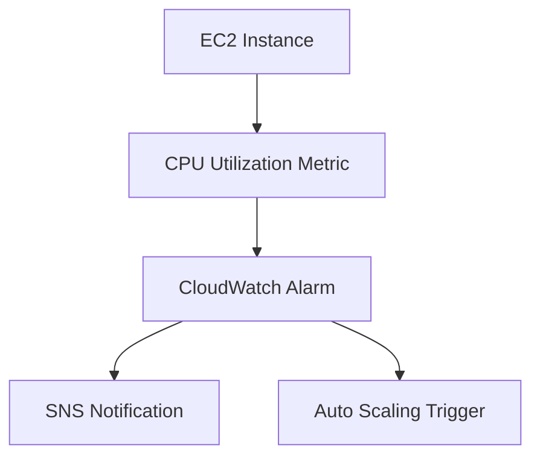

# Amazon CloudWatch - Comprehensive Guide

## Table of Contents
- [Amazon CloudWatch - Comprehensive Guide](#amazon-cloudwatch---comprehensive-guide)
  - [Table of Contents](#table-of-contents)
  - [Introduction to CloudWatch](#introduction-to-cloudwatch)
  - [Core Components](#core-components)
    - [1. Metrics](#1-metrics)
    - [2. Alarms](#2-alarms)
    - [3. Events](#3-events)
  - [Monitoring Types](#monitoring-types)
  - [Alarms and Actions](#alarms-and-actions)
    - [Alarm States:](#alarm-states)
    - [Action Types:](#action-types)
  - [Metrics Deep Dive](#metrics-deep-dive)
    - [Metric Structure:](#metric-structure)
  - [Security Monitoring](#security-monitoring)
    - [Key Security Use Cases:](#key-security-use-cases)
  - [Dashboards](#dashboards)
  - [Key Takeaways](#key-takeaways)

---

## Introduction to CloudWatch

**Definition**: Amazon CloudWatch is a monitoring service for AWS cloud resources and applications, providing data and actionable insights.

**Key Capabilities**:
- Collect and track metrics
- Monitor log files
- Set alarms
- Automatically react to changes

**Example Use Case**:


**Pricing**:
- Basic Monitoring: Free (5-minute granularity)
- Detailed Monitoring: Paid (1-minute granularity)

---

## Core Components

### 1. Metrics
- **Standard Metrics**: Pre-defined by AWS services (e.g., `AWS/EC2 CPUUtilization`)
- **Custom Metrics**: User-defined (e.g., application memory usage)

### 2. Alarms
- Threshold-based monitoring
- Three states: `OK`, `ALARM`, `INSUFFICIENT_DATA`
- Example CLI command:
  ```bash
  aws cloudwatch put-metric-alarm \
    --alarm-name "High-CPU" \
    --metric-name CPUUtilization \
    --namespace AWS/EC2 \
    --statistic Average \
    --period 300 \
    --threshold 70 \
    --comparison-operator GreaterThanThreshold \
    --evaluation-periods 2
  ```

### 3. Events
- Respond to state changes
- Event patterns example:
  ```json
  {
    "source": ["aws.ec2"],
    "detail-type": ["EC2 Instance State-change Notification"],
    "detail": {
      "state": ["stopped"]
    }
  }
  ```

---

## Monitoring Types

| Feature | Basic Monitoring | Detailed Monitoring |
|---------|------------------|---------------------|
| **Frequency** | 5 minutes | 1 minute |
| **Cost** | Free | Additional charge |
| **Metrics** | 7 pre-selected | All available |
| **Status Checks** | 3 metrics at 1-min | Same as basic |

**Activation**:
```bash
aws ec2 monitor-instances --instance-ids i-1234567890abcdef0
```

---

## Alarms and Actions

### Alarm States:
- **OK**: Within threshold
- **ALARM**: Threshold breached
- **INSUFFICIENT_DATA**: Initial state or missing data

### Action Types:
1. **EC2 Actions**: Stop, Terminate, Recover
2. **Auto Scaling**: Scale in/out
3. **Notifications**: SNS, SES
4. **Systems Manager**: Run automation documents

**Example Alarm Response Flow**:
```
High CPU Alarm → SNS → Email Team → Auto Scaling → Launch New Instance
```

---

## Metrics Deep Dive

### Metric Structure:
- **Namespace**: Container for metrics (e.g., `AWS/EC2`)
- **Dimensions**: Qualifiers (e.g., `InstanceId=i-12345`)
- **Period**: Data collection interval (1s to 1 day)

**Example Dimensions**:
```json
{
  "Namespace": "AWS/S3",
  "Dimensions": [
    {"Name": "BucketName", "Value": "my-bucket"},
    {"Name": "StorageType", "Value": "Standard"}
  ],
  "MetricName": "BucketSizeBytes"
}
```

**Retention Periods**:
- 1-minute data: 15 days
- 5-minute data: 63 days
- 1-hour data: 455 days

---

## Security Monitoring

### Key Security Use Cases:
1. **Unusual Activity Detection**:
   - Spikes in CPU/Disk usage
   - Unauthorized API calls

2. **Billing Alerts**:
   ```bash
   aws cloudwatch put-metric-alarm \
     --alarm-name "MonthlyBudget" \
     --metric-name EstimatedCharges \
     --namespace AWS/Billing \
     --statistic Maximum \
     --period 21600 \
     --threshold 100 \
     --comparison-operator GreaterThanThreshold
   ```

3. **Compliance Tracking**:
   - Monitor security group changes
   - Track IAM policy modifications

---

## Dashboards

**Features**:
- Customizable views
- Cross-service monitoring
- Automatic updates

**Example Dashboard Metrics**:
1. EC2 CPU Utilization
2. Lambda Invocation Errors
3. RDS Connection Count
4. S3 Bucket Size
5. Custom Application Metrics

**Best Practices**:
- Group related resources
- Set appropriate time ranges
- Include operational and business metrics

---

## Key Takeaways

1. **Comprehensive Monitoring**:
   - Tracks resources across 70+ AWS services
   - Supports custom application metrics

2. **Proactive Alerting**:
   - Configurable alarm thresholds
   - Multi-channel notifications

3. **Operational Insights**:
   - Historical data retention (15 months)
   - Performance baselining

4. **Security Integration**:
   - Anomaly detection
   - Compliance monitoring

**Implementation Checklist**:
- [ ] Enable detailed monitoring for critical instances
- [ ] Configure billing alerts
- [ ] Create cross-service dashboards
- [ ] Set up recovery alarms for production workloads

**Final Note**: CloudWatch forms the foundation of AWS operational visibility, integrating with 20+ other AWS services for comprehensive monitoring solutions.