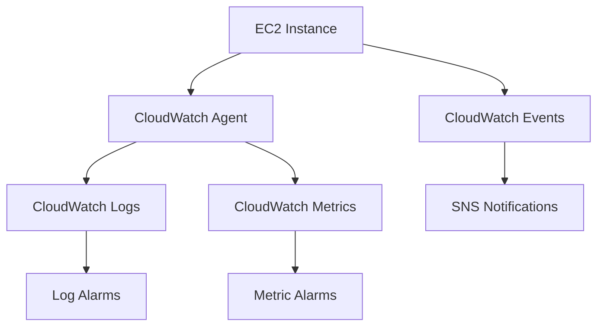

# AWS Monitoring Lab: Monitoring Your Applications and Infrastructure - Comprehensive Guide

## Table of Contents
- [AWS Monitoring Lab: Monitoring Your Applications and Infrastructure - Comprehensive Guide](#aws-monitoring-lab-monitoring-your-applications-and-infrastructure---comprehensive-guide)
  - [Table of Contents](#table-of-contents)
  - [Lab Overview](#lab-overview)
  - [Task 1: Install CloudWatch Agent](#task-1-install-cloudwatch-agent)
    - [Implementation Steps:](#implementation-steps)
  - [Task 2: Stream and Monitor Logs](#task-2-stream-and-monitor-logs)
    - [Step-by-Step:](#step-by-step)
  - [Task 3: Monitor System Metrics](#task-3-monitor-system-metrics)
    - [Configuration:](#configuration)
  - [Task 4: Configure Event Notifications](#task-4-configure-event-notifications)
    - [Implementation:](#implementation)
  - [Key Takeaways](#key-takeaways)

---

## Lab Overview

**Objective**: Implement comprehensive monitoring for EC2 instances using AWS CloudWatch suite

**Architecture**:


**Services Used**:
- AWS Systems Manager (SSM)
- CloudWatch (Logs, Metrics, Events)
- SNS (Notifications)
- AWS Config (Compliance)

---

## Task 1: Install CloudWatch Agent

### Implementation Steps:

1. **Prepare Systems Manager**:
   ```bash
   # Verify SSM agent is running
   sudo systemctl status amazon-ssm-agent
   ```

2. **Run Installation Command**:
   ```bash
   aws ssm send-command \
     --instance-ids "i-1234567890abcdef0" \
     --document-name "AWS-ConfigureAWSPackage" \
     --parameters '{"action":["Install"],"name":["AmazonCloudWatchAgent"]}'
   ```

3. **Configure Agent**:
   - Retrieve configuration from Parameter Store:
     ```bash
     aws ssm get-parameter --name "/AmazonCloudWatch/linux-config"
     ```
   - Sample config (JSON):
     ```json
     {
       "metrics": {
         "metrics_collected": {
           "cpu": {"resources": "*", "measurement": ["usage_idle"]}
         }
       },
       "logs": {
         "logs_collected": {
           "files": {
             "collect_list": [
               {"file_path": "/var/log/httpd/access_log", "log_group_name": "ApacheAccessLogs"}
             ]
           }
         }
       }
     }
     ```

**Verification**:
```bash
sudo /opt/aws/amazon-cloudwatch-agent/bin/amazon-cloudwatch-agent-ctl -m ec2 -a status
```

---

## Task 2: Stream and Monitor Logs

### Step-by-Step:

1. **Verify Log Streaming**:
   ```bash
   aws logs describe-log-streams --log-group-name "ApacheAccessLogs"
   ```

2. **Create Metric Filter** (404 Errors):
   ```bash
   aws logs put-metric-filter \
     --log-group-name "ApacheAccessLogs" \
     --filter-name "404Errors" \
     --filter-pattern '[ip, id, user, timestamp, request, status_code=404, size]' \
     --metric-transformations \
       metricName=HTTP404Errors,metricNamespace=WebServer,metricValue=1
   ```

3. **Set Up Alarm**:
   ```bash
   aws cloudwatch put-metric-alarm \
     --alarm-name "High404Rate" \
     --metric-name HTTP404Errors \
     --namespace WebServer \
     --statistic Sum \
     --period 300 \
     --threshold 10 \
     --comparison-operator GreaterThanThreshold \
     --evaluation-periods 1 \
     --alarm-actions "arn:aws:sns:us-east-1:123456789012:AlertsTopic"
   ```

**Example Log Pattern Analysis**:
```sql
# CloudWatch Logs Insights Query
filter @message like /404/
| stats count(*) by bin(5m)
| sort @timestamp desc
```

---

## Task 3: Monitor System Metrics

### Configuration:

1. **View Custom Metrics**:
   ```bash
   aws cloudwatch list-metrics --namespace "CWAgent"
   ```

2. **Create CPU Alarm**:
   ```bash
   aws cloudwatch put-metric-alarm \
     --alarm-name "HighCPUUsage" \
     --metric-name "cpu_usage_idle" \
     --namespace "CWAgent" \
     --statistic Average \
     --period 60 \
     --threshold 20 \
     --comparison-operator LessThanThreshold \
     --dimensions Name=InstanceId,Value=i-1234567890abcdef0 \
     --evaluation-periods 3 \
     --alarm-actions "arn:aws:sns:us-east-1:123456789012:AlertsTopic"
   ```

3. **Build Dashboard**:
   ```bash
   aws cloudwatch put-dashboard \
     --dashboard-name "EC2-Monitoring" \
     --dashboard-body '{
       "widgets": [
         {
           "type": "metric",
           "x": 0,
           "y": 0,
           "width": 12,
           "height": 6,
           "properties": {
             "metrics": [
               ["CWAgent", "cpu_usage_idle", "InstanceId", "i-1234567890abcdef0"]
             ],
             "period": 60,
             "stat": "Average",
             "region": "us-east-1",
             "title": "CPU Utilization"
           }
         }
       ]
     }'
   ```

---

## Task 4: Configure Event Notifications

### Implementation:

1. **Create EC2 State Change Rule**:
   ```bash
   aws events put-rule \
     --name "EC2-Stopped-Alert" \
     --event-pattern '{
       "source": ["aws.ec2"],
       "detail-type": ["EC2 Instance State-change Notification"],
       "detail": {"state": ["stopped"]}
     }'
   ```

2. **Add SNS Target**:
   ```bash
   aws events put-targets \
     --rule "EC2-Stopped-Alert" \
     --targets '[{
       "Id": "SNSAlert",
       "Arn": "arn:aws:sns:us-east-1:123456789012:AlertsTopic"
     }]'
   ```

3. **Test Notification**:
   ```bash
   aws ec2 stop-instances --instance-ids "i-1234567890abcdef0"
   ```

**Event Pattern Examples**:
- Auto Scaling events
- Security Group changes
- EBS volume attachments

---

## Key Takeaways

1. **End-to-End Monitoring**:
   - Agent installation → Log collection → Metric creation → Alerting

2. **Multi-Layer Visibility**:
   - System metrics (CPU, memory)
   - Application logs (Apache)
   - Infrastructure changes (EC2 events)

3. **Automated Response**:
   - Real-time notifications via SNS
   - Potential integration with Lambda for auto-remediation

4. **Best Practices**:
   - Use Systems Manager for agent management
   - Structure log groups by application/team
   - Set meaningful alarm thresholds
   - Document all monitoring configurations

**Implementation Checklist**:
- [ ] CloudWatch agent installed and configured
- [ ] Critical log streams identified
- [ ] Baseline metrics established
- [ ] Alert thresholds validated
- [ ] Notification channels tested

**Final Note**: This lab establishes a production-grade monitoring foundation that can scale to hundreds of instances while providing actionable insights through AWS's native observability tools.