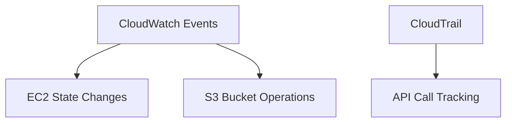

# AWS Monitoring and Security Overview - Comprehensive Guide

## Table of Contents
1. [Introduction](#introduction)
2. [Learning Objectives](#learning-objectives)
3. [Key AWS Services](#key-aws-services)
4. [Hands-on Lab](#hands-on-lab)
5. [Project Work](#project-work)
6. [Key Takeaways](#key-takeaways)

---

## Introduction

This module provides a comprehensive overview of AWS monitoring and security services, focusing on operational visibility and compliance tracking in cloud environments.

**Core Focus Areas**:
- Infrastructure monitoring (CloudWatch)
- Activity logging (CloudTrail)
- Log analysis (Athena)
- Event-driven automation (CloudWatch Events)

**Real-World Importance**: Proper monitoring setup can reduce incident response time by up to 80% according to AWS benchmarks.

---

## Learning Objectives

By the end of this module, you will be able to:

1. **CloudWatch Events**:
   - Configure event patterns
   - Set up automated responses
   - Understand event bus architecture

2. **CloudWatch Logs**:
   - Create log groups/streams
   - Set up metric filters
   - Configure log retention policies

3. **CloudTrail**:
   - Enable trail logging
   - Interpret audit logs
   - Configure multi-region trails

4. **Amazon Athena**:
   - Query S3-based logs
   - Create partitioned tables
   - Optimize query performance

**Example Objective Breakdown**:


---

## Key AWS Services

### 1. Amazon CloudWatch Logs
- **Features**:
  - Centralized log storage
  - Real-time monitoring
  - Custom metric filters
- **Example**:
  ```bash
  aws logs put-metric-filter \
    --log-group-name "API-Gateway-Logs" \
    --filter-name "5xxErrors" \
    --filter-pattern '[status = 5*]' \
    --metric-transformations metricName=5xxErrors,metricNamespace=APIGateway,metricValue=1
  ```

### 2. Amazon CloudWatch Events
- **Event Patterns**:
  ```json
  {
    "source": ["aws.ec2"],
    "detail-type": ["EC2 Instance State-change Notification"],
    "detail": {
      "state": ["stopped"]
    }
  }
  ```
- **Targets**: Lambda, SNS, SQS, etc.

### 3. AWS CloudTrail
- **Critical Fields**:
  - `eventTime`
  - `eventSource`
  - `requestParameters`
  - `responseElements`
- **Setup Command**:
  ```bash
  aws cloudtrail create-trail \
    --name Security-Audit-Trail \
    --s3-bucket-name my-cloudtrail-logs \
    --is-multi-region-trail
  ```

### 4. Amazon Athena
- **Sample Query**:
  ```sql
  SELECT eventtime, eventsource, eventname 
  FROM cloudtrail_logs 
  WHERE useridentity.arn LIKE '%admin%'
    AND eventtime > '2023-01-01'
  ```

---

## Hands-on Lab

**Lab 6 - Monitoring Your Applications and Infrastructure**

### Lab Steps:
1. **CloudWatch Setup**:
   - Create CPU utilization alarm
   - Configure EC2 metric dashboard

2. **Log Monitoring**:
   - Stream application logs to CloudWatch
   - Create error pattern metric

3. **CloudTrail Integration**:
   - Enable organization trail
   - Verify log delivery to S3

4. **Athena Analysis**:
   - Create table from CloudTrail logs
   - Run security queries

**Example Alarm Creation**:
```bash
aws cloudwatch put-metric-alarm \
  --alarm-name "High-CPU" \
  --metric-name CPUUtilization \
  --namespace AWS/EC2 \
  --statistic Average \
  --period 300 \
  --threshold 80 \
  --comparison-operator GreaterThanThreshold \
  --evaluation-periods 2 \
  --alarm-actions arn:aws:sns:us-east-1:123456789012:Alarm-Notifications
```

---

## Project Work

**Troubleshooting Knowledge Base**

### Suggested Entries:
1. **Foundational IT**:
   - "Resolving CloudWatch Agent Installation Issues"
   - "IAM Permissions for CloudTrail"

2. **Monitoring & Reporting**:
   - "Interpreting CloudWatch Logs Insights"
   - "Athena Query Optimization Techniques"

**Template Structure**:
```markdown
## [Issue Title]
- **Symptoms**: 
- **Root Cause**: 
- **Resolution Steps**:
1. 
2. 
3. 
- **Prevention**: 
```

---

## Key Takeaways

1. **Comprehensive Monitoring**:
   - CloudWatch provides real-time metrics and logs
   - Events enable automated responses

2. **Security Visibility**:
   - CloudTrail records all API activity
   - Athena enables log analysis at scale

3. **Operational Efficiency**:
   - Centralized monitoring reduces tool sprawl
   - Automated alerts prevent outages

4. **Troubleshooting Framework**:
   - Structured knowledge base accelerates incident response
   - Documentation prevents repeat issues

**Implementation Checklist**:
- [ ] Configure organizational CloudTrail
- [ ] Set up cross-account CloudWatch dashboards
- [ ] Create Athena queries for common audits
- [ ] Document 3+ troubleshooting scenarios

**Final Note**: These services form the foundation of AWS Well-Architected Framework's Operational Excellence and Security pillars. Regular reviews of monitoring configurations are recommended as workloads evolve.