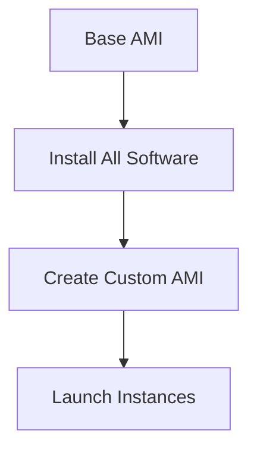
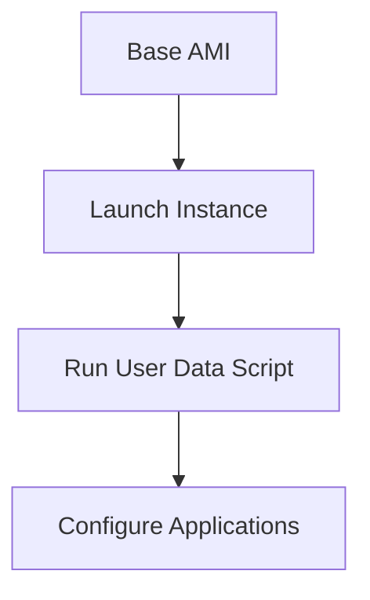
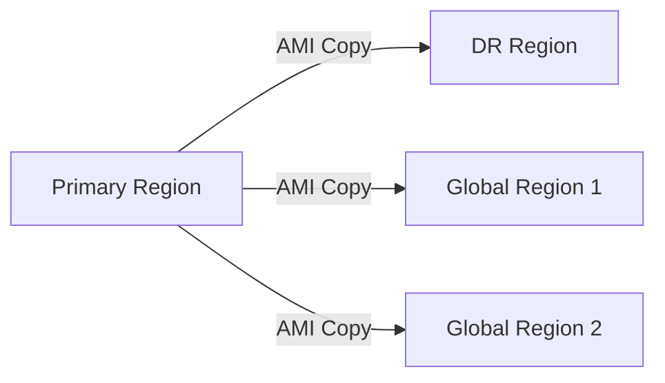
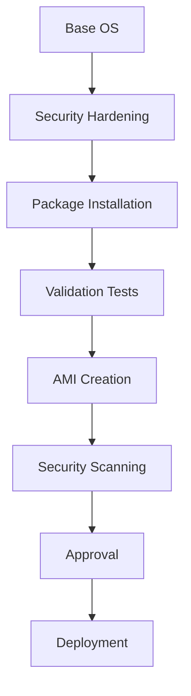

# AMI Building Strategy - Comprehensive Guide

## Table of Contents
- [AMI Building Strategy - Comprehensive Guide](#ami-building-strategy---comprehensive-guide)
  - [Table of Contents](#table-of-contents)
  - [Introduction to AMIs](#introduction-to-amis)
  - [AMI Types and Strategies](#ami-types-and-strategies)
    - [1. AMI Classification by Content](#1-ami-classification-by-content)
    - [2. Configuration Strategies](#2-configuration-strategies)
  - [Creating Custom AMIs](#creating-custom-amis)
    - [Step-by-Step Process:](#step-by-step-process)
  - [Copying AMIs Across Regions](#copying-amis-across-regions)
    - [Copy Process:](#copy-process)
  - [Windows AMI Best Practices](#windows-ami-best-practices)
    - [Sysprep Process:](#sysprep-process)
  - [Cost Considerations](#cost-considerations)
    - [Pricing Factors:](#pricing-factors)
  - [Key Takeaways](#key-takeaways)
  - [Additional Notes and Examples](#additional-notes-and-examples)
    - [Real-World Implementation](#real-world-implementation)
  - [Frequently Asked Questions](#frequently-asked-questions)

---

## Introduction to AMIs

**What is an AMI?**  
An Amazon Machine Image (AMI) is a template that contains the information required to launch an EC2 instance, including:
- Operating system
- Application server
- Applications
- Configuration settings

**Value Proposition:**
- **Consistency:** Ensures identical environments
- **Speed:** Reduces instance launch time
- **Compliance:** Meets security and regulatory requirements
- **Automation:** Enables repeatable deployments

**AMI Components:**
1. **Root Volume Template:** OS and pre-installed software
2. **Launch Permissions:** Controls who can use the AMI
3. **Block Device Mapping:** Defines attached storage volumes

---

## AMI Types and Strategies

### 1. AMI Classification by Content

| Type | Description | Best For | Example |
|------|-------------|----------|---------|
| **Full AMI** | Complete application stack pre-installed | Stable environments with infrequent changes | E-commerce platform with all dependencies |
| **Hybrid AMI** | Base OS + core utilities, apps installed at launch | Environments needing flexibility | Development environments with varying requirements |
| **OS-only AMI** | Bare OS, everything installed at launch | Highly dynamic environments | CI/CD pipelines with frequent updates |

### 2. Configuration Strategies

**a. Bootstrap Approach (Full AMI):**


**b. Dynamic Configuration (Hybrid):**


**Tradeoff Analysis:**

| Factor | Full AMI | Hybrid AMI | OS-only AMI |
|--------|----------|------------|-------------|
| Build Time | Long | Medium | Short |
| Boot Time | Short | Medium | Long |
| Shelf Life | Short (1-3 months) | Medium (3-6 months) | Long (6+ months) |
| Maintenance | High | Medium | Low |

---

## Creating Custom AMIs

### Step-by-Step Process:

1. **Launch Base Instance:**
   ```bash
   aws ec2 run-instances --image-id ami-0abcdef1234567890 --instance-type t2.micro
   ```

2. **Connect and Configure:**
   - Install required packages
   - Apply security hardening
   - Configure monitoring agents

3. **Create AMI:**
   ```bash
   aws ec2 create-image \
     --instance-id i-1234567890abcdef0 \
     --name "Company-Base-AMI-2023" \
     --description "Base Linux AMI with security tools"
   ```

4. **Verify AMI:**
   ```bash
   aws ec2 describe-images --image-ids ami-9876543210fedcba
   ```

**Important Notes:**
- Instances are rebooted by default during AMI creation
- EBS volumes are automatically snapshotted
- AMIs are region-specific

**Example: Hybrid AMI with User Data**
```bash
#!/bin/bash
# Install application dependencies
yum install -y java-11-amazon-corretto
# Configure monitoring
curl -s https://monitoring-agent.company.com/install.sh | bash
```

---

## Copying AMIs Across Regions

### Copy Process:

1. **Identify Source AMI:**
   ```bash
   aws ec2 describe-images --image-ids ami-1234567890abcdef0
   ```

2. **Copy to Target Region:**
   ```bash
   aws ec2 copy-image \
     --source-image-id ami-1234567890abcdef0 \
     --source-region us-east-1 \
     --region eu-west-1 \
     --name "Company-Base-AMI-EU"
   ```

3. **Verify Copy:**
   ```bash
   aws ec2 describe-images --region eu-west-1 \
     --image-ids ami-abcdef0123456789
   ```

**Key Considerations:**
- Encryption keys must be available in target region
- Copying large AMIs may take time
- Network transfer costs apply
- AKI (Amazon Kernel Image) must exist in target region

**Cross-Region Deployment Pattern:**


---

## Windows AMI Best Practices

### Sysprep Process:

1. **Generalize Phase:**
   - Removes system-specific information
   - Clears event logs and security identifiers

2. **Specialize Phase:**
   - Detects and installs hardware drivers
   - Generates new SID and computer name

3. **OOBE Phase:**
   - Runs abbreviated Windows setup
   - Can be automated with answer files

**Windows Version Considerations:**

| Version | Tool | Command Example |
|---------|------|-----------------|
| Windows Server 2016+ | EC2Launch | `C:\ProgramData\Amazon\EC2-Windows\Launch\Scripts\InitializeInstance.ps1 -Schedule` |
| Windows Server 2012 R2 and earlier | EC2Config | `C:\Program Files\Amazon\Ec2ConfigService\Ec2Config.exe -sysprep` |

**Example Sysprep Answer File:**
```xml
<unattend>
    <settings pass="generalize">
        <component name="Microsoft-Windows-Shell-Setup" processorArchitecture="amd64" publicKeyToken="31bf3856ad364e35" language="neutral" versionScope="nonSxS">
            <DoNotCleanTaskBar>true</DoNotCleanTaskBar>
        </component>
    </settings>
</unattend>
```

---

## Cost Considerations

### Pricing Factors:
1. **Storage Costs:**
   - EBS snapshots: $0.05/GB/month (varies by region)
   - Example: 50GB AMI → $2.50/month

2. **Data Transfer:**
   - Cross-region copy: $0.02/GB (between US regions)
   - Example: Copying 50GB AMI → $1.00

3. **Instance Costs:**
   - Temporary instance for AMI creation

**Cost Optimization Tips:**
- Regularly clean up unused AMIs and snapshots
- Compress application binaries before AMI creation
- Use smaller base images (Amazon Linux 2 minimal)
- Implement AMI lifecycle policies

**Example Cost Calculation:**
```
5 AMIs x 30GB each = 150GB
Snapshot cost: 150GB x $0.05 = $7.50/month
Annual cost: $7.50 x 12 = $90.00
```

---

## Key Takeaways

1. **Standardization:** Custom AMIs ensure consistent environments
2. **Flexibility:** Hybrid approach balances speed and maintainability
3. **Security:** Hardened base images reduce attack surface
4. **Global Deployment:** AMI copying enables multi-region architectures
5. **Cost Awareness:** Monitor and optimize AMI storage usage

**Implementation Checklist:**
- [ ] Define AMI update schedule
- [ ] Document AMI contents and purpose
- [ ] Test AMI launch process
- [ ] Set up cross-region copy procedures
- [ ] Implement cleanup automation

---

## Additional Notes and Examples

### Real-World Implementation

**Case Study: SaaS Provider**
1. **Challenge:** Inconsistent developer environments
2. **Solution:**
   - Created golden AMI with:
     - IDE tools
     - SDKs
     - Test frameworks
   - Automated AMI refresh every 2 weeks
3. **Result:**
   - 75% reduction in environment issues
   - Faster onboarding for new developers

**Advanced AMI Pipeline:**


---

## Frequently Asked Questions

**Q: How often should I update my AMIs?**
A: Monthly for security patches, quarterly for major updates (adjust based on compliance requirements)

**Q: Can I automate AMI creation?**
A: Yes, using AWS Systems Manager or CI/CD pipelines with Packer

**Q: What's the difference between EBS-backed and instance store AMIs?**
A: EBS-backed persists independently, instance store is ephemeral

**Q: How do I share AMIs securely between accounts?**
A: Use AMI permissions with specific AWS account IDs

**Q: What's the best way to document AMI contents?**
A: Include metadata in AMI description and maintain a central registry

**Q: Can I convert between AMI types?**
A: Yes, you can convert instance store to EBS-backed using AWS CLI

**Q: How do I handle AMI dependencies?**
A: Use tags to track related resources and document requirements