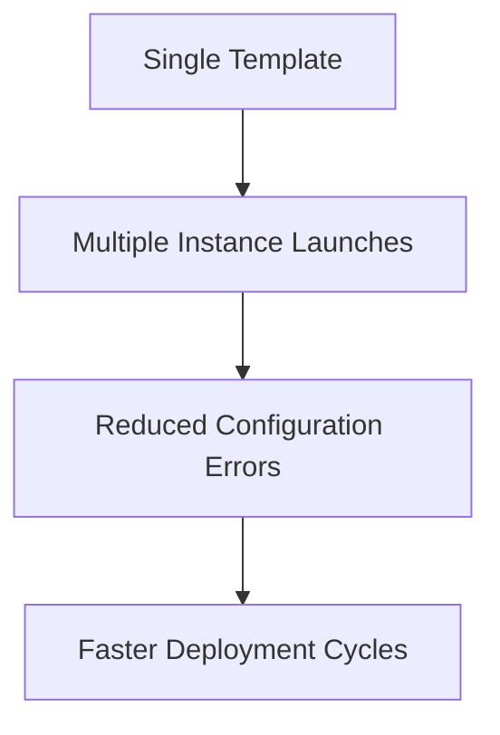
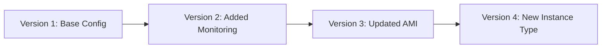

# Amazon EC2 Launch Templates - Comprehensive Guide

## Table of Contents
- [Amazon EC2 Launch Templates - Comprehensive Guide](#amazon-ec2-launch-templates---comprehensive-guide)
  - [Table of Contents](#table-of-contents)
  - [Introduction to Launch Templates](#introduction-to-launch-templates)
  - [Key Features and Benefits](#key-features-and-benefits)
    - [1. Standardization and Compliance](#1-standardization-and-compliance)
    - [2. Operational Efficiency](#2-operational-efficiency)
    - [3. Cost Management](#3-cost-management)
    - [4. Integration Capabilities](#4-integration-capabilities)
  - [Creating Launch Templates](#creating-launch-templates)
    - [Step-by-Step Creation](#step-by-step-creation)
  - [Version Management](#version-management)
    - [Version Control System](#version-control-system)
  - [Use Cases and Best Practices](#use-cases-and-best-practices)
    - [Common Use Cases](#common-use-cases)
    - [Best Practices](#best-practices)
  - [Key Takeaways](#key-takeaways)
  - [Additional Notes and Examples](#additional-notes-and-examples)
    - [Real-World Implementation](#real-world-implementation)
  - [Frequently Asked Questions](#frequently-asked-questions)

---

## Introduction to Launch Templates

**What is a Launch Template?**  
A launch template is a configuration template that contains all the parameters needed to launch an EC2 instance, serving as a blueprint for instance creation.

**Core Components:**
- **AMI ID:** Base image for the instance
- **Instance Type:** Compute capacity (e.g., t2.micro)
- **Network Settings:** VPC, subnet, security groups
- **Storage:** EBS volumes and configurations
- **Advanced Settings:** IAM roles, user data, tags

**Comparison with Other Methods:**

| Feature | Launch Template | Launch Configuration | Manual Launch |
|---------|----------------|----------------------|--------------|
| Versioning | Yes | No | N/A |
| Auto Scaling Support | Yes | Yes | No |
| Parameter Reuse | High | Medium | Low |
| Maintenance | Easy | Difficult | Manual |

---

## Key Features and Benefits

### 1. Standardization and Compliance
- Enforce corporate standards across all deployments
- Ensure security groups and IAM roles are consistently applied

### 2. Operational Efficiency


### 3. Cost Management
- Control instance types and sizes
- Enforce tagging for cost allocation
- Optimize Spot Instance configurations

### 4. Integration Capabilities
- Works with:
  - Auto Scaling Groups
  - Spot Fleets
  - EC2 Fleet
  - AWS Batch

---

## Creating Launch Templates

### Step-by-Step Creation

1. **Via AWS Console:**
   - Navigate to EC2 > Launch Templates > Create launch template
   - Fill in required parameters:
     - Template name and description
     - AMI selection
     - Instance type
     - Key pair
     - Network settings

2. **Using AWS CLI:**
   ```bash
   aws ec2 create-launch-template \
     --launch-template-name MyWebServerTemplate \
     --version-description InitialVersion \
     --launch-template-data '{
       "ImageId":"ami-0abcdef1234567890",
       "InstanceType":"t2.micro",
       "KeyName":"MyKeyPair",
       "SecurityGroupIds":["sg-1234567890abcdef0"]
     }'
   ```

3. **With CloudFormation:**
   ```yaml
   Resources:
     MyLaunchTemplate:
       Type: AWS::EC2::LaunchTemplate
       Properties:
         LaunchTemplateName: MyTemplate
         LaunchTemplateData:
           InstanceType: t2.micro
           ImageId: ami-0abcdef1234567890
   ```

**Important Parameters:**
- **User Data:** For bootstrap scripts
- **IAM Instance Profile:** For permissions
- **Tag Specifications:** For resource tracking
- **Market Options:** For Spot Instance configuration

---

## Version Management

### Version Control System

**Key Concepts:**
- Each template can have multiple numbered versions
- Default version can be changed at any time
- Previous versions are retained for rollback

**Version Lifecycle Example:**


**CLI Commands for Version Management:**

1. **Create New Version:**
   ```bash
   aws ec2 create-launch-template-version \
     --launch-template-id lt-1234567890abcdef0 \
     --source-version 1 \
     --version-description "Added CloudWatch agent" \
     --launch-template-data '{"Monitoring":{"Enabled":true}}'
   ```

2. **Set Default Version:**
   ```bash
   aws ec2 modify-launch-template \
     --launch-template-id lt-1234567890abcdef0 \
     --default-version 2
   ```

3. **List Versions:**
   ```bash
   aws ec2 describe-launch-template-versions \
     --launch-template-id lt-1234567890abcdef0
   ```

---

## Use Cases and Best Practices

### Common Use Cases

1. **Auto Scaling Groups:**
   ```bash
   aws autoscaling create-auto-scaling-group \
     --auto-scaling-group-name MyASG \
     --launch-template "LaunchTemplateId=lt-1234567890abcdef0,Version=1" \
     --min-size 2 --max-size 10
   ```

2. **Spot Fleet Configurations:**
   - Define instance type alternatives
   - Set max price as percentage of On-Demand

3. **Disaster Recovery:**
   - Maintain launch templates in multiple regions
   - Quick deployment of recovery instances

### Best Practices

1. **Naming Conventions:**
   - `{app}-{env}-{purpose}` (e.g., `web-prod-frontend`)

2. **Parameter Strategy:**
   - Store sensitive data in Systems Manager Parameter Store
   - Use latest AMI IDs via AWS Systems Manager

3. **Change Management:**
   - Test new versions in staging first
   - Implement versioning for all changes

4. **Cleanup Process:**
   ```bash
   # List old versions
   aws ec2 describe-launch-template-versions --launch-template-id lt-1234567890abcdef0

   # Delete specific version
   aws ec2 delete-launch-template-versions --launch-template-id lt-1234567890abcdef0 --versions 1
   ```

---

## Key Takeaways

1. **Consistency:** Launch templates standardize instance configurations
2. **Efficiency:** Reduce repetitive configuration tasks
3. **Control:** Versioning enables safe updates and rollbacks
4. **Integration:** Works seamlessly with AWS services

**Implementation Checklist:**
- [ ] Define template naming standards
- [ ] Establish version control process
- [ ] Document template parameters
- [ ] Set up monitoring for template usage
- [ ] Implement cleanup procedures

---

## Additional Notes and Examples

### Real-World Implementation

**Case Study: E-Commerce Platform**
1. **Challenge:** Inconsistent production instances
2. **Solution:**
   - Created golden launch template with:
     - Standardized security groups
     - Required tags
     - Monitoring configuration
3. **Result:**
   - 90% reduction in configuration errors
   - Faster scaling during peak loads

**Advanced Template Example:**
```json
{
  "ImageId": "resolve:ssm:/aws/service/ami-amazon-linux-latest/amzn2-ami-hvm-x86_64-gp2",
  "InstanceType": "t3.medium",
  "IamInstanceProfile": {"Arn": "arn:aws:iam::123456789012:instance-profile/MyRole"},
  "Monitoring": {"Enabled": true},
  "UserData": "base64_encoded_script",
  "TagSpecifications": [
    {
      "ResourceType": "instance",
      "Tags": [
        {"Key": "Environment", "Value": "Production"},
        {"Key": "Application", "Value": "CheckoutService"}
      ]
    }
  ]
}
```

---

## Frequently Asked Questions

**Q: How many versions can a launch template have?**
A: There's no hard limit, but AWS recommends keeping only active versions

**Q: Can I convert launch configurations to templates?**
A: Yes, using the `create-launch-template` CLI command with `--source-version`

**Q: What's the difference between launch templates and AMIs?**
A: AMIs are machine images, launch templates are configuration sets that can specify AMIs

**Q: How do launch templates help with security?**
A: They enforce standardized security groups, IAM roles, and other security settings

**Q: Can I share launch templates across accounts?**
A: Not directly, but you can export configurations or use AWS RAM for resource sharing

**Q: How often should I update my launch templates?**
A: Review quarterly or when making significant infrastructure changes

**Q: What happens if I delete a launch template version?**
A: Existing instances continue running, but new launches can't use that version