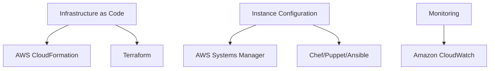

# Configuration Management in AWS - Comprehensive Guide

## Table of Contents
- [Configuration Management in AWS - Comprehensive Guide](#configuration-management-in-aws---comprehensive-guide)
  - [Table of Contents](#table-of-contents)
  - [Introduction to Configuration Management](#introduction-to-configuration-management)
  - [Benefits of Configuration Management](#benefits-of-configuration-management)
    - [1. Operational Efficiency](#1-operational-efficiency)
    - [2. Change Validation](#2-change-validation)
    - [3. Cost Optimization](#3-cost-optimization)
    - [4. Security Enforcement](#4-security-enforcement)
    - [5. Automated Remediation](#5-automated-remediation)
    - [6. Documentation as Code](#6-documentation-as-code)
  - [AWS Configuration Management Tools](#aws-configuration-management-tools)
    - [Core AWS Services:](#core-aws-services)
    - [Complementary Services:](#complementary-services)
  - [Configuration Management Strategies](#configuration-management-strategies)
    - [1. Layered Approach](#1-layered-approach)
    - [2. Hybrid Approach](#2-hybrid-approach)
    - [3. Immutable Infrastructure](#3-immutable-infrastructure)
  - [Implementation Approaches](#implementation-approaches)
    - [1. EC2 User Data Scripts](#1-ec2-user-data-scripts)
    - [2. Custom AMIs](#2-custom-amis)
    - [3. Configuration Management Tools](#3-configuration-management-tools)
    - [4. AWS CloudFormation Templates](#4-aws-cloudformation-templates)
  - [Key Takeaways](#key-takeaways)
  - [Additional Notes and Examples](#additional-notes-and-examples)
    - [Real-World Implementation](#real-world-implementation)
  - [Frequently Asked Questions](#frequently-asked-questions)

---

## Introduction to Configuration Management

**Definition:**  
Configuration management is the process of systematically handling changes to maintain system integrity over time. In AWS, this involves managing your infrastructure and application configurations in a consistent, automated way.

**Why It Matters in Cloud:**
- Cloud environments are dynamic and scalable
- Manual configuration doesn't scale
- Compliance and security requirements demand consistency
- Rapid deployment needs reliable processes

**AWS Configuration Management Ecosystem:**


---

## Benefits of Configuration Management

### 1. Operational Efficiency
- **Example:** Deploy 50 identical EC2 instances in minutes vs hours manually
- **AWS Tool:** CloudFormation templates

### 2. Change Validation
- **Example:** Automated testing before production deployment
- **AWS Tool:** AWS CodePipeline with approval gates

### 3. Cost Optimization
- **Example:** Automatically tag and delete untagged resources
- **AWS Tool:** AWS Config rules + Lambda functions

### 4. Security Enforcement
- **Example:** Ensure all S3 buckets are encrypted
- **AWS Tool:** AWS Config managed rules

### 5. Automated Remediation
- **Example:** Auto-heal EC2 instances failing health checks
- **AWS Tool:** AWS Systems Manager Automation

### 6. Documentation as Code
- **Example:** Version-controlled infrastructure definitions
- **AWS Tool:** AWS CloudFormation in CodeCommit

---

## AWS Configuration Management Tools

### Core AWS Services:

| Service | Primary Use | Key Feature | Example Command |
|---------|------------|-------------|-----------------|
| **AWS CloudFormation** | Infrastructure as Code | Template-based provisioning | `aws cloudformation create-stack` |
| **AWS Systems Manager** | Instance management | Run commands at scale | `aws ssm send-command` |
| **AWS OpsWorks** | Chef/Puppet management | Managed configuration servers | `aws opsworks create-stack` |
| **AWS AppConfig** | Application configs | Feature flags management | `aws appconfig create-application` |

### Complementary Services:
- **Amazon CloudWatch:** Monitoring and alerts
- **AWS Config:** Configuration history and compliance
- **AWS CodeDeploy:** Application deployment automation

**Example: Systems Manager Session Manager**
```bash
# Start an interactive session with an EC2 instance
aws ssm start-session --target i-1234567890abcdef0
```

---

## Configuration Management Strategies

### 1. Layered Approach

**a. Base Layer (AMIs):**
- Standard OS images with security patches
- Common monitoring agents
- Example: `ami-company-linux-base-v1.0`

**b. Middle Layer (Configuration Mgmt):**
- Application runtime environments
- Dependencies installation
- Example: Chef cookbook for Java apps

**c. Top Layer (Deployment):**
- Application code deployment
- Environment-specific configs
- Example: CodeDeploy deployment group

### 2. Hybrid Approach

**Example Workflow:**
1. Launch from base AMI (`ami-company-base`)
2. Apply middleware config (Ansible playbook)
3. Deploy app (CodeDeploy)
4. Runtime configs (AppConfig)

### 3. Immutable Infrastructure

**Implementation:**
- Deploy new instances rather than modifying existing
- Blue/green deployments
- Example: Auto Scaling Group with new launch template

---

## Implementation Approaches

### 1. EC2 User Data Scripts
```bash
#!/bin/bash
yum update -y
yum install -y httpd
systemctl start httpd
systemctl enable httpd
```

**Best For:** Simple, one-time configuration

### 2. Custom AMIs
**Creation Process:**
1. Launch instance from base AMI
2. Install required packages
3. Harden security settings
4. Create image: `aws ec2 create-image`

**Best For:** Large installations or compliance requirements

### 3. Configuration Management Tools

**Chef Example:**
```ruby
package 'httpd' do
  action :install
end

service 'httpd' do
  action [:enable, :start]
end
```

**Ansible Example:**
```yaml
- hosts: webservers
  tasks:
    - name: Install Apache
      yum:
        name: httpd
        state: present
```

### 4. AWS CloudFormation Templates
```yaml
Resources:
  MyEC2Instance:
    Type: AWS::EC2::Instance
    Properties:
      ImageId: ami-0abcdef1234567890
      InstanceType: t2.micro
      UserData: !Base64 |
        #!/bin/bash
        yum install -y httpd
```

---

## Key Takeaways

1. **Start Small:** Begin with critical systems and expand
2. **Version Control Everything:** Infrastructure definitions, scripts, configurations
3. **Automate Enforcement:** Use AWS Config rules for compliance
4. **Monitor Changes:** CloudWatch for operational visibility
5. **Document Processes:** Maintain runbooks and templates

**Implementation Checklist:**
- [ ] Define configuration standards
- [ ] Select appropriate tools
- [ ] Create base AMIs
- [ ] Develop deployment pipelines
- [ ] Implement monitoring
- [ ] Train team members

---

## Additional Notes and Examples

### Real-World Implementation

**Case Study: Financial Services Company**
1. **Challenge:** Inconsistent security configurations across 500+ EC2 instances
2. **Solution:**
   - Created golden AMI with security tools
   - Implemented AWS Systems Manager State Manager
   - Automated compliance checks with AWS Config
3. **Result:**
   - 100% configuration compliance
   - 80% reduction in security incidents
   - Automated patching process

**Advanced Configuration Example:**
```yaml
# CloudFormation template with parameters and conditions
Parameters:
  EnvironmentType:
    Type: String
    AllowedValues: [dev, prod]

Conditions:
  IsProduction: !Equals [!Ref EnvironmentType, "prod"]

Resources:
  MyDB:
    Type: AWS::RDS::DBInstance
    Properties:
      AllocatedStorage: !If [IsProduction, 100, 20]
      BackupRetentionPeriod: !If [IsProduction, 35, 7]
```

---

## Frequently Asked Questions

**Q: When to use user data vs configuration management tools?**
A: User data for simple one-time configs, CM tools for ongoing management

**Q: How often should we update our base AMIs?**
A: Monthly for security patches, quarterly for major updates

**Q: Can we use multiple configuration tools together?**
A: Yes, e.g., CloudFormation for infrastructure + Ansible for app config

**Q: How to handle secrets in configuration management?**
A: Use AWS Secrets Manager or Parameter Store with SecureString

**Q: What's the best way to learn AWS configuration management?**
A: Start with AWS Quick Starts, then modify for your needs

**Q: How to test configuration changes safely?**
A: Use CloudFormation change sets and deploy to staging first

**Q: Can we automate configuration drift remediation?**
A: Yes, with AWS Config rules and Systems Manager Automation