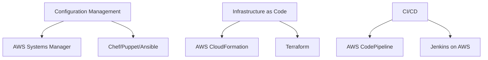
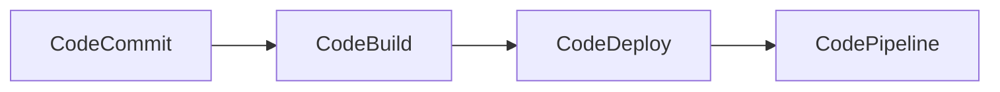

# Creating Automated and Repeatable Deployments - Comprehensive Guide

## Table of Contents
- [Creating Automated and Repeatable Deployments - Comprehensive Guide](#creating-automated-and-repeatable-deployments---comprehensive-guide)
  - [Table of Contents](#table-of-contents)
  - [Introduction to Automated Deployments](#introduction-to-automated-deployments)
  - [Configuration Management in AWS](#configuration-management-in-aws)
    - [Key AWS Services:](#key-aws-services)
  - [Infrastructure as Code (IaC)](#infrastructure-as-code-iac)
    - [Core Concepts:](#core-concepts)
  - [AWS CloudFormation Deep Dive](#aws-cloudformation-deep-dive)
    - [Template Anatomy:](#template-anatomy)
  - [CI/CD on AWS](#cicd-on-aws)
    - [AWS Developer Tools Suite:](#aws-developer-tools-suite)
  - [Troubleshooting CloudFormation](#troubleshooting-cloudformation)
    - [Common Issues and Solutions:](#common-issues-and-solutions)
  - [Best Practices](#best-practices)
    - [CloudFormation Excellence:](#cloudformation-excellence)
  - [Additional Notes and Examples](#additional-notes-and-examples)
    - [Real-World Implementation:](#real-world-implementation)
  - [Frequently Asked Questions](#frequently-asked-questions)

---

## Introduction to Automated Deployments

**Why Automation Matters:**
- Eliminates manual errors in deployments
- Enables consistent environments across stages
- Accelerates release cycles
- Facilitates disaster recovery

**Common Deployment Challenges:**
1. **Environment Drift:** Differences between dev, test, and prod
2. **Manual Processes:** Time-consuming and error-prone
3. **Scaling Issues:** Difficulty replicating environments
4. **Auditability:** Lack of deployment history

**AWS Solutions Overview:**


---

## Configuration Management in AWS

### Key AWS Services:

| Service | Use Case | Example Command |
|---------|----------|-----------------|
| **AWS Systems Manager** | Centralized system management | `aws ssm send-command --document-name "AWS-RunShellScript"` |
| **AWS OpsWorks** | Chef/Puppet managed instances | `aws opsworks create-stack --name "MyStack"` |
| **AWS AppConfig** | Application configuration management | `aws appconfig create-application --name "MyApp"` |

**Example: Using SSM for Configuration**
```bash
# Apply security patches across EC2 instances
aws ssm create-association \
  --name "AWS-ApplyPatchBaseline" \
  --targets "Key=tag:Env,Values=Production"
```

**Third-Party Tools Integration:**
- **Ansible:** `ansible-playbook deploy.yml`
- **Chef:** `knife bootstrap aws.example.com`
- **Puppet:** `puppet apply site.pp`

---

## Infrastructure as Code (IaC)

### Core Concepts:

**1. Declarative vs Imperative:**
- **Declarative (CloudFormation):** Describe WHAT you want
- **Imperative (CDK):** Describe HOW to get it

**2. Benefits:**
- Version-controlled infrastructure
- Repeatable deployments
- Self-documenting systems
- Automated drift detection

**Example: CloudFormation vs Terraform**

| Feature | AWS CloudFormation | Terraform |
|---------|-------------------|-----------|
| Language | JSON/YAML | HCL |
| State Management | AWS-managed | Self-managed |
| Multi-cloud | No | Yes |

**Sample IaC Workflow:**
1. Developer commits to Git
2. CI pipeline validates templates
3. Deployment to test environment
4. Automated testing
5. Promotion to production

---

## AWS CloudFormation Deep Dive

### Template Anatomy:

```yaml
AWSTemplateFormatVersion: "2010-09-09"
Description: "EC2 instance with security group"

Parameters:
  InstanceType:
    Type: String
    Default: t2.micro

Resources:
  MyEC2Instance:
    Type: AWS::EC2::Instance
    Properties:
      InstanceType: !Ref InstanceType
      ImageId: ami-0abcdef1234567890
```

**Key Components:**
1. **Parameters:** Customizable inputs
2. **Resources:** AWS components to create
3. **Outputs:** Exported values
4. **Conditions:** Conditional logic

**Advanced Features:**
- **Nested Stacks:** Break down complex templates
- **Custom Resources:** Extend functionality
- **Change Sets:** Preview changes
- **Stack Policies:** Protect critical resources

---

## CI/CD on AWS

### AWS Developer Tools Suite:



**Example Pipeline:**
1. **Source Stage:** CodeCommit repository
2. **Build Stage:** CodeBuild compiles app
3. **Test Stage:** Run automated tests
4. **Deploy Stage:** CodeDeploy to EC2/ECS

**Sample buildspec.yml:**
```yaml
version: 0.2
phases:
  install:
    commands:
      - npm install
  build:
    commands:
      - npm run build
artifacts:
  files:
    - '**/*'
```

---

## Troubleshooting CloudFormation

### Common Issues and Solutions:

| Error | Cause | Solution |
|-------|-------|----------|
| `CREATE_FAILED` | Invalid resource properties | Check AWS docs for required fields |
| `ROLLBACK_COMPLETE` | Dependency failure | Examine event timeline |
| `UPDATE_ROLLBACK_FAILED` | Irrecoverable state | Continue rollback or delete stack |
| `Resource limit exceeded` | Too many resources | Use nested stacks |

**Debugging Tools:**
1. **CloudFormation Events:** Chronological status updates
2. **AWS CloudTrail:** API call history
3. **Stack Policy:** Prevent accidental deletions

**Example Debugging Command:**
```bash
aws cloudformation describe-stack-events \
  --stack-name MyStack \
  --query 'StackEvents[?ResourceStatus==`CREATE_FAILED`]'
```

---

## Best Practices

### CloudFormation Excellence:

1. **Modular Design:**
   - Small, focused templates
   - Nested stacks for separation of concerns

2. **Security:**
   - No secrets in templates
   - Use AWS Secrets Manager
   - Apply least privilege IAM roles

3. **Maintainability:**
   - Consistent naming conventions
   - Documentation in template metadata
   - Version control all templates

4. **Automated Testing:**
   - Linting with `cfn-lint`
   - Dry-run deployments
   - Integration testing

**Sample Stack Policy:**
```json
{
  "Statement" : [{
    "Effect" : "Deny",
    "Action" : "Update:Replace",
    "Principal": "*",
    "Resource" : "LogicalIdOfMyImportantResource"
  }]
}
```

---

## Additional Notes and Examples

### Real-World Implementation:

**Case Study: E-Commerce Platform**
1. **Challenge:** Manual deployments causing outages
2. **Solution:**
   - CloudFormation for infrastructure
   - CodePipeline for CI/CD
   - Parameter Store for configuration
3. **Result:**
   - Deployment time reduced from 4hrs to 15min
   - Zero downtime deployments
   - Environment consistency

**Advanced Template Example:**
```yaml
# Conditional creation based on parameter
Resources:
  MyDB:
    Type: AWS::RDS::DBInstance
    Condition: CreateProdResources
    Properties: {...}

Conditions:
  CreateProdResources: !Equals [!Ref EnvType, "prod"]
```

---

## Frequently Asked Questions

**Q: When to use CloudFormation vs Terraform?**
A: CloudFormation for AWS-only, Terraform for multi-cloud

**Q: How to handle secrets in CloudFormation?**
A: Use Secrets Manager or Parameter Store (SecureString)

**Q: What's the best way to learn CloudFormation?**
A: Start with AWS sample templates, then modify gradually

**Q: How to prevent accidental stack deletion?**
A: Enable termination protection and use stack policies

**Q: Can CloudFormation manage non-AWS resources?**
A: Yes, via Custom Resources using Lambda

**Q: How to rollback failed updates?**
A: CloudFormation automatically rolls back unless disabled

**Q: What's the difference between Change Sets and Stack Updates?**
A: Change Sets preview changes without applying them