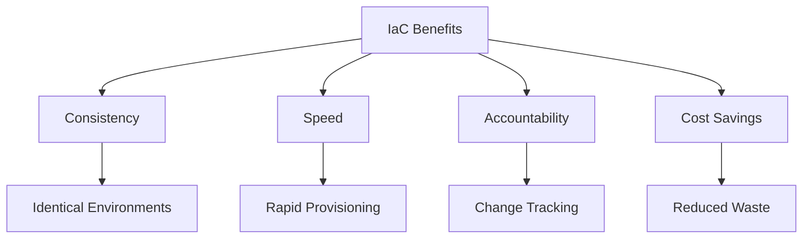
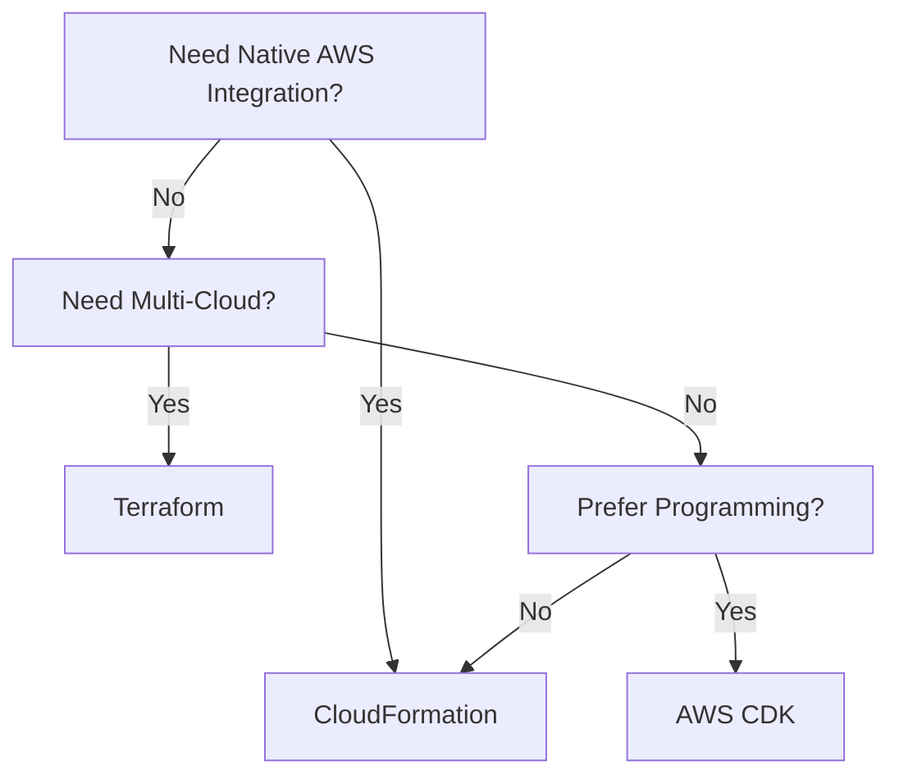

# Infrastructure as Code (IaC) - Comprehensive Guide

## Table of Contents
- [Infrastructure as Code (IaC) - Comprehensive Guide](#infrastructure-as-code-iac---comprehensive-guide)
  - [Table of Contents](#table-of-contents)
  - [Introduction to Infrastructure as Code](#introduction-to-infrastructure-as-code)
  - [Resource Provisioning with IaC](#resource-provisioning-with-iac)
    - [AWS CloudFormation Example](#aws-cloudformation-example)
  - [Configuration Management](#configuration-management)
    - [Post-Provisioning Management](#post-provisioning-management)
  - [AWS IaC Tools](#aws-iac-tools)
    - [Core Services](#core-services)
  - [Immutable Infrastructure](#immutable-infrastructure)
    - [Implementation Pattern](#implementation-pattern)
  - [Key Takeaways](#key-takeaways)
  - [Additional Notes and Examples](#additional-notes-and-examples)
    - [Real-World Implementation](#real-world-implementation)
  - [Frequently Asked Questions](#frequently-asked-questions)

---

## Introduction to Infrastructure as Code

**Definition:**  
Infrastructure as Code (IaC) is the practice of managing and provisioning computing infrastructure through machine-readable definition files, rather than physical hardware configuration or interactive configuration tools.

**Core Principles:**
- **Idempotency:** Repeatable deployments with consistent results
- **Version Control:** Track changes like application code
- **Automation:** Eliminate manual processes
- **Reusability:** Modular components for different environments

**Value Proposition:**


---

## Resource Provisioning with IaC

### AWS CloudFormation Example

**Template Structure:**
```yaml
AWSTemplateFormatVersion: '2010-09-09'
Description: 'Basic VPC with public subnet'

Resources:
  MyVPC:
    Type: AWS::EC2::VPC
    Properties:
      CidrBlock: 10.0.0.0/16
      EnableDnsSupport: true
      EnableDnsHostnames: true
      Tags:
        - Key: Name
          Value: Production-VPC
```

**Deployment Process:**
1. **Develop:** Create/modify template
2. **Validate:** `aws cloudformation validate-template`
3. **Deploy:** `aws cloudformation create-stack`
4. **Manage:** Update/delete stacks as needed

**Use Cases:**
- **Disaster Recovery:** Replicate environments across regions
- **Development Environments:** Spin up/down as needed
- **Demo Environments:** Mirror production temporarily

---

## Configuration Management

### Post-Provisioning Management

**Tools Comparison:**

| Tool | Primary Use | Key Feature | Example Command |
|------|------------|-------------|-----------------|
| **AWS Systems Manager** | State management | Run commands at scale | `aws ssm send-command` |
| **AWS OpsWorks** | Chef/Puppet management | Managed configuration servers | `aws opsworks create-stack` |
| **Ansible** | Multi-server config | Agentless architecture | `ansible-playbook deploy.yml` |

**Immutable vs Mutable Infrastructure:**

| Approach | Pros | Cons | Best For |
|----------|------|------|----------|
| **Immutable** | No configuration drift, consistent | Longer deployment time | Stateless applications |
| **Mutable** | Faster updates, preserves state | Risk of drift | Stateful systems (databases) |

**Example: Systems Manager Document**
```json
{
  "schemaVersion": "2.2",
  "description": "Install Apache Web Server",
  "parameters": {
    "packageName": {
      "type": "String",
      "default": "httpd"
    }
  },
  "mainSteps": [
    {
      "action": "aws:runShellScript",
      "name": "installPackage",
      "inputs": {
        "runCommand": ["sudo yum install -y {{ packageName }}"]
      }
    }
  ]
}
```

---

## AWS IaC Tools

### Core Services

1. **AWS CloudFormation**
   - Declarative templates (JSON/YAML)
   - Native AWS integration
   - Change sets for safe updates

2. **AWS CDK (Cloud Development Kit)**
   - Define infrastructure in programming languages
   - Higher-level abstractions
   - Example (TypeScript):
     ```typescript
     new ec2.Vpc(this, 'MyVpc', {
       maxAzs: 2,
       subnetConfiguration: [
         {
           cidrMask: 24,
           name: 'Public',
           subnetType: ec2.SubnetType.PUBLIC,
         }
       ]
     });
     ```

3. **Terraform on AWS**
   - Multi-cloud capability
   - Resource graph for dependencies
   - State management

**Tool Selection Guide:**


---

## Immutable Infrastructure

### Implementation Pattern

1. **Create New AMI:**
   ```bash
   aws ec2 create-image --instance-id i-1234567890abcdef0 --name "v2.0"
   ```

2. **Update Launch Template:**
   ```bash
   aws ec2 create-launch-template-version \
     --launch-template-id lt-1234567890abcdef0 \
     --source-version 1 \
     --launch-template-data '{"ImageId":"ami-9876543210fedcba"}'
   ```

3. **Deploy:**
   - Auto Scaling Group rollout
   - Blue/green deployment
   - Canary testing

**Benefits:**
- Eliminates configuration drift
- Simplifies rollback (just use previous AMI)
- Improves security (fresh instances with latest patches)

---

## Key Takeaways

1. **Consistency:** IaC ensures identical environments every time
2. **Efficiency:** Automates previously manual processes
3. **Risk Reduction:** Version control and change tracking
4. **Cost Optimization:** Right-size resources and eliminate waste

**Implementation Roadmap:**
1. Start with core infrastructure components
2. Implement version control for templates
3. Establish CI/CD pipeline for infrastructure
4. Expand to application deployments
5. Implement monitoring and governance

---

## Additional Notes and Examples

### Real-World Implementation

**Case Study: Financial Services**
1. **Challenge:** Manual processes caused audit failures
2. **Solution:**
   - Implemented CloudFormation for all infrastructure
   - AWS Config for compliance monitoring
   - Systems Manager for patching
3. **Results:**
   - 100% audit compliance
   - 80% faster provisioning
   - 60% cost reduction in dev environments

**Advanced CloudFormation Template:**
```yaml
Parameters:
  EnvironmentType:
    Type: String
    AllowedValues: [dev, test, prod]
    Default: dev

Conditions:
  IsProduction: !Equals [!Ref EnvironmentType, "prod"]

Resources:
  MyDB:
    Type: AWS::RDS::DBInstance
    Properties:
      AllocatedStorage: !If [IsProduction, 100, 20]
      BackupRetentionPeriod: !If [IsProduction, 35, 7]
      DBInstanceClass: !If [IsProduction, "db.m5.large", "db.t3.medium"]
```

---

## Frequently Asked Questions

**Q: How does IaC differ from traditional provisioning?**
A: IaC uses code definitions for repeatable, automated deployments vs manual GUI/CLI processes

**Q: What's the learning curve for CloudFormation?**
A: Start with sample templates, then modify gradually. AWS provides many Quick Starts.

**Q: Can I mix IaC with manual changes?**
A: Possible but not recommended - leads to configuration drift

**Q: How do I handle secrets in IaC?**
A: Use AWS Secrets Manager or Parameter Store with SecureString parameters

**Q: What's the best way to manage large CloudFormation templates?**
A: Break into nested stacks or use AWS CDK for better organization

**Q: How often should I update my IaC templates?**
A: Treat like application code - update when making infrastructure changes

**Q: Can I convert existing resources to IaC?**
A: Yes, using CloudFormation resource import or tools like Terraform import