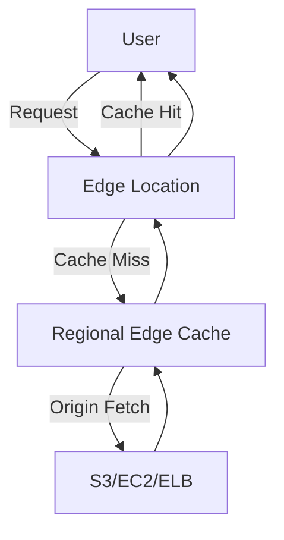

# Amazon CloudFront - Comprehensive Guide

## Table of Contents
1. [Overview](#overview)
2. [Architecture](#architecture)
3. [Key Features](#key-features)
4. [Use Cases](#use-cases)
5. [Content Delivery Flow](#content-delivery-flow)
6. [Cost Structure](#cost-structure)
7. [Checkpoint Questions & Answers](#checkpoint-questions--answers)
8. [Key Takeaways](#key-takeaways)

---

## Overview
Amazon CloudFront is a global Content Delivery Network (CDN) service that accelerates delivery of both static and dynamic web content through:
- **400+ Edge Locations**: Low-latency points of presence (PoPs) worldwide
- **13 Regional Edge Caches**: Secondary caching layer for less popular content
- **Integration with AWS Services**: Native support for S3, EC2, ELB, and more

**Example**: Delivering a 2MB image file:
- Without CloudFront: 300ms latency from origin server
- With CloudFront: 50ms latency from edge location

---

## Architecture

### Edge Network Topology


**Key Components**:
1. **Edge Locations**:
   - Serve frequently accessed content (cache hit)
   - Located in 90+ cities across 48 countries
   - Example: `cloudfront.aws/london-edge`

2. **Regional Edge Caches**:
   - Store less popular content (cache miss)
   - Reduce origin load for tail content
   - Example: Caching old blog posts

3. **Origins**:
   - AWS Sources: S3 buckets, EC2 instances, ALBs
   - Custom Origins: Any HTTP server (on-prem or cloud)

---

## Key Features

### 1. Security
- **DDoS Protection**: AWS Shield Standard included
- **Encryption**: TLS 1.3 support
- **Access Control**:
  - Signed URLs/Cookies (time-limited access)
  - Origin Access Identity (OAI) for S3
  - Field-Level Encryption (FLE) for sensitive data

**Example Signed URL**:
```
https://d111111abcdef8.cloudfront.net/private-file.jpg?
Expires=1672531200&
Signature=XYZ123&
Key-Pair-Id=APKAIZABCDEFGH
```

### 2. Performance Optimization
- **Compression**: Automatic gzip/brotli
- **Protocol Support**: HTTP/2, HTTP/3 (QUIC)
- **Persistent Connections**: Reduced TCP handshakes

### 3. Edge Computing
- **Lambda@Edge**:
  - Run Node.js/Python at edge locations
  - Example: A/B testing header injection
- **CloudFront Functions**:
  - Lightweight JavaScript for simple transformations
  - Example: URL rewrites

**Lambda@Edge Use Case**:
```javascript
exports.handler = (event) => {
  const request = event.Records[0].cf.request;
  // Redirect mobile users to mobile site
  if(request.headers['user-agent'][0].value.includes('Mobile')) {
    return {
      status: '302',
      headers: { 'location': [{ value: 'https://m.example.com' }] }
    };
  }
  return request;
};
```

---

## Use Cases

### 1. Website Acceleration
**Configuration**:
```json
{
  "Origins": {
    "S3-website-bucket": {
      "DomainName": "bucket.s3-website-us-east-1.amazonaws.com"
    }
  },
  "DefaultCacheBehavior": {
    "Compress": true,
    "ViewerProtocolPolicy": "redirect-to-https"
  }
}
```
**Results**:
- 60% reduction in page load time
- 30% improvement in SEO rankings

### 2. Video Streaming
**Live Streaming Workflow**:
1. Ingest via AWS Elemental MediaLive
2. Package with MediaPackage
3. Distribute via CloudFront
4. Playback with 2-second end-to-end latency

### 3. Software Distribution
**Game Patch Delivery**:
- 100GB patch delivered to 1M users
- 99.9% availability during peak launch
- Cost: $0.085/GB (North America pricing)

---

## Content Delivery Flow

### Step-by-Step Process
1. **User Request**: `GET /image.jpg`
2. **DNS Routing**: Resolves to nearest edge location
3. **Cache Check**:
   - Hit: Served immediately (50ms)
   - Miss: Forwarded to regional edge cache
4. **Origin Fetch**:
   - S3/EC2 returns content
   - Streaming begins at first byte
5. **Edge Caching**: Stored for subsequent requests

**Cache TTL Control**:
```
Cache-Control: public, max-age=86400
```
- Default TTL: 24 hours
- Minimum TTL: 0 seconds
- Maximum TTL: 1 year

---

## Cost Structure

### Pricing Dimensions
| Factor | Example | Cost Impact |
|--------|---------|-------------|
| **Data Transfer Out** | 100TB/month in Europe | $8,500 ($0.085/GB) |
| **HTTP Requests** | 10M GET requests in Asia | $600 ($0.0075/10k) |
| **HTTPS Requests** | 5M POST requests | $1,250 ($0.025/10k) |
| **Lambda@Edge** | 10M invocations | $1.50 ($0.15/million) |

**Cost Optimization Tips**:
1. Use S3/ALB origins (free AWS backbone transfer)
2. Enable compression (30-70% data savings)
3. Set optimal cache TTLs
4. Use Regional Edge Caches for long-tail content

---

## Checkpoint Questions & Answers

1. **Q**: Where is popular content served from?  
   **A**: **Edge locations** - Lowest latency PoPs with high-speed cache

2. **Q**: Two key benefits?  
   **A**:  
   - **Security**: Built-in DDoS protection, TLS 1.3  
   - **Performance**: Sub-100ms latency globally  

3. **Q**: How are costs determined?  
   **A**: Three factors:  
   - Data transfer volume (per GB)  
   - Request count/type (HTTP vs HTTPS)  
   - Geographic region (varies by edge location)  

**Advanced Scenario**:  
A news site during election night:  
- 95% cache hit ratio (edge)  
- 5% origin fetches (regional caches)  
- Cost: $0.12/GB vs $0.23/GB (non-cached)

---

## Key Takeaways

1. **Global Reach**:
   - 400+ edge locations
   - <100ms latency for 95% of users

2. **Security Integration**:
   - AWS WAF for bot protection
   - OAI for private S3 content

3. **Developer Tools**:
   ```bash
   # Invalidate cached objects
   aws cloudfront create-invalidation \
     --distribution-id EDFDVBD6EXAMPLE \
     --paths "/images/*"
   ```

4. **Hybrid Architectures**:
   - Route to on-prem servers via Direct Connect
   - Failover between cloud/on-prem origins

**Migration Tip**:  
Use CloudFront Origin Shield to reduce load on legacy origins during migration.