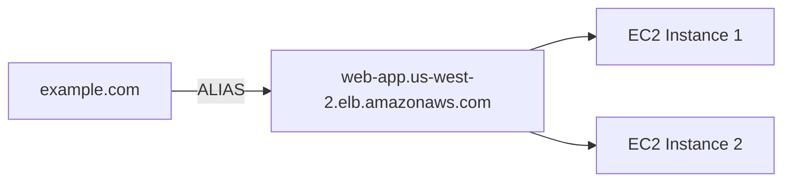
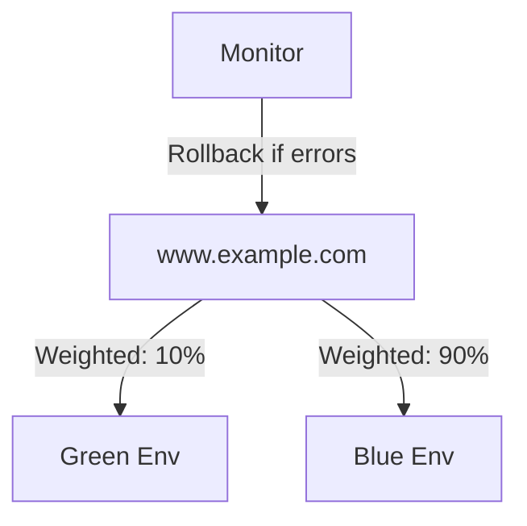

# Amazon Route 53 - Comprehensive Guide

## Table of Contents
1. [Overview](#overview)
2. [Core Features](#core-features)
3. [Integration with AWS Services](#integration-with-aws-services)
4. [Routing Policies](#routing-policies)
5. [Use Cases](#use-cases)
6. [Checkpoint Questions & Answers](#checkpoint-questions--answers)
7. [Key Takeaways](#key-takeaways)

---

## Overview
Amazon Route 53 is a scalable and highly available Domain Name System (DNS) web service that provides:
- Domain registration and management
- DNS resolution (translating domain names to IP addresses)
- Traffic routing to AWS and external resources
- Health checking and failover capabilities

**Example**: `www.example.com` → `192.0.2.1` (EC2 instance IP)

---

## Core Features

### 1. Domain Registration
- Register new domains (e.g., `example.com`)
- Transfer existing domains to Route 53
- Automatic DNS configuration

**Example Workflow**:
1. Register `myapp.com` via Route 53
2. Automatically creates hosted zone with NS/SOA records

### 2. DNS Resolution
- Resolves domain names to:
  - AWS resources (EC2, ELB, S3)
  - External endpoints
- Supports A, AAAA, CNAME, MX, TXT records

**Example Record**:
```
api.example.com.  A  300  192.0.2.1
```

### 3. Traffic Routing
- 8 routing policies for global traffic management
- Combines with health checks for failover

### 4. Health Checks
- Monitor endpoint availability
- Failover to healthy resources
- Customizable thresholds (e.g., 3 failures in 30 seconds)

---

## Integration with AWS Services

### Elastic Load Balancing (ELB)


**Key Options**:
1. **ALIAS Records**: Direct mapping to ELB (recommended)
   - Automatically resolves to ELB IPs
   - No TTL issues (unlike CNAME)
2. **CNAME Records**: Legacy method (not for root domains)

**Example Configuration**:
```json
{
  "Name": "example.com",
  "Type": "A",
  "AliasTarget": {
    "HostedZoneId": "Z2H123EXAMPLE",
    "DNSName": "dualstack.web-app.elb.amazonaws.com"
  }
}
```

### Other AWS Integrations:
- **S3 Static Websites**: Route traffic to S3 buckets
- **CloudFront**: Route to CDN endpoints
- **API Gateway**: Route to REST APIs

---

## Routing Policies

| Policy | Description | Use Case | Example |
|--------|-------------|----------|---------|
| **Simple** | Single resource routing | Basic websites | `example.com → 192.0.2.1` |
| **Weighted** | Traffic distribution by % | A/B testing | 70% US, 30% EU |
| **Latency** | Lowest latency routing | Global apps | Sydney users → ap-southeast-2 |
| **Failover** | Active-passive setup | Disaster recovery | Primary → East, Secondary → West |
| **Geolocation** | Route by user location | Compliance | EU users → GDPR-compliant servers |
| **Geoproximity** | Route by resource location | Hybrid cloud | On-prem ↔ AWS traffic |
| **Multivalue** | Random healthy endpoints | High availability | 8 healthy IPs returned |
| **IP-based** | Route by client IP | Internal apps | Office IP → private endpoint |

**Advanced Scenario**:
```python
# Weighted + Geolocation combo
if user_region == "EU":
    route_to(gdpr_endpoint, weight=100)
else:
    route_to(global_endpoint, weight=80)
```

---

## Use Cases

### 1. Blue/Green Deployments


**Steps**:
1. Deploy new version (Green)
2. Shift 10% traffic via weighted policy
3. Monitor with CloudWatch
4. Gradually increase to 100%

### 2. Global Low-Latency Apps
**Latency-Based Routing Flow**:
1. User in Tokyo queries `app.example.com`
2. Route 53 checks latency metrics:
   - ap-northeast-1: 45ms
   - us-west-2: 150ms
3. Returns Tokyo ELB endpoint

### 3. Disaster Recovery
**Failover Configuration**:
```yaml
Primary:
  - Record: primary.example.com
  - Health Check: HTTP:80/status
  - Failover: PRIMARY

Secondary:
  - Record: secondary.example.com
  - Failover: SECONDARY
```

---

## Checkpoint Questions & Answers

1. **Q**: Route users to the closest geographic Region?  
   **A**: **Geolocation routing policy**  
   *Example*: EU users → Frankfurt, US users → Virginia

2. **Q**: Fix slow responses after geographic routing?  
   **A**: **Latency-based routing (LBR)**  
   *Why*: Geographic proximity ≠ lowest latency (e.g., network congestion)

3. **Q**: AWS resources Route 53 can route to?  
   **A**: EC2, ELB, S3, CloudFront, API Gateway, etc.  
   *Advanced*: Also supports on-premises servers via VPN/Direct Connect

---

## Key Takeaways

1. **Domain Management**:
   - One-stop for registration + DNS
   - Supports DNSSEC for security

2. **Advanced Routing**:
   - Combine policies (e.g., Weighted + Failover)
   - Health checks enable self-healing architectures

3. **Performance**:
   - 100% SLA availability
   - Global anycast network (low-latency DNS)

4. **Migration Tip**:
   ```bash
   # Use AWS CLI to migrate DNS records
   aws route53 change-resource-record-sets \
     --hosted-zone-id Z1PA6795EXAMPLE \
     --change-batch file://records.json
   ```

**Cost Consideration**: $0.50/month per hosted zone + $0.40/1M queries (volume discounts available)