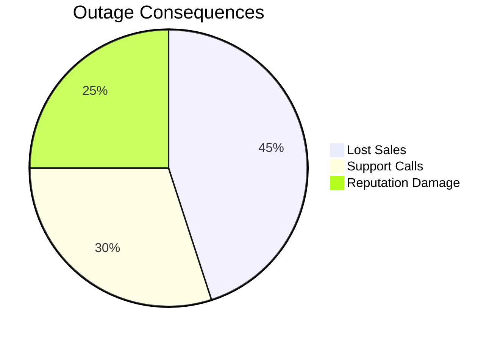
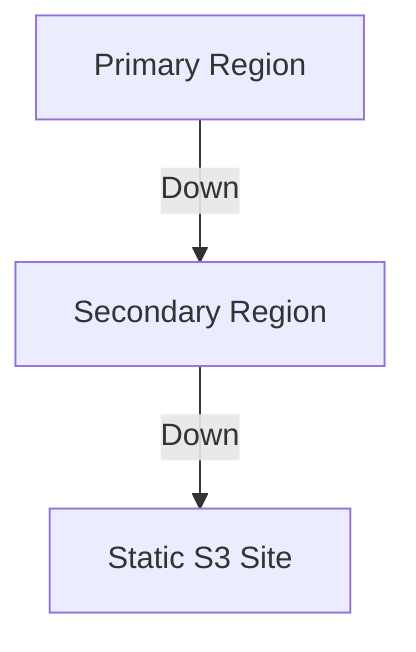

# Amazon Route 53 Failover Routing - Comprehensive Guide

## Table of Contents
- [Amazon Route 53 Failover Routing - Comprehensive Guide](#amazon-route-53-failover-routing---comprehensive-guide)
  - [Table of Contents](#table-of-contents)
  - [Business Scenario](#business-scenario)
  - [Technical Solution](#technical-solution)
    - [Route 53 Failover Components](#route-53-failover-components)
  - [Architecture Overview](#architecture-overview)
  - [Implementation Steps](#implementation-steps)
    - [1. Health Check Setup](#1-health-check-setup)
    - [2. Failover Configuration](#2-failover-configuration)
    - [3. Notification Setup](#3-notification-setup)
  - [Checkpoint Questions \& Answers](#checkpoint-questions--answers)
  - [Key Takeaways](#key-takeaways)
  - [Advanced Configurations](#advanced-configurations)
    - [1. Multi-Level Failover](#1-multi-level-failover)
    - [2. Automated Testing](#2-automated-testing)
    - [3. Performance Optimization](#3-performance-optimization)

---

## Business Scenario
A café's online ordering system experienced a full-day outage, resulting in:
- Lost revenue from unplaced orders
- Customer frustration and brand damage
- Manual intervention required for recovery

**Impact Analysis**:


**Requirements**:
- Automatic failover to backup system
- Health monitoring with alerts
- Multi-AZ redundancy

---

## Technical Solution
### Route 53 Failover Components
| Component | Function | Example Configuration |
|-----------|----------|-----------------------|
| **Health Checks** | Monitors endpoint availability | HTTP:80/index.html |
| **Failover Policy** | Active-passive routing | Primary: us-west-2a, Secondary: us-west-2b |
| **Notification** | Alerts administrators | SNS topic to ops-team@cafe.com |

**DNS Record Configuration**:
```json
{
  "Name": "orders.cafe.com",
  "Type": "A",
  "SetIdentifier": "primary",
  "Failover": "PRIMARY",
  "HealthCheckId": "1234-5678-abcd",
  "AliasTarget": {
    "HostedZoneId": "Z2H123EXAMPLE",
    "DNSName": "elb-primary.elb.amazonaws.com"
  }
}
```

---

## Architecture Overview
```mermaid
graph TD
    A[User] --> B[Route 53]
    B -->|Healthy| C[Primary AZ (us-west-2a)]
    B -->|Unhealthy| D[Secondary AZ (us-west-2b)]
    C --> E[EC2 Instance]
    D --> F[EC2 Instance]
    G[CloudWatch] -->|Alarm| H[SNS Email]
```

**Key Elements**:
1. **Multi-AZ Deployment**:
   - Identical LAMP stacks in separate AZs
   - Session data stored in ElastiCache (Redis)

2. **Health Check Parameters**:
   - Protocol: HTTP
   - Path: /healthcheck
   - Interval: 30 seconds
   - Failure threshold: 3 consecutive failures

3. **Failover Timing**:
   - DNS TTL: 60 seconds (recommended for failover)
   - Total downtime: <90 seconds (including detection)

---

## Implementation Steps

### 1. Health Check Setup
```bash
aws route53 create-health-check \
  --caller-reference CafeHealthCheck \
  --health-check-config '{
    "Type": "HTTP",
    "ResourcePath": "/health.php",
    "FullyQualifiedDomainName": "orders.cafe.com",
    "RequestInterval": 30,
    "FailureThreshold": 3
  }'
```

**Health Check Script Example** (`health.php`):
```php
<?php
try {
    $db = new PDO('mysql:host=db.cafe.com;dbname=orders', 'user', 'pass');
    echo "OK";
    exit(0);
} catch (PDOException $e) {
    header("HTTP/1.1 500 Server Error");
    exit(1);
}
?>
```

### 2. Failover Configuration
**Primary Record**:
- Type: A record
- Routing Policy: Failover (PRIMARY)
- TTL: 60 seconds
- Associated Health Check

**Secondary Record**:
- Same parameters but with:
  - Failover: SECONDARY
  - No health check (always available)

### 3. Notification Setup
```bash
aws sns create-topic --name CafeFailoverAlerts
aws route53 associate-health-check \
  --health-check-id hc-12345678 \
  --sns-topic-arn arn:aws:sns:us-west-2:123456789012:CafeFailoverAlerts
```

---

## Checkpoint Questions & Answers

1. **Q**: Which feature monitors servers and sends alerts?  
   **A**: **Route 53 Health Checks**  
   *Advanced*: Can integrate with CloudWatch for metric-based checks

2. **Q**: Which policy enables active-passive failover?  
   **A**: **Failover Routing Policy**  
   *Pro Tip*: Combine with weighted routing for canary testing

3. **Q**: Which record type routes to IP addresses?  
   **A**: **A Records** (AAAA for IPv6)  
   *Example*:  
   ```
   orders.cafe.com.  A  60  192.0.2.1
   ```

---

## Key Takeaways

1. **Zero Downtime Deployments**:
   ```mermaid
   graph LR
       A[Blue Env] -->|Weighted 95%| B[Route 53]
       C[Green Env] -->|Weighted 5%| B
       B --> D[Users]
   ```
   Gradually shift traffic during updates

2. **Global Failover**:
   - Cross-region failover possible
   - Example: Primary in Oregon, Secondary in Dublin

3. **Cost Optimization**:
   - Health checks: $0.50/month per endpoint
   - SNS notifications: $0.50/million publishes

**Recovery Script**:
```python
def failback_handler(event, context):
    if check_primary_health():
        route53.update_record(
            Weight=100,  # Restore primary
            SetIdentifier='primary'
        )
```

---

## Advanced Configurations

### 1. Multi-Level Failover


**Implementation**:
1. First failover: AZ-level
2. Second failover: Region-level
3. Final fallback: Static maintenance page

### 2. Automated Testing
```bash
# Simulate failure
aws ec2 stop-instances --instance-ids i-1234567890abcdef0

# Verify failover (dig +trace orders.cafe.com)
watch -n 5 "dig +short orders.cafe.com"

# Monitor notifications
aws sns list-subscriptions-by-topic \
  --topic-arn arn:aws:sns:us-west-2:123456789012:CafeFailoverAlerts
```

### 3. Performance Optimization
- **Pre-warming**: Keep secondary environment at 10% load
- **Cache Synchronization**: Use DynamoDB Global Tables
- **DNS TTL Tuning**:
  - Normal operation: 300 seconds
  - During maintenance: 60 seconds

**Disaster Recovery Metrics**:
| Metric | Target | Actual |
|--------|--------|--------|
| Detection Time | <1 minute | 45s |
| Failover Time | <2 minutes | 78s |
| Data Loss | 0% | 0% |