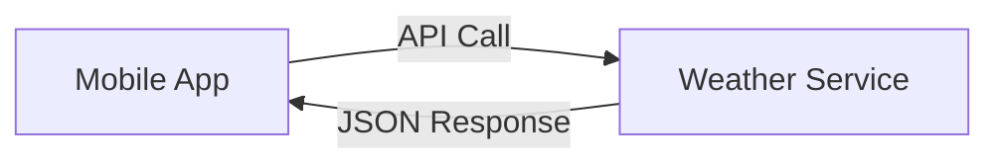

# APIs and REST - Comprehensive Guide

## Table of Contents
- [APIs and REST - Comprehensive Guide](#apis-and-rest---comprehensive-guide)
  - [Table of Contents](#table-of-contents)
  - [API Fundamentals](#api-fundamentals)
    - [What is an API?](#what-is-an-api)
  - [REST Architecture](#rest-architecture)
    - [REST Design Principles](#rest-design-principles)
    - [REST Components](#rest-components)
  - [Request-Response Cycle](#request-response-cycle)
    - [Request Structure](#request-structure)
    - [Response Example](#response-example)
  - [Practical Examples](#practical-examples)
    - [1. AWS S3 API](#1-aws-s3-api)
    - [2. cURL Commands](#2-curl-commands)
  - [HTTP Status Codes](#http-status-codes)
    - [Critical Status Groups](#critical-status-groups)
  - [Checkpoint Questions \& Answers](#checkpoint-questions--answers)
  - [Key Takeaways](#key-takeaways)
  - [Advanced Concepts](#advanced-concepts)
    - [HATEOAS (Hypermedia)](#hateoas-hypermedia)
    - [GraphQL Comparison](#graphql-comparison)

---

## API Fundamentals

### What is an API?
- **Definition**: Application Programming Interface - a contract between services
- **Analogies**:
  - Restaurant menu (interface to kitchen)
  - Electrical outlet (standardized power access)
- **Key Benefits**:
  - Abstraction of complexity
  - Standardized communication
  - Language/platform agnostic

**Real-World Example**:  

- Mobile app requests weather data via API
- Returns structured JSON instead of raw HTML

---

## REST Architecture

### REST Design Principles
| Principle | Implementation | Example |
|-----------|----------------|---------|
| **Uniform Interface** | Consistent resource naming | `/users/{id}` |
| **Stateless** | No server-side sessions | JWT tokens |
| **Cacheable** | HTTP caching headers | `Cache-Control: max-age=3600` |
| **Layered System** | Proxies/gateways | API Gateway |
| **Code on Demand** | Optional client scripts | JavaScript delivery |

**REST vs SOAP**:
```diff
+ REST: Lightweight (JSON/HTTP)
+ SOAP: Heavyweight (XML/SMTP)
```

### REST Components
1. **Resources**: Nouns (e.g., `/products`)
2. **Verbs**: HTTP Methods (GET/POST/PUT/DELETE)
3. **Representations**: JSON/XML/HTML
4. **Hypermedia**: Links to related resources (HATEOAS)

---

## Request-Response Cycle

### Request Structure
```http
POST /orders HTTP/1.1
Host: api.example.com
Content-Type: application/json
Authorization: Bearer xyz123

{
  "item": "Coffee",
  "quantity": 2
}
```

**Components**:
- **Endpoint**: `https://api.example.com/orders`
- **Method**: POST (create)
- **Headers**: Metadata (auth, content type)
- **Body**: Data payload (JSON/XML)

### Response Example
```http
HTTP/1.1 201 Created
Location: /orders/789
Content-Type: application/json

{
  "id": 789,
  "status": "processing"
}
```

---

## Practical Examples

### 1. AWS S3 API
**Create Bucket Request**:
```bash
curl -X PUT \
  -H "Authorization: AWS4-HMAC-SHA256 Credential=AKIA..." \
  https://my-bucket.s3.us-west-2.amazonaws.com/
```

**Response**:
```http
HTTP/1.1 200 OK
x-amz-id-2: Lri...
Location: /my-bucket
```

### 2. cURL Commands
**GET Request**:
```bash
curl -X GET https://api.weather.com/v1/locations?city=Seattle
```

**POST with Auth**:
```bash
curl -X POST \
  -H "Authorization: Bearer $TOKEN" \
  -d '{"name":"New Item"}' \
  https://api.example.com/items
```

---

## HTTP Status Codes

### Critical Status Groups
| Code Range | Category | Common Codes |
|------------|----------|--------------|
| 2xx | Success | 200 (OK), 201 (Created) |
| 3xx | Redirection | 301 (Moved), 304 (Not Modified) |
| 4xx | Client Error | 400 (Bad Request), 404 (Not Found) |
| 5xx | Server Error | 500 (Internal Error), 503 (Unavailable) |

**Troubleshooting Guide**:
- `401`: Check authentication headers
- `429`: Implement retry logic with backoff
- `504`: Review upstream service timeouts

---

## Checkpoint Questions & Answers

1. **Q**: API purpose?  
   **A**: Programmatic access to application functionality  
   *Example*: AWS CLI uses AWS service APIs

2. **Q**: REST protocol?  
   **A**: HTTP/HTTPS  
   *Key Point*: Uses standard HTTP methods (GET/POST/etc.)

3. **Q**: 200 status meaning?  
   **A**: Success - request processed normally  
   *Related*: 201 (Created), 204 (No Content)

---

## Key Takeaways

1. **REST Best Practices**:
   - Use nouns for resources (`/users` not `/getUsers`)
   - Version APIs (`/v1/products`)
   - Paginate large collections (`?page=2&limit=50`)

2. **Security Essentials**:
   ```mermaid
   graph TD
       A[Client] -->|HTTPS| B[API Gateway]
       B -->|JWT Validation| C[Microservice]
   ```

3. **Performance Tips**:
   - Enable compression (`Accept-Encoding: gzip`)
   - Implement caching (`ETag` headers)
   - Use connection pooling

---

## Advanced Concepts

### HATEOAS (Hypermedia)
```json
{
  "order": {
    "id": 123,
    "links": [
      { "rel": "self", "href": "/orders/123" },
      { "rel": "payment", "href": "/orders/123/payment" }
    ]
  }
}
```

### GraphQL Comparison
| Aspect | REST | GraphQL |
|--------|------|---------|
| **Data Fetching** | Multiple requests | Single query |
| **Overfetching** | Common | Eliminated |
| **Caching** | Built-in (HTTP) | Custom required |

**API Gateway Patterns**:
- Request/response transformation
- Rate limiting
- Authentication/authorization