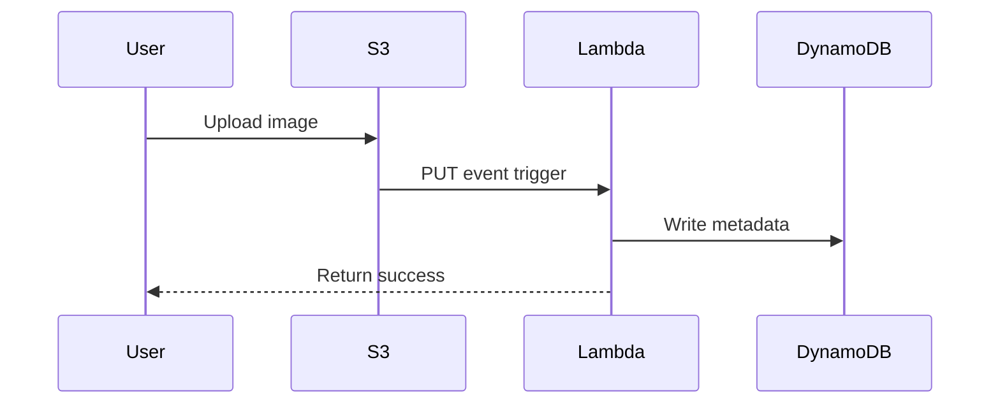
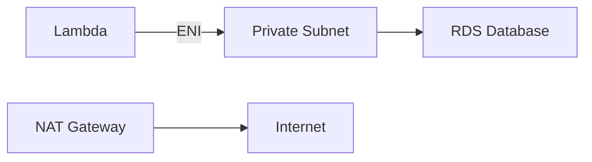

# AWS Lambda - Comprehensive Guide

## Table of Contents
- [AWS Lambda - Comprehensive Guide](#aws-lambda---comprehensive-guide)
  - [Table of Contents](#table-of-contents)
  - [Serverless Computing Overview](#serverless-computing-overview)
    - [Traditional vs Serverless Comparison](#traditional-vs-serverless-comparison)
  - [AWS Lambda Fundamentals](#aws-lambda-fundamentals)
    - [Core Characteristics](#core-characteristics)
  - [Lambda Architecture \& Workflow](#lambda-architecture--workflow)
    - [Execution Flow](#execution-flow)
    - [Invocation Patterns](#invocation-patterns)
  - [Key Use Cases](#key-use-cases)
    - [1. Image Processing Pipeline](#1-image-processing-pipeline)
    - [2. Scheduled EC2 Management](#2-scheduled-ec2-management)
    - [3. Real-Time Data Transformation](#3-real-time-data-transformation)
  - [Development \& Deployment](#development--deployment)
    - [IAM Permission Best Practices](#iam-permission-best-practices)
    - [Deployment Packages](#deployment-packages)
  - [Advanced Features](#advanced-features)
    - [Lambda Layers](#lambda-layers)
    - [VPC Connectivity](#vpc-connectivity)
  - [Limitations \& Quotas](#limitations--quotas)
    - [Critical Limits](#critical-limits)
  - [Checkpoint Questions \& Answers](#checkpoint-questions--answers)
  - [Key Takeaways](#key-takeaways)

---

## Serverless Computing Overview

### Traditional vs Serverless Comparison
| Aspect | Traditional (EC2) | Serverless (Lambda) |
|--------|------------------|---------------------|
| **Provisioning** | Manual server setup | No servers to manage |
| **Scaling** | Manual/auto-scaling rules | Automatic, instantaneous |
| **Maintenance** | OS patching required | Fully managed |
| **Billing** | Per-hour instance cost | Per-millisecond execution |
| **Availability** | Manual multi-AZ setup | Built-in high availability |

**Example Cost Savings**:
- EC2 t3.micro (24/7): ~$8.50/month
- Lambda (100K invocations @100ms): ~$0.20/month

---

## AWS Lambda Fundamentals

### Core Characteristics
- **Event-Driven Execution**: Triggers from 200+ AWS services
- **Runtime Limits**:
  - Maximum duration: 15 minutes
  - Memory range: 128MB - 10GB
  - Temporary storage: 512MB - 10GB (/tmp)
- **Supported Runtimes**:
  ```mermaid
  graph LR
    A[Node.js] --> B[Python]
    B --> C[Java]
    C --> D[.NET]
    D --> E[Ruby]
    E --> F[Go]
    F --> G[Custom Runtimes]
  ```

**Cold Start Mitigation**:
1. Provisioned Concurrency ($)
2. Minimum traffic (keep-warm)
3. Smaller deployment packages

---

## Lambda Architecture & Workflow

### Execution Flow


### Invocation Patterns
1. **Synchronous** (API Gateway, CLI)
   - Immediate response required
2. **Asynchronous** (S3, SNS)
   - Queue-based processing
3. **Stream** (Kinesis, DynamoDB Streams)
   - Record-by-record processing

**Concurrency Model**:
- Default: 1000 concurrent executions/account
- Burst capacity: 3000 instances/minute

---

## Key Use Cases

### 1. Image Processing Pipeline
```python
# Example: S3 Triggered Thumbnail Generator
import boto3
from PIL import Image

s3 = boto3.client('s3')

def lambda_handler(event, context):
    bucket = event['Records'][0]['s3']['bucket']['name']
    key = event['Records'][0]['s3']['object']['key']
    
    # Download original
    s3.download_file(bucket, key, '/tmp/original.jpg')
    
    # Process image
    img = Image.open('/tmp/original.jpg')
    img.thumbnail((256, 256))
    img.save('/tmp/thumbnail.jpg')
    
    # Upload result
    s3.upload_file('/tmp/thumbnail.jpg', bucket, f'thumbs/{key}')
```

### 2. Scheduled EC2 Management
```yaml
# EventBridge Rule for Stopping Instances
AWSTemplateFormatVersion: '2010-09-09'
Resources:
  StopInstancesRule:
    Type: AWS::Events::Rule
    Properties:
      ScheduleExpression: "cron(0 2 ? * MON-FRI *)"
      Targets:
        - Arn: !GetAtt StopEC2Lambda.Arn
          Id: "StopEC2Target"
```

### 3. Real-Time Data Transformation
**Kinesis Stream Processing**:
- 1 Lambda invocation per shard
- Batch size: 10,000 records
- Error handling: Automatic retries

---

## Development & Deployment

### IAM Permission Best Practices
```json
{
  "Version": "2012-10-17",
  "Statement": [{
    "Effect": "Allow",
    "Action": [
      "logs:CreateLogGroup",
      "logs:CreateLogStream",
      "logs:PutLogEvents"
    ],
    "Resource": "*"
  }]
}
```

### Deployment Packages
| Method | Max Size | Use Case |
|--------|---------|----------|
| **Inline Code** | 3KB | Simple scripts |
| **ZIP Upload** | 50MB | Medium complexity |
| **Container Image** | 10GB | Custom runtimes |

**CI/CD Pipeline Example**:
1. CodeCommit → CodeBuild → Lambda
2. SAM CLI for local testing
3. CloudFormation for staging/prod

---

## Advanced Features

### Lambda Layers
**Benefits**:
- Shared libraries (e.g., NumPy, Pandas)
- Custom runtimes (e.g., Rust, PHP)
- Configuration files

**Layer Structure**:
```
python/
    lib/
        python3.8/
            site-packages/
                requests/
```

**Usage**:
```bash
aws lambda publish-layer-version \
  --layer-name data-science \
  --zip-file fileb://layer.zip
```

### VPC Connectivity


**Considerations**:
- Cold starts increase with VPC
- Minimum 2 subnets required
- Security group must allow all outbound

---

## Limitations & Quotas

### Critical Limits
| Resource | Limit | Workaround |
|----------|-------|------------|
| Memory | 10GB | Split workloads |
| Timeout | 15min | Step Functions |
| Package Size | 250MB | Use layers |
| Concurrent Executions | 1000 | Request increase |

**Monitoring Metrics**:
- `Duration` (P99 under 1s)
- `ConcurrentExecutions` (<80% limit)
- `Throttles` (alarm if >0)

---

## Checkpoint Questions & Answers

1. **Q**: Is scaling configuration needed?  
   **A**: **No** - Lambda auto-scales to 1000+ concurrent executions  

2. **Q**: Why choose Lambda over EC2 for infrequent tasks?  
   **A**: **Cost efficiency** - Pay only for execution time vs 24/7 instance  

3. **Q**: Lambda layers advantage?  
   **A**: **Code reuse** - Share common dependencies across functions  

**Real-World Scenario**:  
Processing 10,000 images/month:  
- EC2: $8.50 (t3.micro) + EBS  
- Lambda: $0.02 (100ms @1GB)  

---

## Key Takeaways

1. **Event-Driven Paradigm**:
   ```python
   # Sample SQS Trigger
   def handler(event, context):
       for record in event['Records']:
           process_message(record['body'])
   ```

2. **Best Practices**:
   - Keep functions small (<50MB)
   - Set conservative timeouts
   - Use DLQs for error handling

3. **Advanced Patterns**:
   ```mermaid
   graph TB
       A[API Gateway] --> B[Lambda]
       B --> C[Step Functions]
       C --> D[DynamoDB]
       C --> E[SNS]
   ```

**Migration Tip**:  
Use Lambda Power Tuning to optimize memory/cost ratio:  
```bash
aws lambda update-function-configuration \
  --function-name my-function \
  --memory-size 2048
```