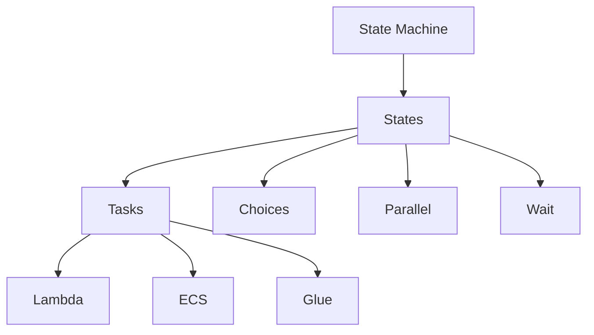
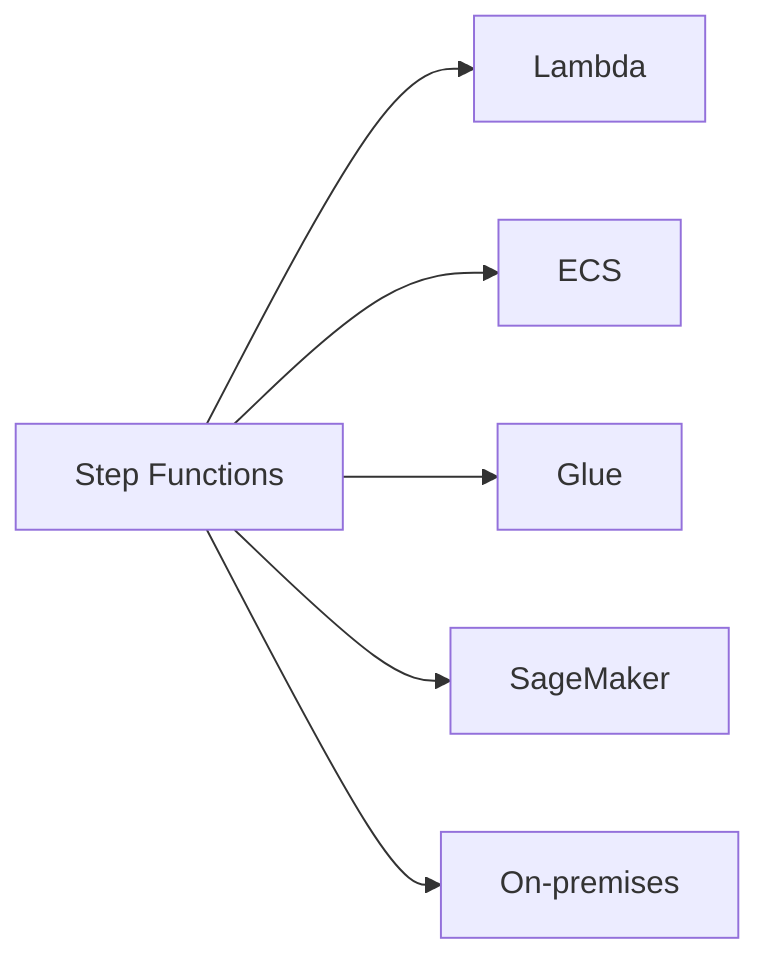
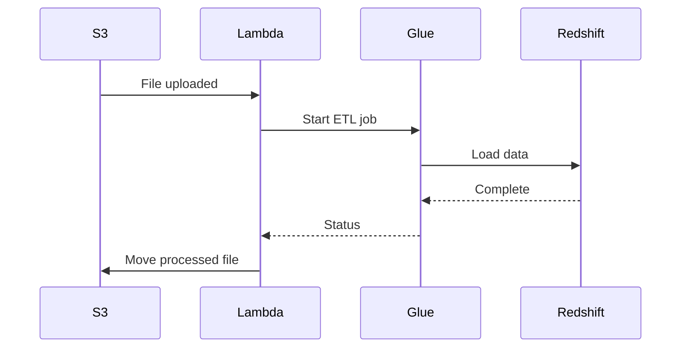
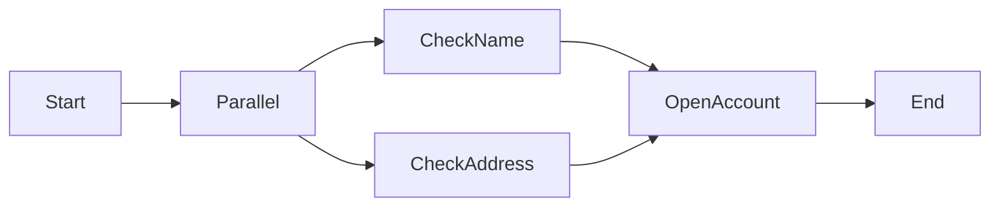

# AWS Step Functions - Comprehensive Guide

## Table of Contents
1. [Overview](#overview)
2. [Core Concepts](#core-concepts)
3. [Key Benefits](#key-benefits)
4. [Architecture & Features](#architecture--features)
5. [Use Cases](#use-cases)
6. [Implementation Example](#implementation-example)
7. [Checkpoint Questions & Answers](#checkpoint-questions--answers)
8. [Key Takeaways](#key-takeaways)
9. [Advanced Patterns](#advanced-patterns)

---

## Overview
AWS Step Functions is a serverless orchestration service that coordinates components across distributed applications using visual workflows.

**Key Characteristics**:
- **Serverless**: No infrastructure to manage
- **Stateful**: Tracks application state between steps
- **Resilient**: Built-in error handling and retries
- **Visual**: Workflow visualization in AWS Console

**Comparison to Alternatives**:
| Feature | Step Functions | SWF | Airflow |
|---------|---------------|-----|---------|
| **Management** | Fully managed | Managed | Self-hosted |
| **Execution Limit** | 1 year | 1 year | Unlimited |
| **Pricing Model** | Per state transition | Per workflow | Infrastructure costs |

---

## Core Concepts

### State Machine Components


**Definitions**:
- **State Machine**: Entire workflow definition (JSON)
- **State**: Individual step in workflow
- **Task**: Unit of work (invokes AWS service)
- **Execution**: Single run of state machine

**State Types**:
1. **Task State**: Performs work
2. **Choice State**: Branching logic
3. **Parallel State**: Concurrent execution
4. **Wait State**: Delays execution
5. **Succeed/Fail**: Terminal states

---

## Key Benefits

### 1. Productivity Boost
- **Visual Workflow Designer**: Drag-and-drop interface
- **Code Reuse**: Existing Lambda functions
- **Rapid Iteration**: Change workflows without code changes

**Example**: 
```json
"CheckInventory": {
  "Type": "Task",
  "Resource": "arn:aws:lambda:us-east-1:123456789012:function:check-inventory",
  "Next": "ProcessOrder"
}
```

### 2. Operational Resilience
- **Automatic Retries**: Configurable per task
- **Error Handling**: Catch patterns
- **Execution History**: 90-day audit trail

### 3. Cost Efficiency
- **Pay-per-use**: $0.025 per 1,000 state transitions
- **No idle costs**: Unlike always-on servers

---

## Architecture & Features

### Service Integration


**Key Features**:
- **Scalability**: Handles thousands of concurrent executions
- **Security**: IAM integration + PrivateLink support
- **Observability**: CloudWatch metrics and logs
- **Duration**: Runs up to 1 year

**Error Handling Pattern**:
```json
"Retry": [ {
  "ErrorEquals": ["States.Timeout"],
  "IntervalSeconds": 5,
  "MaxAttempts": 3,
  "BackoffRate": 2.0
}]
```

---

## Use Cases

### 1. Data Processing Pipeline


### 2. Order Fulfillment System
**States**:
1. Validate order
2. Check inventory (parallel):
   - Warehouse A
   - Warehouse B
3. Process payment
4. Initiate shipping
5. Send confirmation

### 3. ML Model Training
1. Data validation
2. Feature engineering
3. Model training
4. Evaluation
5. Deployment (if metrics pass)

---

## Implementation Example

### Bank Account Opening Workflow
```json
{
  "Comment": "Account processing workflow",
  "StartAt": "ParallelChecks",
  "States": {
    "ParallelChecks": {
      "Type": "Parallel",
      "Next": "OpenAccount",
      "Branches": [
        {
          "StartAt": "CheckName",
          "States": {
            "CheckName": {
              "Type": "Task",
              "Resource": "arn:aws:lambda:us-east-1:123456789012:function:CheckName",
              "End": true
            }
          }
        },
        {
          "StartAt": "CheckAddress",
          "States": {
            "CheckAddress": {
              "Type": "Task",
              "Resource": "arn:aws:lambda:us-east-1:123456789012:function:CheckAddress",
              "End": true
            }
          }
        }
      ]
    },
    "OpenAccount": {
      "Type": "Task",
      "Resource": "arn:aws:lambda:us-east-1:123456789012:function:OpenNewAccount",
      "End": true
    }
  }
}
```

**Visualization**:


---

## Checkpoint Questions & Answers

1. **Q**: Step Functions features?  
   **A**: Automatic scaling, high availability, pay-per-use pricing, security compliance  
   *Example*: Scales to handle Black Friday traffic spikes

2. **Q**: Key benefits?  
   **A**: Productivity (visual designer), agility (easy changes), resilience (retries)  
   *Use Case*: Faster order processing system development

3. **Q**: State machine vs state vs task?  
   **A**:  
   - **State Machine**: Entire workflow  
   - **State**: Processing step  
   - **Task**: Work unit (Lambda/ECS/etc.)  

---

## Key Takeaways

1. **Best Practices**:
   - Keep individual states under 5 minutes
   - Use parallel states for independent tasks
   - Implement proper error handling

2. **Monitoring**:
   ```bash
   aws stepfunctions list-executions \
     --state-machine-arn arn:aws:states:us-east-1:123456789012:stateMachine:MyStateMachine
   ```

3. **Cost Optimization**:
   - Minimize unnecessary state transitions
   - Use Express Workflows for high-volume, short-duration workflows

---

## Advanced Patterns

### 1. Human Approval Flow
```json
"ManagerApproval": {
  "Type": "Task",
  "Resource": "arn:aws:states:::lambda:invoke.waitForTaskToken",
  "Parameters": {
    "FunctionName": "SendApprovalEmail",
    "Payload": {
      "approvalToken.$": "$$.Task.Token"
    }
  }
}
```

### 2. Dynamic Parallelism
```python
# Lambda function generating dynamic branches
def lambda_handler(event, context):
    regions = ['us-east-1', 'eu-west-1', 'ap-northeast-1']
    return {
        "regions": regions,
        "batchSize": 10
    }
```

### 3. Saga Pattern
**Compensation Logic**:
1. Book hotel → if flight fails → Cancel hotel
2. Book flight → if car fails → Cancel flight
3. Book car → Finalize

**Implementation**:
```json
"Catch": [{
  "ErrorEquals": ["States.ALL"],
  "Next": "CompensateHotel"
}]
```