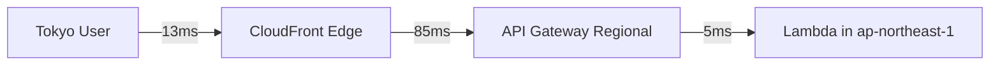
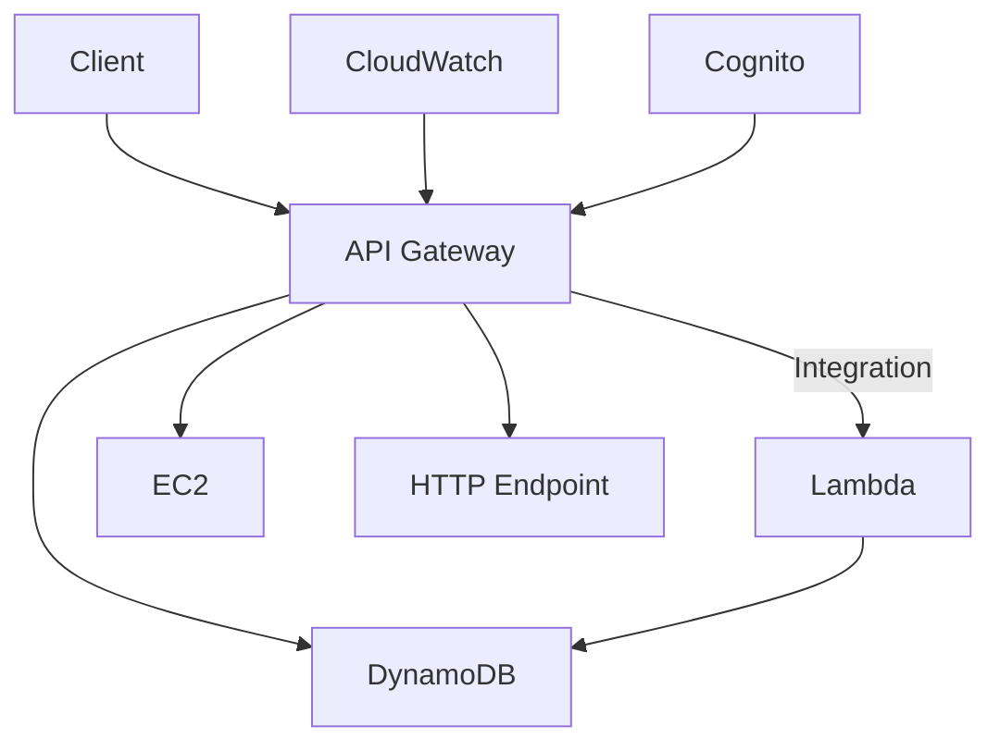
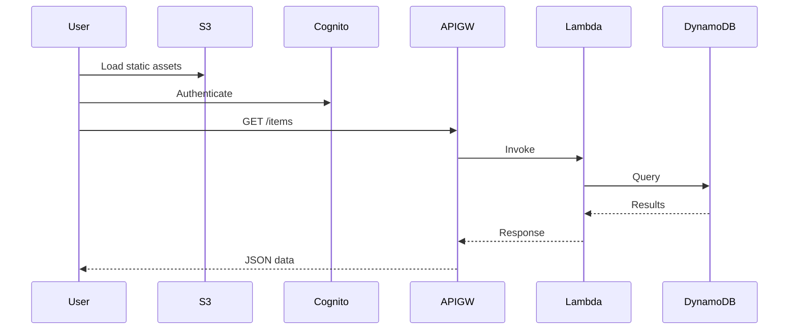

# Amazon API Gateway - Comprehensive Guide

## Table of Contents
1. [Overview](#overview)
2. [Key Benefits](#key-benefits)
3. [Architecture](#architecture)
4. [Use Cases](#use-cases)
5. [Implementation Example](#implementation-example)
6. [Checkpoint Questions & Answers](#checkpoint-questions--answers)
7. [Key Takeaways](#key-takeaways)
8. [Advanced Features](#advanced-features)

---

## Overview
Amazon API Gateway is a fully managed service for creating, publishing, maintaining, monitoring, and securing APIs at any scale.

**Core Capabilities**:
- REST API creation and management
- Serverless integration with AWS Lambda
- Traffic management and throttling
- Authorization and access control
- API versioning and staging

**Service Comparison**:
| Feature | API Gateway | ALB | CloudFront |
|---------|------------|-----|-----------|
| **Protocol Support** | REST/WebSocket | HTTP/HTTPS | HTTP/HTTPS |
| **Serverless** | ✓ | ✗ | ✗ |
| **Caching** | ✓ | ✗ | ✓ |
| **Cost Model** | Per request + data transfer | Per hour + LCU | Per request + data transfer |

---

## Key Benefits

### 1. Performance Optimization
- **Edge Optimization**: 200+ CloudFront PoPs globally
- **Caching**: Configurable TTL (1s-3600s) at stage/method level
- **Compression**: Automatic gzip/brotli support

**Latency Reduction Example**:


### 2. Security Controls
- **Authentication**:
  - IAM roles/policies
  - Cognito user pools
  - Custom authorizers (Lambda)
- **Protection**:
  - AWS WAF integration
  - Rate limiting (10,000 RPS default)
  - Request validation

### 3. Cost Efficiency
**Pricing Example**:
- 1M API calls/month: $3.50 (REST) vs $1.00 (HTTP)
- Data transfer: $0.09/GB (first 10TB)

---

## Architecture

### Component Diagram


**Key Elements**:
1. **Frontend**:
   - Resource paths (`/orders`)
   - Methods (GET/POST)
   - Request/response transformations

2. **Backend**:
   - Lambda functions
   - EC2 instances
   - DynamoDB tables
   - Any HTTP endpoint

---

## Use Cases

### 1. Serverless Microservices
```yaml
# SAM Template Example
Resources:
  OrdersAPI:
    Type: AWS::Serverless::Api
    Properties:
      StageName: Prod
      DefinitionUri: swagger.yml

  GetOrderFunction:
    Type: AWS::Serverless::Function
    Properties:
      Events:
        ApiEvent:
          Type: Api
          Properties:
            Path: /orders/{id}
            Method: GET
            RestApiId: !Ref OrdersAPI
```

### 2. Mobile Backend
**Security Flow**:
1. Mobile app authenticates with Cognito
2. Receives JWT token
3. Calls API Gateway with Authorization header
4. Custom authorizer validates token

### 3. Legacy Modernization
**Pattern**:
- API Gateway → Lambda → SOAP adapter → On-prem ESB
- Gradual migration path

---

## Implementation Example

### Serverless Web App


**Configuration Steps**:
1. Create REST API in API Gateway
2. Define resources/methods (`/items`, GET)
3. Set Lambda integration
4. Deploy to "Prod" stage
5. Configure custom domain

---

## Checkpoint Questions & Answers

1. **Q**: API Gateway purpose?  
   **A**: Create, publish, maintain, and monitor APIs  
   *Example*: Building RESTful interfaces for mobile apps

2. **Q**: Application types using API Gateway?  
   **A**: Web apps, mobile apps, IoT devices, VPC applications  
   *Advanced*: Hybrid cloud architectures

3. **Q**: Frontend vs backend?  
   **A**:  
   - **Frontend**: Request/response interface  
   - **Backend**: AWS service integrations  

---

## Key Takeaways

1. **Deployment Best Practices**:
   - Use stages (dev/test/prod)
   - Enable CloudWatch logging
   - Set cache encryption

2. **Monitoring**:
   ```bash
   aws cloudwatch get-metric-statistics \
     --namespace AWS/ApiGateway \
     --metric-name 4XXError \
     --dimensions Name=ApiName,Value=MyApi
   ```

3. **Security**:
   - Least privilege IAM roles
   - Enable WAF for DDoS protection
   - Use Cognito for user auth

---

## Advanced Features

### 1. Canary Deployments
```json
{
  "canary": {
    "percentTraffic": 10,
    "stageVariableOverrides": {
      "lambdaAlias": "new-version"
    }
  }
}
```

### 2. Request Transformation
**Velocity Template Example**:
```json
{
  "method": "$context.httpMethod",
  "path": "$context.resourcePath",
  "user": "$context.authorizer.claims.email"
}
```

### 3. WebSocket APIs
```python
# Connection handler
def lambda_handler(event, context):
    if event['requestContext']['eventType'] == 'CONNECT':
        # New connection
    elif event['requestContext']['eventType'] == 'MESSAGE':
        # Process message
```

**Use Cases**: Real-time apps (chat, gaming, trading)