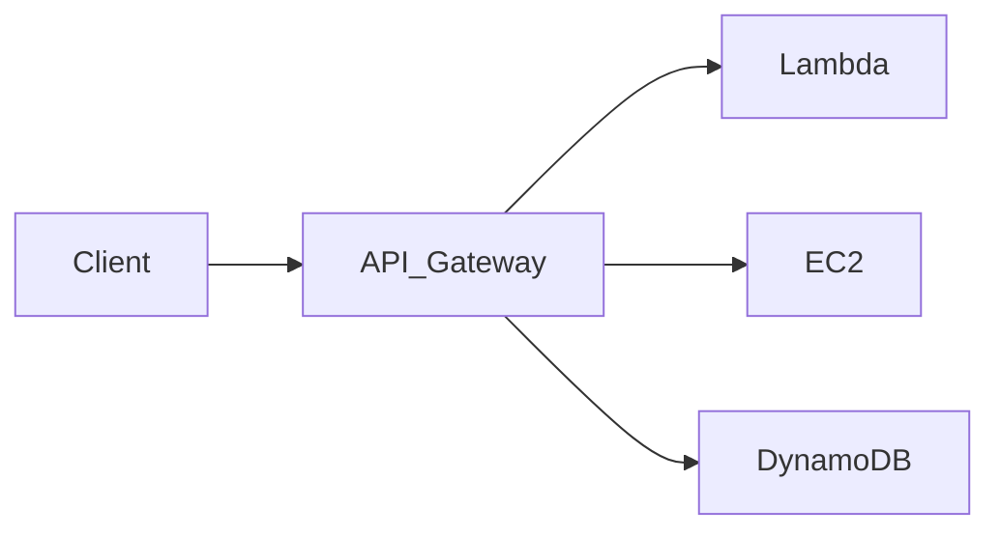
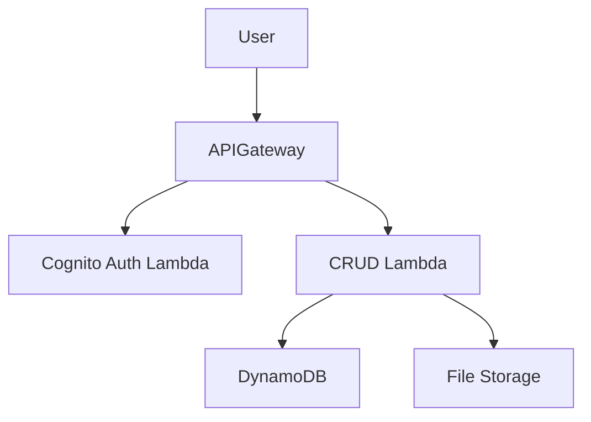
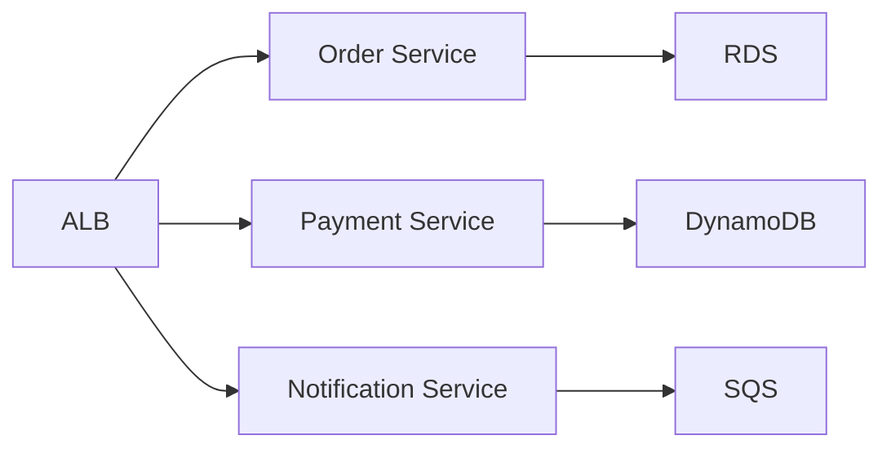

# Serverless and Containers on AWS - Comprehensive Guide

## Table of Contents
- [Serverless and Containers on AWS - Comprehensive Guide](#serverless-and-containers-on-aws---comprehensive-guide)
  - [Table of Contents](#table-of-contents)
  - [Unit Overview](#unit-overview)
  - [Key Learning Objectives](#key-learning-objectives)
  - [Troubleshooting Knowledge Base](#troubleshooting-knowledge-base)
    - [Recommended Structure for Entries](#recommended-structure-for-entries)
    - [Example Entry](#example-entry)
    - [APIs and RESTful APIs](#apis-and-restful-apis)
    - [Amazon API Gateway](#amazon-api-gateway)
    - [Containers on AWS](#containers-on-aws)
    - [AWS Step Functions](#aws-step-functions)
  - [Practical Examples](#practical-examples)
    - [Serverless Web Application](#serverless-web-application)
    - [Microservices with Containers](#microservices-with-containers)
  - [Troubleshooting Scenarios](#troubleshooting-scenarios)
    - [Common Issues and Solutions](#common-issues-and-solutions)
  - [Key Takeaways](#key-takeaways)

---

## Unit Overview

This unit focuses on serverless computing and container technologies on AWS, covering:
- Event-driven computing with AWS Lambda
- API management with Amazon API Gateway
- Container services (ECS, EKS, Fargate)
- Workflow orchestration with AWS Step Functions

**Duration**: Self-paced with hands-on exercises  
**Target Audience**: Cloud practitioners, developers, and solutions architects  

---

## Key Learning Objectives

By the end of this unit, you should be able to:

1. **AWS Lambda**
   - Explain serverless computing concepts
   - Create and configure Lambda functions
   - Implement event-driven architectures

2. **APIs and RESTful APIs**
   - Describe REST architectural principles
   - Differentiate between HTTP methods (GET, POST, PUT, DELETE)
   - Implement API endpoints

3. **Amazon API Gateway**
   - Create REST APIs
   - Configure authentication and authorization
   - Implement throttling and caching

4. **Containers on AWS**
   - Compare containers vs. virtual machines
   - Deploy applications using ECS/EKS
   - Choose between Fargate and EC2 launch types

5. **AWS Step Functions**
   - Design state machines
   - Implement workflow orchestration
   - Handle errors and retries

---

## Troubleshooting Knowledge Base

### Recommended Structure for Entries

```markdown
### [Issue Description]
**Service**: [AWS Service]  
**Category**: Compute/Automation  
**Symptoms**:  
- [Observable behavior]  
- [Error messages]  

**Root Cause**:  
- [Technical explanation]  

**Solution**:  
1. [Step-by-step resolution]  
2. [AWS CLI commands if applicable]  

**Prevention**:  
- [Best practices]  
- [Monitoring suggestions]  
```

### Example Entry
```markdown
### Lambda Function Timeout
**Service**: AWS Lambda  
**Category**: Compute  
**Symptoms**:  
- Function fails after 3 seconds  
- CloudWatch shows "Task timed out after 3.00 seconds"  

**Root Cause**:  
- Default timeout is 3 seconds  
- Function processing large dataset  

**Solution**:  
1. Navigate to Lambda console  
2. Increase timeout under Configuration → General configuration  
3. Optimize code:  
   ```python
   # Process data in smaller batches
   for chunk in divide_chunks(large_data, 1000):
       process(chunk)
   ```

**Prevention**:  
- Set appropriate timeout during creation  
- Implement pagination for large datasets  
```

---

## Detailed Service Breakdown

### AWS Lambda

**Key Concepts**:
- Event sources (S3, DynamoDB, API Gateway)
- Cold starts vs. warm starts
- Concurrency limits

**Example: Image Processing Pipeline**
```python
import boto3

def lambda_handler(event, context):
    s3 = boto3.client('s3')
    rekognition = boto3.client('rekognition')
    
    # Process uploaded image
    response = rekognition.detect_labels(
        Image={'S3Object': {'Bucket': event['Bucket'], 'Name': event['Key']}}
    )
    
    # Store results
    s3.put_object(
        Bucket='results-bucket',
        Key=f"analysis/{event['Key']}",
        Body=str(response)
    )
```

**Common Issues**:
- Permission errors (missing IAM roles)
- Resource constraints (memory/timeout)
- VPC configuration challenges

---

### APIs and RESTful APIs

**HTTP Methods Deep Dive**:
| Method | Idempotent | Safe | Typical Status Codes |
|--------|------------|------|----------------------|
| GET    | Yes        | Yes  | 200, 404             |
| POST   | No         | No   | 201, 400             |
| PUT    | Yes        | No   | 200, 204             |
| DELETE | Yes        | No   | 200, 404             |

**Best Practices**:
- Use nouns for resources (`/users` not `/getUsers`)
- Implement HATEOAS for discoverability
- Version APIs (`/v1/products`)

---

### Amazon API Gateway

**Architecture Pattern**:


**Advanced Features**:
- Usage plans and API keys
- Request/response transformation
- Custom authorizers (Lambda)

---

### Containers on AWS

**Service Comparison**:
| Feature          | ECS           | EKS            | Fargate       |
|-----------------|---------------|----------------|---------------|
| Orchestration   | AWS-native    | Kubernetes     | Serverless    |
| Management      | Moderate      | Complex        | Minimal       |
| Best For        | AWS-centric   | Hybrid/multi-cloud | Quick deployments |

**Deployment Example**:
```bash
# Deploy to ECS Fargate
aws ecs register-task-definition \
    --family my-app \
    --cpu 256 --memory 512 \
    --container-definitions file://container-def.json

aws ecs create-service \
    --cluster my-cluster \
    --service-name my-service \
    --task-definition my-app:1 \
    --desired-count 3 \
    --launch-type FARGATE
```

---

### AWS Step Functions

**State Machine Example**:
```json
{
  "StartAt": "ProcessOrder",
  "States": {
    "ProcessOrder": {
      "Type": "Task",
      "Resource": "arn:aws:lambda:us-east-1:123456789012:function:validateOrder",
      "Next": "CheckInventory"
    },
    "CheckInventory": {
      "Type": "Choice",
      "Choices": [
        {
          "Variable": "$.inStock",
          "BooleanEquals": true,
          "Next": "ChargeCustomer"
        }
      ],
      "Default": "NotifyOutOfStock"
    }
  }
}
```

**Error Handling Patterns**:
- Exponential backoff retries
- Catch states for failure recovery
- Parallel state branching

---

## Practical Examples

### Serverless Web Application


### Microservices with Containers


---

## Troubleshooting Scenarios

### Common Issues and Solutions

1. **Lambda Cold Starts**
   - **Solution**: Provisioned concurrency
   - **CLI Command**:
     ```bash
     aws lambda put-provisioned-concurrency-config \
       --function-name my-function \
       --qualifier LIVE \
       --provisioned-concurrent-executions 100
     ```

2. **API Gateway 504 Errors**
   - **Check**: Lambda timeout < API Gateway timeout (29s max)
   - **Configuration**:
     ```yaml
     # SAM template
     Resources:
       MyApi:
         Type: AWS::Serverless::Api
         Properties:
           StageName: Prod
           DefinitionBody:
             timeoutInMillis: 29000
     ```

3. **ECS Task Stuck in PROVISIONING**
   - **Causes**: Insufficient Fargate capacity
   - **Resolution**:
     - Check AWS Service Health Dashboard
     - Retry in different AZ
     - Adjust task requirements (CPU/memory)

---

## Key Takeaways

1. **Serverless Benefits**:
   - No server management
   - Automatic scaling
   - Pay-per-use pricing

2. **Container Best Practices**:
   - One process per container
   - Immutable images
   - Health checks

3. **Workflow Design**:
   - Keep state machines simple
   - Implement proper error handling
   - Use parallel processing where possible

**Next Steps**:
- Complete hands-on labs in AWS Console
- Contribute to Troubleshooting Knowledge Base
- Explore AWS certification paths

---

**Feedback**:  
For corrections or questions, contact [AWS Training Support](https://support.aws.amazon.com/#/contacts/aws-training).  

© 2023, Amazon Web Services, Inc. or its affiliates. All rights reserved.