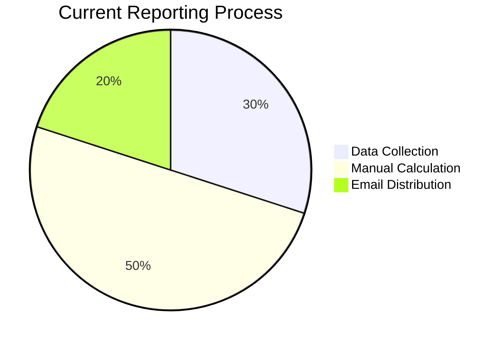
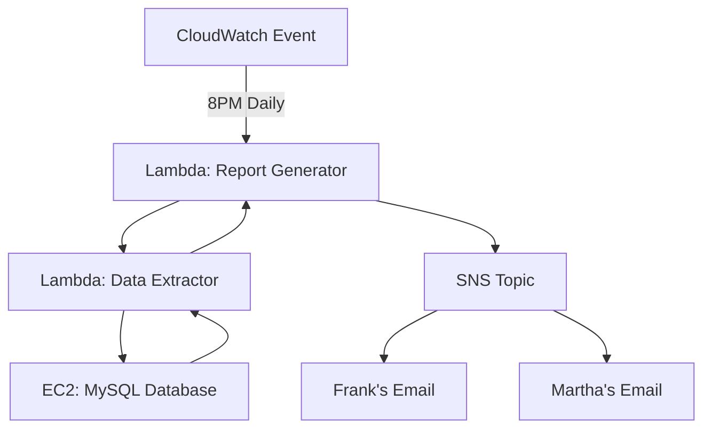

# Working with AWS Lambda - Comprehensive Guide

## Table of Contents
- [Working with AWS Lambda - Comprehensive Guide](#working-with-aws-lambda---comprehensive-guide)
  - [Table of Contents](#table-of-contents)
  - [Business Scenario](#business-scenario)
  - [Solution Architecture](#solution-architecture)
    - [Automated Reporting System](#automated-reporting-system)
  - [Implementation Steps](#implementation-steps)
    - [1. Database Connection Setup](#1-database-connection-setup)
    - [2. Report Generation Logic](#2-report-generation-logic)
    - [3. Email Formatting](#3-email-formatting)
    - [4. CloudWatch Event Rule](#4-cloudwatch-event-rule)
  - [Challenge Activity](#challenge-activity)
    - [Word Count Processor Requirements](#word-count-processor-requirements)
  - [Checkpoint Questions \& Answers](#checkpoint-questions--answers)
  - [Key Takeaways](#key-takeaways)
  - [Advanced Considerations](#advanced-considerations)
    - [Performance Optimization](#performance-optimization)
    - [Error Handling](#error-handling)
    - [Monitoring Setup](#monitoring-setup)

---

## Business Scenario
A café needs to automate daily baking reports based on sales data:
- **Requirement**: Generate tomorrow's baking requirements from today's orders
- **Current Process**: Manual calculation by staff
- **Pain Points**:
  - Time-consuming (1-2 hours daily)
  - Prone to human error
  - No historical data analysis

**Data Flow**:


---

## Solution Architecture

### Automated Reporting System


**Components**:
1. **Trigger**: CloudWatch Events (Scheduled)
2. **Orchestrator**: `salesAnalysisReport` Lambda
3. **Data Layer**: `salesAnalysisReportDataExtractor` Lambda
4. **Database**: MariaDB on EC2 LAMP stack
5. **Delivery**: Amazon SNS (Email/SMS)

**IAM Roles**:
- `salesAnalysisReportRole`: SNS publish permissions
- `salesAnalysisReportDRRole`: RDS read permissions

---

## Implementation Steps

### 1. Database Connection Setup
```python
# Using PyMySQL with AWS Systems Manager Parameter Store
import pymysql
import boto3

ssm = boto3.client('ssm')

def get_db_connection():
    host = ssm.get_parameter(Name='/cafe/db/host')['Parameter']['Value']
    user = ssm.get_parameter(Name='/cafe/db/user')['Parameter']['Value']
    password = ssm.get_parameter(Name='/cafe/db/password', WithDecryption=True)
    
    return pymysql.connect(
        host=host,
        user=user,
        password=password,
        database='cafe_db'
    )
```

### 2. Report Generation Logic
```sql
-- Daily Baking Requirements Query
SELECT 
    item_name, 
    SUM(quantity) as total_sold,
    SUM(quantity) * 1.2 as required_bake -- 20% buffer
FROM orders
WHERE order_date = CURDATE()
GROUP BY item_name
```

### 3. Email Formatting
```python
def format_report(data):
    report = ["Daily Baking Requirements:\n"]
    for row in data:
        report.append(f"{row['item_name']}: {row['required_bake']} units")
    return "\n".join(report)
```

### 4. CloudWatch Event Rule
```json
{
  "ScheduleExpression": "cron(0 20 ? * MON-SAT *)",
  "State": "ENABLED",
  "Targets": [{
    "Arn": "arn:aws:lambda:us-west-2:123456789012:function:salesAnalysisReport",
    "Id": "DailyReportTrigger"
  }]
}
```

---

## Challenge Activity

### Word Count Processor Requirements
1. **Trigger**: S3 upload of `.txt` files
2. **Processing**:
   - Count words in uploaded file
   - Format message: "The word count in the file {filename} is {count}"
3. **Notification**:
   - Email via SNS
   - Optional SMS
   - Subject: "Word Count Result"

**Implementation Code**:
```python
import boto3
import re

s3 = boto3.client('s3')
sns = boto3.client('sns')

def lambda_handler(event, context):
    # Get file details
    bucket = event['Records'][0]['s3']['bucket']['name']
    key = event['Records'][0]['s3']['object']['key']
    
    # Download and process file
    obj = s3.get_object(Bucket=bucket, Key=key)
    content = obj['Body'].read().decode('utf-8')
    word_count = len(re.findall(r'\w+', content))
    
    # Publish to SNS
    message = f"The word count in the file {key} is {word_count}."
    sns.publish(
        TopicArn='arn:aws:sns:us-east-1:123456789012:WordCountResults',
        Message=message,
        Subject='Word Count Result'
    )
```

**IAM Policy Requirements**:
```json
{
  "Version": "2012-10-17",
  "Statement": [
    {
      "Effect": "Allow",
      "Action": [
        "s3:GetObject",
        "logs:CreateLogGroup",
        "logs:CreateLogStream",
        "logs:PutLogEvents"
      ],
      "Resource": "*"
    },
    {
      "Effect": "Allow",
      "Action": "sns:Publish",
      "Resource": "arn:aws:sns:us-east-1:123456789012:WordCountResults"
    }
  ]
}
```

---

## Checkpoint Questions & Answers

1. **Q**: Two Lambda invocation methods?  
   **A**:  
   - **Event-based**: S3 uploads, API calls, etc.  
   - **Scheduled**: CloudWatch Events (cron expressions)  

2. **Q**: Permission management?  
   **A**: **IAM roles** attached to Lambda functions  
   *Best Practice*: Least-privilege roles  

3. **Q**: AWS CLI create-function command?  
   **A**:  
   ```bash
   aws lambda create-function \
     --function-name my-function \
     --runtime python3.8 \
     --role arn:aws:iam::123456789012:role/lambda-role \
     --handler lambda_function.lambda_handler \
     --zip-file fileb://function.zip
   ```

---

## Key Takeaways

1. **Serverless Benefits**:
   - Zero infrastructure management
   - Cost: ~$0.00001667 per GB-second
   - Automatic scaling

2. **Event-Driven Patterns**:
   ```mermaid
   graph LR
       A[S3 Upload] --> B[Lambda]
       B --> C[SNS]
       C --> D[Email]
       C --> E[SMS]
   ```

3. **Security Best Practices**:
   - Store secrets in Parameter Store
   - Use VPC for database access
   - Enable CloudTrail logging

---

## Advanced Considerations

### Performance Optimization
| Factor | Recommendation | Impact |
|--------|----------------|--------|
| **Memory** | 1792MB (optimal price/performance) | Faster execution |
| **Package** | Use layers for dependencies | Reduced cold starts |
| **Concurrency** | Set reserved concurrency | Predictable performance |

### Error Handling
```python
def lambda_handler(event, context):
    try:
        # Main logic
    except Exception as e:
        send_to_dlq(event, str(e))
        raise
```

### Monitoring Setup
```bash
aws cloudwatch put-metric-alarm \
  --alarm-name LambdaErrors \
  --metric-name Errors \
  --namespace AWS/Lambda \
  --statistic Sum \
  --period 300 \
  --threshold 1 \
  --comparison-operator GreaterThanThreshold \
  --evaluation-periods 1 \
  --alarm-actions arn:aws:sns:us-east-1:123456789012:AlarmNotifications
```