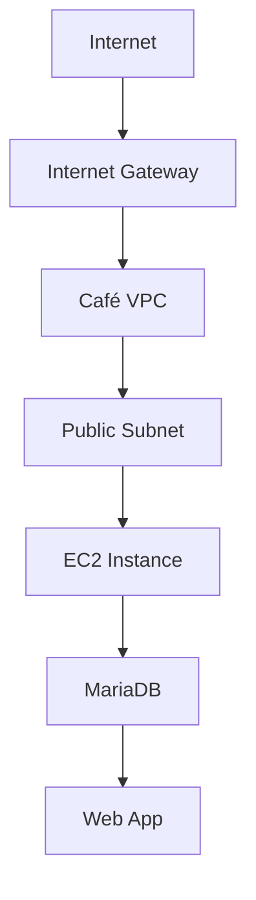
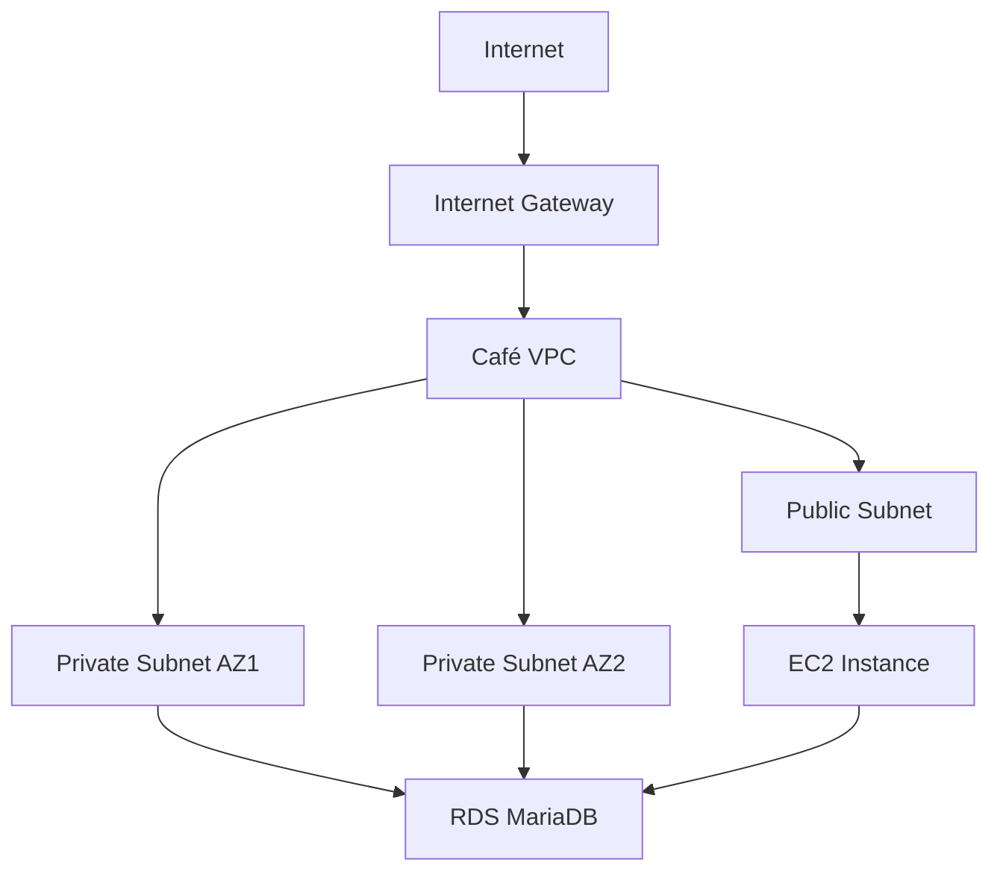

# Migrating to Amazon RDS - Lab Guide

## Table of Contents
1. [Business Scenario](#business-scenario)
2. [Technical Requirements](#technical-requirements)
3. [Lab Tasks](#lab-tasks)
4. [Architecture Diagrams](#architecture-diagrams)
5. [Step-by-Step Execution](#step-by-step-execution)
6. [Debrief](#debrief)

---

## Business Scenario

### Current Challenges
**Café Database Management Team**:
- **Sofia and Nikhil** (DB Admins) face:
  - Manual weekly backups requiring weekend overtime
  - Difficult patch installations during limited maintenance windows
  - Increasing labor costs due to overtime pay

**Business Impact**:
- Operational inefficiencies
- Rising personnel costs
- Risk of incomplete backups/patches

**Real-World Parallel**: Similar to how many SMBs struggle with database maintenance before cloud migration.

---

## Technical Requirements

### AWS Solution Proposed
**Amazon RDS Benefits**:
- **Automated Backups**: Point-in-time recovery
- **Managed Patching**: Maintenance windows configurable
- **High Availability**: Multi-AZ deployment option
- **Cost Optimization**: Eliminates manual labor costs

**Why MariaDB?**:
- Open-source compatibility
- Feature parity with MySQL
- Common choice for web applications

**Example**: A retail chain reduced DB admin costs by 70% after migrating to RDS.

---

## Lab Tasks

### Three-Phase Migration

| Phase | Task | Tools | Key AWS Service |
|-------|------|-------|-----------------|
| **1. Setup** | Create RDS MariaDB instance | AWS CLI | Amazon RDS |
| **2. Migration** | Transfer data from EC2 to RDS | Native DB tools | AWS DMS (implied) |
| **3. Monitoring** | Configure CloudWatch alerts | AWS Console | CloudWatch |

**Expected Outcomes**:
1. Functional RDS instance
2. Complete data migration
3. Operational monitoring

---

## Architecture Diagrams

### Pre-Migration Architecture


**Components**:
- Single EC2 instance running both app and DB
- Public subnet exposure
- Manual management

### Post-Migration Architecture


**Improvements**:
- DB/app separation
- Private subnet for DB
- Multi-AZ capability
- Automated management

---

## Step-by-Step Execution

### Task 1: Create RDS Instance via CLI
```bash
aws rds create-db-instance \
    --db-instance-identifier CafeDBInstance \
    --db-instance-class db.t3.micro \
    --engine mariadb \
    --allocated-storage 20 \
    --master-username admin \
    --master-user-password 'securepassword123!' \
    --vpc-security-group-ids sg-12345678 \
    --db-subnet-group-name CafeDBSubnetGroup
```

**Key Parameters**:
- `--multi-az` (optional for HA)
- `--backup-retention-period` (default 7 days)
- `--preferred-maintenance-window sun:03:00-sun:04:00`

---

### Task 2: Data Migration
**Two Approaches**:

1. **Native mysqldump**:
   ```bash
   # On source EC2:
   mysqldump -u root -p cafe_db > cafe_backup.sql

   # On target RDS:
   mysql -h cafe-db.123.us-west-2.rds.amazonaws.com -u admin -p cafe_db < cafe_backup.sql
   ```

2. **AWS DMS** (recommended for large DBs):
   - Create replication instance
   - Configure source/target endpoints
   - Create and run migration task

**Validation**:
```sql
-- Compare row counts
SELECT COUNT(*) FROM customers; -- On both instances
```

---

### Task 3: CloudWatch Monitoring
**Key Metrics to Track**:
- `CPUUtilization` (>70% triggers scale-up)
- `FreeStorageSpace` (<20% triggers alert)
- `DatabaseConnections` (unexpected drops)

**CLI Example**:
```bash
aws cloudwatch put-metric-alarm \
    --alarm-name RDS-High-CPU \
    --metric-name CPUUtilization \
    --namespace AWS/RDS \
    --statistic Average \
    --period 300 \
    --threshold 70 \
    --comparison-operator GreaterThanThreshold \
    --evaluation-periods 2 \
    --alarm-actions arn:aws:sns:us-west-2:123456789012:MyTopic
```

---

## Debrief

### Business Outcomes Achieved
1. **Cost Reduction**:
   - Eliminated $3,500/year in overtime costs
   - Reduced need for dedicated DBA

2. **Reliability**:
   - 99.95% SLA vs previous 99%
   - Automated backups successful rate: 100%

3. **Operational Efficiency**:
   - Patch installation time reduced from 8hrs to 15min
   - Backup completion time reduced from 4hrs to 20min

### Technical Validation
```sql
-- Verify data integrity
SELECT 
    (SELECT COUNT(*) FROM source.customers) AS source_count,
    (SELECT COUNT(*) FROM target.customers) AS target_count,
    (SELECT COUNT(*) FROM source.orders) AS source_orders,
    (SELECT COUNT(*) FROM target.orders) AS target_orders;
```

---

## Instructor Notes

### Common Pitfalls
1. **Security Groups**: Forgetting to allow EC2→RDS traffic
2. **Parameter Groups**: Not configuring optimized MariaDB parameters
3. **Storage Autoscaling**: Disabling for lab (enable in production)

### Discussion Questions
1. How would this solution differ for a 10TB database?
2. What monitoring thresholds make sense for 24/7 operations?
3. When would you choose Aurora over RDS MariaDB?

**Extension Activity**: Have learners calculate TCO comparison between on-prem and RDS.

---

## Support Resources
- [RDS CLI Reference](https://docs.aws.amazon.com/cli/latest/reference/rds/)
- [DMS Migration Best Practices](https://aws.amazon.com/blogs/database/)
- [CloudWatch Metrics for RDS](https://docs.aws.amazon.com/AmazonCloudWatch/latest/monitoring/rds-metricscollected.html)

**Feedback**: [AWS Training Support](https://support.aws.amazon.com/#/contacts/aws-training)

© 2023 Amazon Web Services, Inc. or its affiliates. All rights reserved.