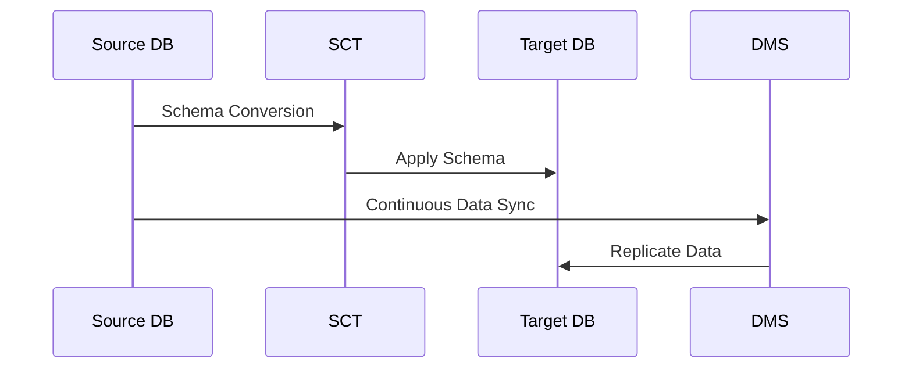

# AWS Database Services - Instructor Guide

## Table of Contents
1. [AWS Database Services Overview](#aws-database-services-overview)
2. [Introduction to Databases on AWS](#introduction-to-databases-on-aws)
3. [Amazon Redshift](#amazon-redshift)
4. [Amazon Aurora](#amazon-aurora)
5. [AWS DMS](#aws-dms)
6. [Migrating to Amazon RDS](#migrating-to-amazon-rds)
7. [Knowledge Check](#knowledge-check)

---

## AWS Database Services Overview

### Lesson Details
| Modality | Duration |
|----------|----------|
| Presentation | 0:05 |
| Instructor Q&A | 0:05 |
| **Total** | **0:10** |

### Learning Objectives
- Explore available AWS database services
- Define Redshift and Aurora
- Explain AWS DMS functionality
- Demonstrate AWS DMS usage

### Key Concepts
- **Troubleshooting Knowledge Base**: Encourage learners to document findings for future reference
- **Service Spectrum**: Overview of relational, NoSQL, and data warehouse services

**Instructor Note**: Begin with a quick poll: "What database technologies have you worked with before?"

---

## Introduction to Databases on AWS

### Lesson Details
| Modality | Duration |
|----------|----------|
| Presentation | 0:25 |
| Instructor Q&A | 0:05 |
| **Total** | **0:30** |

### Learning Objectives
- Identify AWS database services and benefits
- Compare unmanaged vs managed solutions
- Select appropriate databases for business scenarios

### Key Discussion Points
1. **SQL vs NoSQL**:
   - SQL: Structured, ACID compliance (e.g., RDS)
   - NoSQL: Flexible schema, horizontal scaling (e.g., DynamoDB)

2. **Managed vs Unmanaged**:
   ```mermaid
   graph LR
     A[On-Premises] -->|All Admin| B[EC2 Self-Managed]
     B -->|Partial Admin| C[RDS Managed]
     C -->|Full AWS Managed| D[Aurora Serverless]
   ```

3. **Use Case Matching**:
   - CRM: Amazon RDS
   - IoT: Timestream
   - Social Graph: Neptune

**Activity**: Have learners match company profiles (provided) to appropriate AWS database services.

---

## Amazon Redshift

### Lesson Details
| Modality | Duration |
|----------|----------|
| Presentation | 0:55 |
| Instructor Q&A | 0:05 |
| **Total** | **1:00** |

### Learning Objectives
- Define data warehouses
- Describe Redshift features

### Deep Dive
**Architecture**:
- **Leader Node**: Query planning
- **Compute Nodes**: Parallel processing
- **Columnar Storage**: Optimized for analytics

**Real-World Example**: Show how Airbnb uses Redshift to analyze 1PB+ of booking data daily.

**Hands-On Suggestion**: Demonstrate a sample Redshift query against the TPC-H dataset.

---

## Amazon Aurora

### Lesson Details
| Modality | Duration |
|----------|----------|
| Presentation | 0:35 |
| Instructor Q&A | 0:05 |
| **Total** | **0:40** |

### Learning Objectives
- Describe Aurora service and features

### Key Comparisons
| Feature | RDS MySQL | Aurora MySQL |
|---------|-----------|--------------|
| Replication | 5 replicas | 15 replicas |
| Failover | 60-120s | <30s |
| Throughput | 1x | 5x |

**Demo**: Walk through Aurora cluster creation showing:
1. Multi-AZ deployment
2. Read replica configuration
3. Performance Insights

---

## AWS DMS

### Lesson Details
| Modality | Duration |
|----------|----------|
| Presentation | 0:50 |
| Instructor Q&A | 0:05 |
| **Total** | **0:55** |

### Learning Objectives
- Describe AWS DMS features
- Differentiate migration types
- Explain AWS SCT

### Migration Types
**Homogeneous**:
- MySQL → RDS MySQL (direct transfer)

**Heterogeneous**:
1. Oracle → SCT → PostgreSQL schema
2. DMS → data migration

**Visual Guide**:


---

## Migrating to Amazon RDS

### Lesson Details
| Modality | Duration |
|----------|----------|
| Presentation | 0:10 |
| Instructor Q&A | 0:05 |
| Lab | 1:00 |
| **Total** | **1:15** |

### Lab Objectives
- Create RDS MariaDB instance via AWS CLI
- Migrate EC2 MariaDB → RDS MariaDB
- Monitor with CloudWatch

**Lab Tips**:
1. Show `aws rds create-db-instance` CLI command
2. Highlight DMS task monitoring console
3. Demonstrate key CloudWatch metrics

---

## Knowledge Check

### Assessment Details
| Modality | Duration |
|----------|----------|
| Test | 0:15 |
| Review | 0:15 |
| **Total** | **0:30** |

### Sample Questions & Answers
1. **Q**: Which service combines MySQL compatibility with 5x throughput?  
   **A**: Amazon Aurora (Aurora lesson)

2. **Q**: For Oracle to PostgreSQL migration, which tool converts stored procedures?  
   **A**: AWS SCT (DMS lesson)

3. **Q**: What's the primary benefit of columnar storage?  
   **A**: Analytics performance (Redshift lesson)

**Review Strategy**: Use misanswered questions to identify topics needing reinforcement.

---

## Instructor Resources
- [AWS Database Blog](https://aws.amazon.com/blogs/database/)
- [AWS Database Free Tier](https://aws.amazon.com/free/database/)
- [Database Migration Whitepapers](https://aws.amazon.com/whitepapers/?whitepapers-main.sort-by=item.additionalFields.sortDate&whitepapers-main.sort-order=desc&awsf.whitepapers-content-type=*all&awsf.whitepapers-tech-category=tech-category%23databases&awsf.whitepapers-industry=*all)

**Feedback Channel**: [AWS Training Support](https://support.aws.amazon.com/#/contacts/aws-training)

© 2023 Amazon Web Services, Inc. or its affiliates. All rights reserved.