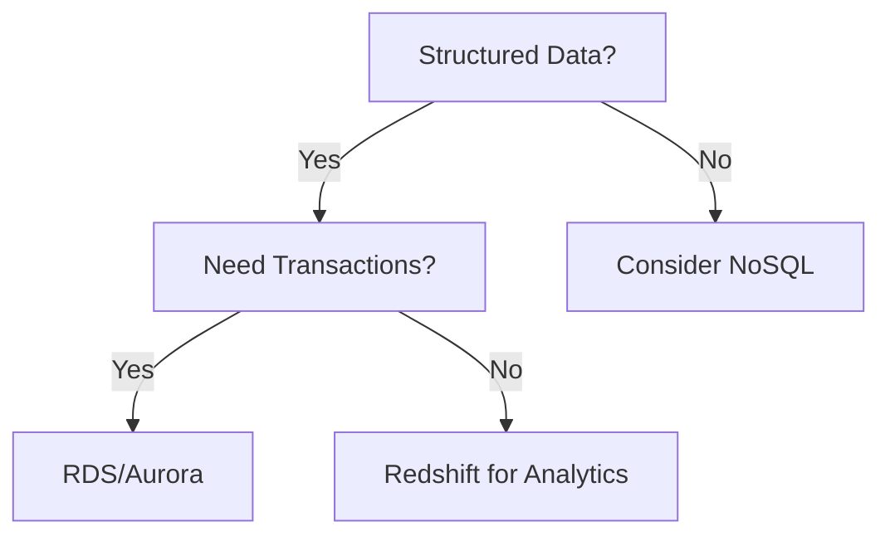

# AWS Database Services Overview - Study Guide

## Table of Contents
- [AWS Database Services Overview - Study Guide](#aws-database-services-overview---study-guide)
  - [Table of Contents](#table-of-contents)
  - [Learning Objectives](#learning-objectives)
    - [Core Competencies](#core-competencies)
  - [Database Services Overview](#database-services-overview)
    - [Service Categories](#service-categories)
  - [Amazon Redshift vs Aurora](#amazon-redshift-vs-aurora)
    - [Feature Comparison](#feature-comparison)
  - [AWS DMS Deep Dive](#aws-dms-deep-dive)
    - [Migration Types Explained](#migration-types-explained)
  - [Troubleshooting Knowledge Base](#troubleshooting-knowledge-base)
    - [Template Structure](#template-structure)
    - [Example Entry](#example-entry)
  - [Practical Applications](#practical-applications)
    - [Hands-On Lab Outline](#hands-on-lab-outline)
  - [Assessment Preparation](#assessment-preparation)
    - [Sample Questions](#sample-questions)
  - [Resources](#resources)

---

## Learning Objectives

### Core Competencies
By completing this unit, you will be able to:
1. **Catalog AWS Database Services**
   - Identify 5+ managed database services
   - Match services to use cases

2. **Define Key Services**
   - Explain Amazon Redshift's data warehouse capabilities
   - Describe Aurora's MySQL/PostgreSQL compatibility

3. **Implement AWS DMS**
   - Configure homogeneous migrations
   - Set up continuous replication

4. **Troubleshoot Effectively**
   - Document common database issues
   - Apply AWS best practices

---

## Database Services Overview

### Service Categories
| Category | Services | Best For |
|----------|---------|----------|
| **Relational** | RDS, Aurora | Transactions, ERP systems |
| **NoSQL** | DynamoDB, DocumentDB | Scalable web apps |
| **Data Warehouse** | Redshift | Analytics, BI |
| **In-Memory** | ElastiCache | Low-latency caching |
| **Migration** | DMS, SCT | Cloud transitions |

**Example Decision Flow**:


---

## Amazon Redshift vs Aurora

### Feature Comparison
| Feature | Redshift | Aurora |
|---------|----------|--------|
| **Purpose** | Analytics | OLTP |
| **Scale** | Petabytes | Terabytes |
| **Query Type** | Complex joins | Simple CRUD |
| **Latency** | Seconds | Milliseconds |
| **Cost Model** | Compute+Storage | Instance-based |

**Real-World Use**:
- **Redshift**: Retail chain analyzing 5 years of sales data
- **Aurora**: Banking processing 10,000 TPS

---

## AWS DMS Deep Dive

### Migration Types Explained
1. **Homogeneous** (MySQL → RDS MySQL)
   - Direct schema transfer
   - Minimal configuration

2. **Heterogeneous** (Oracle → Aurora PostgreSQL)
   ```mermaid
   sequenceDiagram
       Source->>SCT: Schema Conversion
       SCT->>Target: Apply Structure
       Source->>DMS: Data Replication
   ```

**Critical Settings**:
- Target table preparation: Truncate vs Drop
- LOB handling: Limited vs Unlimited
- Error handling: Stop vs Continue

---

## Troubleshooting Knowledge Base

### Template Structure
```markdown
## Issue: [Brief Description]
**Service**: [AWS Service]  
**Symptoms**: 
- Error messages
- Performance metrics

**Root Cause**:  
[Explanation]

**Solution**:  
1. Step 1
2. Step 2

**Prevention**:  
[Best Practices]
```

### Example Entry
```markdown
## Issue: RDS Storage Autoscaling Stuck
**Service**: Amazon RDS  
**Symptoms**: 
- StorageFull metric triggered
- Autoscaling not activating

**Root Cause**:  
IAM permissions missing for storage modification

**Solution**:  
1. Add `rds:ModifyDBInstance` to IAM role
2. Manually increase storage temporarily

**Prevention**:  
Test autoscaling during pre-production
```

---

## Practical Applications

### Hands-On Lab Outline
1. **Service Identification**  
   Given 3 business scenarios, select appropriate AWS databases

2. **DMS Configuration**  
   Set up MySQL to Aurora migration with:
   ```bash
   aws dms create-replication-task \
       --task-identifier mysql-to-aurora \
       --source-endpoint-arn arn:aws:dms:us-east-1:123456789012:endpoint:ABC123 \
       --target-endpoint-arn arn:aws:dms:us-east-1:123456789012:endpoint:XYZ789 \
       --replication-instance-arn arn:aws:dms:us-east-1:123456789012:rep:INSTANCE1 \
       --migration-type full-load-and-cdc
   ```

3. **Troubleshooting Drill**  
   Diagnose and resolve simulated:
   - Redshift query performance issues
   - Aurora failover delays

---

## Assessment Preparation

### Sample Questions
1. **Q**: What's the first step when migrating Oracle to PostgreSQL?  
   **A**: Use AWS SCT for schema conversion

2. **Q**: Which service provides 5x MySQL throughput?  
   **A**: Amazon Aurora

3. **Q**: True/False - DMS can migrate MongoDB to DynamoDB  
   **A**: True (via SCT schema conversion)

**Study Tip**: Create flashcards for service limits (e.g., Aurora's 15 replica limit)

---

## Resources
- [AWS Database Blog](https://aws.amazon.com/blogs/database/)
- [DMS Documentation](https://docs.aws.amazon.com/dms/latest/userguide/)
- [Troubleshooting Guide](https://aws.amazon.com/premiumsupport/technology/backup-recovery/)

**Support**: [AWS Training Contact](https://support.aws.amazon.com/#/contacts/aws-training)

© 2023 Amazon Web Services, Inc. or its affiliates. All rights reserved.