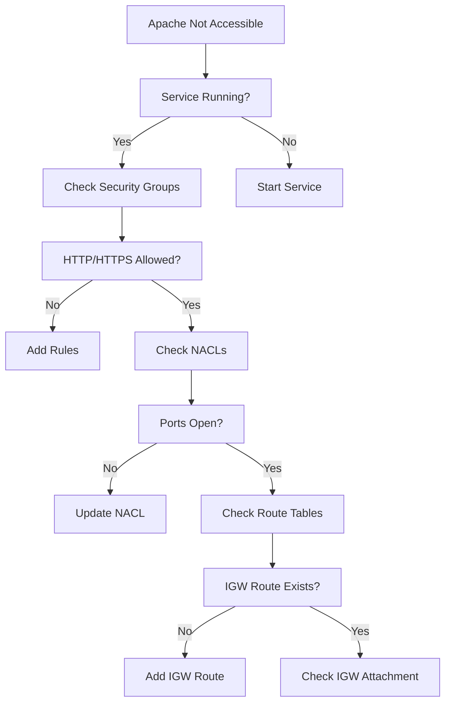

# Comprehensive Lab Guide: Troubleshooting a Network Issue in AWS

## Introduction
This lab provides a systematic approach to troubleshooting network connectivity issues for an Apache web server in AWS. We'll diagnose why a customer's Apache installation isn't accessible despite the service running.

## Task 2: Installing and Configuring Apache HTTP Server

### Step 1: Verify Apache (httpd) Status
1. Check current status:
   ```bash
   sudo systemctl status httpd.service
   ```

**Expected Output if Not Running**:
```
● httpd.service - The Apache HTTP Server
   Loaded: loaded (/usr/lib/systemd/system/httpd.service; disabled; vendor preset: disabled)
   Active: inactive (dead)
```

**Key Observations**:
- Service is installed but inactive
- Not set to start automatically at boot (disabled)

### Step 2: Start Apache Service
1. Start the service:
   ```bash
   sudo systemctl start httpd.service
   ```
2. Verify it's running:
   ```bash
   sudo systemctl status httpd.service
   ```

**Expected Running Output**:
```
● httpd.service - The Apache HTTP Server
   Loaded: loaded (/usr/lib/systemd/system/httpd.service; disabled; vendor preset: disabled)
   Active: active (running) since Thu 2023-08-24 14:30:45 UTC; 5s ago
```

### Step 3: Test Web Access
1. Attempt to access via browser:
   ```
   http://<PUBLIC_IP_OF_INSTANCE>
   ```

**Expected Issue**:
- Page fails to load despite service running
- Indicates network-level blocking

## Task 3: Investigating VPC Configuration

### Step 1: Access AWS VPC Console
1. Navigate to VPC service:
   - Recently visited services or
   - Services → Networking & Content Delivery → VPC

### Step 2: Systematic VPC Resource Check

#### 1. Verify Internet Gateway
- Navigate to "Internet Gateways"
- Confirm:
  - IGW exists
  - Attached to correct VPC
  - Associated with public subnet

**Common Issues**:
- Missing IGW
- IGW not attached
- No route to IGW in route table

#### 2. Check Route Tables
- Navigate to "Route Tables"
- Verify public subnet route table has:
  - Local route (VPC CIDR)
  - Default route (0.0.0.0/0 → IGW)

**Example Valid Route Table**:
| Destination | Target |
|-------------|--------|
| 192.168.0.0/16 | local |
| 0.0.0.0/0 | igw-12345 |

#### 3. Examine Subnet Configuration
- Navigate to "Subnets"
- Confirm:
  - Public subnet has route table with IGW route
  - Auto-assign public IP enabled

#### 4. Review Security Groups
- Navigate to "Security Groups"
- Verify rules for instance's security group:
  - Inbound: HTTP (80), HTTPS (443) from 0.0.0.0/0
  - Outbound: All traffic allowed

**Common Security Group Issues**:
- Missing HTTP/HTTPS rules
- Overly restrictive source IP ranges
- Wrong security group attached to instance

#### 5. Check Network ACLs
- Navigate to "Network ACLs"
- Verify public subnet NACL allows:
  - Inbound: Ephemeral ports (1024-65535) and HTTP/HTTPS
  - Outbound: All traffic

**Sample Working NACL Rules**:
- Inbound:
  - Rule 100: Allow HTTP (80) from 0.0.0.0/0
  - Rule 110: Allow HTTPS (443) from 0.0.0.0/0
  - Rule 120: Allow ephemeral ports (32768-65535)
- Outbound:
  - Rule 100: Allow All traffic

### Step 3: Testing Connectivity
1. From instance terminal:
   ```bash
   ping 8.8.8.8
   ```
   - Success indicates internet access
   - Failure suggests routing/NACL issues

2. Check local Apache response:
   ```bash
   curl http://localhost
   ```
   - Success confirms Apache working locally

## Root Cause Analysis

**Most Likely Issue**: 
Security group missing HTTP/HTTPS inbound rules

**Verification Steps**:
1. Check security group associated with EC2 instance
2. Confirm missing allow rules for ports 80/443
3. Compare with working configuration

## Solution Implementation

### Step 1: Update Security Group
1. Navigate to EC2 → Security Groups
2. Select instance's security group
3. Add inbound rules:
   - Type: HTTP, Port: 80, Source: 0.0.0.0/0
   - Type: HTTPS, Port: 443, Source: 0.0.0.0/0

### Step 2: Verify Fix
1. Retest in browser:
   ```
   http://<PUBLIC_IP_OF_INSTANCE>
   ```
2. Expected result: Apache test page loads

## Troubleshooting Flowchart



## Best Practices

1. **Document Configurations**: Maintain records of security group rules
2. **Least Privilege**: Only open necessary ports
3. **Naming Conventions**: Clearly name resources (e.g., "web-server-sg")
4. **Testing**: Validate changes incrementally
5. **Monitoring**: Set up alerts for security group changes

## Common Questions

**Q: Why can I ping but not access the webpage?**
A: Ping uses ICMP (layer 3), while web access needs TCP ports 80/443 open (layer 4). Check security group and NACL rules for these specific ports.

**Q: The security group looks correct but still no access?**
A: Verify:
1. NACL rules (stateless - need explicit allow)
2. Instance OS firewall (e.g., iptables)
3. Route table associations

**Q: How to make Apache start automatically?**
A: Enable the service:
```bash
sudo systemctl enable httpd.service
```

This comprehensive troubleshooting approach ensures all potential points of failure are systematically checked and validated when diagnosing network connectivity issues in AWS environments.