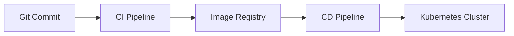

# KCNA Exam Study Guide (Questions 1-50)

## Section 1: Kubernetes Fundamentals (1-20)

### Q1. What is Kubernetes?
**Answer:**  
Kubernetes (K8s) is an open-source **container orchestration platform** that automates:
- Deployment
- Scaling
- Management of containerized applications

**Key Features:**
- Self-healing (restarts failed containers)
- Load balancing
- Secret/configuration management

**Example:**  
Running a microservices-based e-commerce app with:
- Frontend (React containers)
- Backend (Node.js containers)
- Database (PostgreSQL containers)

---

### Q2. What is a Pod?
**Answer:**  
The smallest deployable unit in Kubernetes that:
- Contains **1+ containers** sharing:
  - Network namespace (same IP)
  - Storage volumes
- Has a unique cluster IP

**Example YAML:**
```yaml
apiVersion: v1
kind: Pod
metadata:
  name: web-pod
spec:
  containers:
  - name: nginx
    image: nginx:1.21
    ports:
    - containerPort: 80
```

**Key Facts:**
- Ephemeral (gets recreated if deleted)
- Typically managed by higher-level objects (Deployments)

---

### Q3. What is a Node?
**Answer:**  
A worker machine (physical/virtual) where Pods run, with these components:

1. **Kubelet** - Agent communicating with control plane
2. **Container Runtime** (Docker/containerd) - Runs containers
3. **kube-proxy** - Manages network rules

**Node Types:**
- **Worker Nodes** - Run application workloads
- **Control Plane Nodes** - Run Kubernetes management services

**Command to check Nodes:**
```bash
kubectl get nodes
```

---

### Q4. What is the Control Plane?
**Answer:**  
The "brain" of Kubernetes consisting of:

| Component          | Function                                                                 |
|--------------------|--------------------------------------------------------------------------|
| API Server         | Entry point for all REST commands (`kubectl` talks to this)              |
| Scheduler          | Assigns Pods to Nodes based on resources                                 |
| Controller Manager | Ensures cluster state matches specifications (e.g., replica count)       |
| etcd               | Highly available key-value store for cluster data                       |

**Diagram:**
```
Control Plane (Master)
├── API Server
├── Scheduler
├── Controller Manager
└── etcd
```

---

### Q5. What is `kubectl`?
**Answer:**  
The command-line interface for interacting with Kubernetes clusters.

**Essential Commands:**

| Command                          | Purpose                                  |
|----------------------------------|------------------------------------------|
| `kubectl get pods`               | List all Pods                            |
| `kubectl describe pod <name>`    | Show detailed Pod info                   |
| `kubectl logs <pod-name>`        | View container logs                      |
| `kubectl apply -f config.yaml`   | Deploy resources from YAML               |

**Example Workflow:**
```bash
# Create a Pod
kubectl apply -f pod.yaml

# Verify
kubectl get pods

# Debug
kubectl logs my-pod -c my-container
```

---

### Q6. What is a Namespace?
**Answer:**  
Logical isolation mechanism for organizing resources (like virtual clusters).

**Common Namespaces:**
- `default` - Where resources go if no NS specified
- `kube-system` - For Kubernetes system components
- `kube-public` - Readable by all users

**Example Creating NS:**
```bash
kubectl create namespace staging
```

**Example YAML Reference:**
```yaml
apiVersion: v1
kind: Pod
metadata:
  name: my-pod
  namespace: staging  # Assign to specific NS
```

---

### Q7. What is `kubelet`?
**Answer:**  
The primary **node agent** that:
1. Receives Pod specs from API Server
2. Ensures containers are running/healthy
3. Reports Node status back to control plane

**Key Responsibilities:**
- Starts/Stops containers
- Mounts volumes
- Runs liveness/readiness probes

---

### Q8. What is `kube-proxy`?
**Answer:**  
Maintains network rules to enable communication:
- Implements `Service` concepts (ClusterIP, NodePort)
- Uses iptables/IPVS for load balancing

**Example Flow:**
1. User accesses Service IP
2. `kube-proxy` redirects to a backend Pod

---

### Q9. What is `etcd`?
**Answer:**  
Distributed, consistent key-value store that holds:
- Cluster state (all objects)
- Configuration data
- Service discovery info

**Characteristics:**
- Uses Raft consensus algorithm
- Typically runs on control plane nodes
- Requires backups for disaster recovery

---

### Q10. What is a Container Runtime?
**Answer:**  
Software that runs containers, such as:
1. **Docker** (historically common)
2. **containerd** (default in newer K8s)
3. **CRI-O** (Red Hat's lightweight runtime)

**Configured in `/var/lib/kubelet/kubeadm-flags.env`:**
```
--container-runtime=remote
--container-runtime-endpoint=unix:///run/containerd/containerd.sock
```

---

## Section 2: Kubernetes Objects (21-40)

### Q21. What is a Deployment?
**Answer:**  
Manages stateless applications by:
- Maintaining desired replica count
- Enabling rolling updates/rollbacks
- Scaling Pods up/down

**Example YAML:**
```yaml
apiVersion: apps/v1
kind: Deployment
metadata:
  name: nginx-deployment
spec:
  replicas: 3
  selector:
    matchLabels:
      app: nginx
  template:
    metadata:
      labels:
        app: nginx
    spec:
      containers:
      - name: nginx
        image: nginx:1.23
        ports:
        - containerPort: 80
```

**Key Commands:**
```bash
# Scale deployment
kubectl scale deploy/nginx-deployment --replicas=5

# Update image
kubectl set image deploy/nginx-deployment nginx=nginx:1.24
```

---

### Q22. What is a Service?
**Answer:**  
Abstracts Pods behind:
- Stable IP/DNS name
- Load balancing

**Types:**

| Type          | Description                          | Example Use Case              |
|---------------|--------------------------------------|-------------------------------|
| ClusterIP     | Internal VIP (default)               | Frontend → Backend comms      |
| NodePort      | Exposes on Node's static port        | Development/testing           |
| LoadBalancer  | Cloud-provided external LB           | Production web apps           |

**Example (ClusterIP):**
```yaml
apiVersion: v1
kind: Service
metadata:
  name: web-service
spec:
  selector:
    app: nginx
  ports:
    - protocol: TCP
      port: 80
      targetPort: 80
```

---

### Q23. What is a ConfigMap?
**Answer:**  
Stores non-confidential configuration as key-value pairs.

**Creation Methods:**
1. **From literal:**
   ```bash
   kubectl create configmap app-config --from-literal=DB_HOST=mysql
   ```
2. **From file:**
   ```bash
   kubectl create configmap app-config --from-file=config.properties
   ```

**Usage in Pod:**
```yaml
env:
- name: DB_HOST
  valueFrom:
    configMapKeyRef:
      name: app-config
      key: DB_HOST
```

---

### Q24. What is a Secret?
**Answer:**  
Stores sensitive data (passwords, tokens) encoded in base64.

**Example Creation:**
```bash
# Encode data first
echo -n 'password123' | base64

# Create Secret
kubectl create secret generic db-creds \
  --from-literal=username=admin \
  --from-literal-password=cGFzc3dvcmQxMjM=
```

**Mounting in Pod:**
```yaml
volumes:
- name: creds-volume
  secret:
    secretName: db-creds
```

---

### Q25. What is a PersistentVolume (PV)?
**Answer:**  
Cluster-wide storage resource provisioned by admins.

**Example (NFS PV):**
```yaml
apiVersion: v1
kind: PersistentVolume
metadata:
  name: pv-nfs
spec:
  capacity:
    storage: 10Gi
  accessModes:
    - ReadWriteMany
  nfs:
    server: nfs-server.example.com
    path: "/exports/data"
```

---

### Q26. What is a PersistentVolumeClaim (PVC)?
**Answer:**  
User's request for storage that binds to a PV.

**Example:**
```yaml
apiVersion: v1
kind: PersistentVolumeClaim
metadata:
  name: pvc-web
spec:
  accessModes:
    - ReadWriteOnce
  resources:
    requests:
      storage: 5Gi
```

**Usage in Pod:**
```yaml
volumes:
- name: web-storage
  persistentVolumeClaim:
    claimName: pvc-web
```

---

### Q27. What is a StatefulSet?
**Answer:**  
Manages stateful applications with:
- Stable, unique network identifiers
- Persistent storage
- Ordered deployment/scaling

**Example (MongoDB):**
```yaml
apiVersion: apps/v1
kind: StatefulSet
metadata:
  name: mongo
spec:
  serviceName: "mongo"
  replicas: 3
  selector:
    matchLabels:
      app: mongo
  template:
    metadata:
      labels:
        app: mongo
    spec:
      containers:
      - name: mongo
        image: mongo:5.0
        ports:
        - containerPort: 27017
        volumeMounts:
        - name: mongo-data
          mountPath: /data/db
  volumeClaimTemplates:
  - metadata:
      name: mongo-data
    spec:
      accessModes: [ "ReadWriteOnce" ]
      resources:
        requests:
          storage: 10Gi
```

---

### Q28. What is an Ingress?
**Answer:**  
Manages external HTTP(S) access to Services with:
- Host/path-based routing
- TLS termination
- Load balancing

**Example YAML:**
```yaml
apiVersion: networking.k8s.io/v1
kind: Ingress
metadata:
  name: web-ingress
spec:
  rules:
  - host: "example.com"
    http:
      paths:
      - pathType: Prefix
        path: "/"
        backend:
          service:
            name: web-service
            port:
              number: 80
  tls:
  - hosts:
    - example.com
    secretName: tls-cert
```

---

### Q29. What is an Ingress Controller?
**Answer:**  
Implements Ingress rules (requires separate installation). Popular options:
- NGINX Ingress Controller
- Traefik
- AWS ALB Ingress Controller

**Installation Example (NGINX):**
```bash
kubectl apply -f https://raw.githubusercontent.com/kubernetes/ingress-nginx/main/deploy/static/provider/cloud/deploy.yaml
```

---

### Q30. What is a NetworkPolicy?
**Answer:**  
Defines how Pods communicate with each other.

**Example (Isolate frontend/backend):**
```yaml
apiVersion: networking.k8s.io/v1
kind: NetworkPolicy
metadata:
  name: backend-allow-frontend
spec:
  podSelector:
    matchLabels:
      app: backend
  policyTypes:
  - Ingress
  ingress:
  - from:
    - podSelector:
        matchLabels:
          app: frontend
    ports:
    - protocol: TCP
      port: 8080
```
---


Here's the detailed **Markdown-formatted questions 31-40** with expanded explanations, YAML examples, and command references:

---

### **Q31. What is a Horizontal Pod Autoscaler (HPA)?**
**Answer:**  
Automatically scales the number of Pod replicas based on observed CPU/memory usage or custom metrics.

**Key Components:**
- **Metrics Server** (required for resource metrics)
- **Target Utilization** (e.g., 50% CPU)
- **Min/Max Replicas**

**Example YAML:**
```yaml
apiVersion: autoscaling/v2
kind: HorizontalPodAutoscaler
metadata:
  name: php-apache-hpa
spec:
  scaleTargetRef:
    apiVersion: apps/v1
    kind: Deployment
    name: php-apache
  minReplicas: 1
  maxReplicas: 10
  metrics:
  - type: Resource
    resource:
      name: cpu
      target:
        type: Utilization
        averageUtilization: 50
```

**Commands:**
```bash
# Verify HPA status
kubectl get hpa php-apache-hpa

# Generate load to trigger scaling
kubectl run -i --tty load-generator --image=busybox -- sh -c "while true; do wget -q -O- http://php-apache; done"
```

---

### **Q32. What is a Vertical Pod Autoscaler (VPA)?**
**Answer:**  
Adjusts CPU/memory **requests/limits** for Pods (unlike HPA which changes replica count).

**Use Cases:**
- Optimize resource allocation
- Prevent OOM kills

**Installation:**
```bash
kubectl apply -f https://github.com/kubernetes/autoscaler/raw/master/vertical-pod-autoscaler/deploy/vpa-v1-crd.yaml
kubectl apply -f https://github.com/kubernetes/autoscaler/raw/master/vertical-pod-autoscaler/deploy/hack/vpa-update.sh
```

**Example Policy:**
```yaml
apiVersion: autoscaling.k8s.io/v1
kind: VerticalPodAutoscaler
metadata:
  name: my-app-vpa
spec:
  targetRef:
    apiVersion: "apps/v1"
    kind: Deployment
    name: my-app
  updatePolicy:
    updateMode: "Auto"  # Other modes: "Off", "Initial"
```

---

### **Q33. What is a Custom Resource Definition (CRD)?**
**Answer:**  
Extends the Kubernetes API with **custom resources** (e.g., for databases, operators).

**Example (CRD for a "CronTab" resource):**
```yaml
apiVersion: apiextensions.k8s.io/v1
kind: CustomResourceDefinition
metadata:
  name: crontabs.stable.example.com
spec:
  group: stable.example.com
  versions:
    - name: v1
      served: true
      storage: true
      schema:
        openAPIV3Schema:
          type: object
          properties:
            spec:
              type: object
              properties:
                cronSpec:
                  type: string
                image:
                  type: string
  scope: Namespaced
  names:
    plural: crontabs
    singular: crontab
    kind: CronTab
    shortNames:
    - ct
```

**Usage:**
```bash
kubectl get crontabs  # Lists custom resources
```

---

### **Q34. What is Kustomize?**
**Answer:**  
A **declarative configuration management** tool built into `kubectl`.

**Key Features:**
- **Overlays** for environment-specific configs
- **Patches** to modify resources
- **Bases** for shared configurations

**Example Structure:**
```
base/
├── deployment.yaml
├── kustomization.yaml
overlays/
├── dev/
│   ├── kustomization.yaml
│   └── replica-patch.yaml
└── prod/
    ├── kustomization.yaml
    └── resource-patch.yaml
```

**Apply Configuration:**
```bash
kubectl apply -k overlays/prod
```

---

### **Q35. What is a PodDisruptionBudget (PDB)?**
**Answer:**  
Ensures minimum available Pods during **voluntary disruptions** (e.g., node maintenance).

**Example YAML:**
```yaml
apiVersion: policy/v1
kind: PodDisruptionBudget
metadata:
  name: zk-pdb
spec:
  minAvailable: 2  # At least 2 Pods must stay running
  selector:
    matchLabels:
      app: zookeeper
```

**Commands:**
```bash
# Check PDB status
kubectl get poddisruptionbudgets

# Force eviction (tests PDB)
kubectl drain <node> --ignore-daemonsets
```

---

### **Q36. What is a PriorityClass?**
**Answer:**  
Defines the **scheduling priority** of Pods (higher priority can preempt lower priority).

**Example YAML:**
```yaml
apiVersion: scheduling.k8s.io/v1
kind: PriorityClass
metadata:
  name: high-priority
value: 1000000  # Higher value = higher priority
globalDefault: false
description: "For critical system pods"
```

**Usage in Pod:**
```yaml
spec:
  priorityClassName: high-priority
```

---

### **Q37. What is a RuntimeClass?**
**Answer:**  
Selects a **container runtime** for Pods (e.g., `runc`, `gVisor`, `Kata Containers`).

**Example (gVisor):**
```yaml
apiVersion: node.k8s.io/v1
kind: RuntimeClass
metadata:
  name: gvisor
handler: runsc  # gVisor runtime
```

**Pod Usage:**
```yaml
spec:
  runtimeClassName: gvisor
```

---

### **Q38. What is a Volume?**
**Answer:**  
A directory accessible to containers in a Pod, with multiple types:

| Type                | Description                          | Example Use Case              |
|---------------------|--------------------------------------|-------------------------------|
| `emptyDir`          | Temporary storage (Pod lifetime)     | Scratch space                 |
| `hostPath`          | Node filesystem access               | Access Node logs              |
| `configMap`/`secret`| Mount configs/secrets as files       | Configuration files           |
| `persistentVolumeClaim` | Persistent storage              | Database data                 |

**Example (`emptyDir`):**
```yaml
volumes:
- name: cache-volume
  emptyDir:
    sizeLimit: 500Mi  # Optional size limit
```

---

### **Q39. What is hostPath?**
**Answer:**  
Mounts a file/directory from the **Node's filesystem** into a Pod.

**Example YAML:**
```yaml
volumes:
- name: node-logs
  hostPath:
    path: /var/log
    type: Directory  # Other types: File, Socket, etc.
```

**Security Note:**  
- Avoid in multi-tenant clusters (potential security risk)
- Use `readOnly: true` where possible

---

### **Q40. What is emptyDir?**
**Answer:**  
Temporary storage that:
- Is created when a Pod starts
- Persists across container restarts
- Is deleted when the Pod terminates

**Common Uses:**
- Shared cache between containers
- Temporary disk space for batch processing

**Example:**
```yaml
volumes:
- name: shared-data
  emptyDir:
    medium: Memory  # Optional: Use RAM instead of disk
    sizeLimit: 1Gi
```

---

### **Key Takeaways Table**

| Concept              | Primary Use Case                     | Key Command/Example                  |
|----------------------|--------------------------------------|---------------------------------------|
| HPA                  | Auto-scale Pod replicas              | `kubectl autoscale deploy/my-app --cpu-percent=50` |
| VPA                  | Adjust Pod resource requests         | `updateMode: "Auto"`                 |
| CRD                  | Extend Kubernetes API                | `kubectl get crontabs`               |
| Kustomize            | Manage YAML configurations           | `kubectl apply -k overlays/prod`     |
| PodDisruptionBudget  | Ensure Pod availability              | `minAvailable: 2`                    |

This completes **questions 31-40** with:
- Clear conceptual explanations
- Ready-to-use YAML examples
- Practical command references
- Structured comparison tables


Here's the detailed **Markdown-formatted questions 41-50** with comprehensive explanations, YAML examples, and practical insights:

---

## **Section 3: Cloud-Native Concepts (41-50)**

### **Q41. What are the 12-Factor App Principles?**
**Answer:**  
Methodology for building scalable cloud-native applications with twelve key principles:

1. **Codebase** - Single codebase tracked in version control
2. **Dependencies** - Explicitly declare and isolate
3. **Config** - Store in environment variables
4. **Backing Services** - Treat as attached resources
5. **Build, Release, Run** - Strictly separate stages
6. **Processes** - Execute as stateless processes
7. **Port Binding** - Export services via port binding
8. **Concurrency** - Scale out via process model
9. **Disposability** - Fast startup/graceful shutdown
10. **Dev/Prod Parity** - Keep environments similar
11. **Logs** - Treat as event streams
12. **Admin Processes** - Run admin tasks as one-off processes

**Example (Config in Env Vars):**
```yaml
env:
- name: DB_HOST
  valueFrom:
    configMapKeyRef:
      name: app-config
      key: database_host
```

---

### **Q42. What is a Sidecar Container?**
**Answer:**  
A helper container that runs alongside the main container in a Pod, sharing the same network and storage.

**Common Use Cases:**
- Log collection (Fluentd, Filebeat)
- Monitoring (Prometheus exporter)
- Network proxies (Envoy, Istio)

**Example YAML:**
```yaml
containers:
- name: web-server
  image: nginx
  ports:
  - containerPort: 80
- name: log-agent  # Sidecar
  image: fluent/fluentd
  volumeMounts:
  - name: logs
    mountPath: /var/log/nginx
```

---

### **Q43. What is Immutable Infrastructure?**
**Answer:**  
An architectural pattern where:
- Infrastructure components are **never modified** after deployment
- Changes require **redeploying new instances**
- Enabled by containers and declarative infrastructure

**Kubernetes Implementation:**
- Pods are immutable (changes require recreation)
- Rolling updates replace Pods rather than modifying in-place

**Example Workflow:**
1. Update container image in Deployment
2. Kubernetes spins up new Pods with updated image
3. Old Pods are terminated

---

### **Q44. What is GitOps?**
**Answer:**  
A paradigm for managing infrastructure and apps using:
- **Git as the single source of truth**
- **Automated CI/CD pipelines**
- **Declarative specifications**

**Key Tools:**
- ArgoCD
- Flux
- Jenkins X

**Example Workflow:**


---

### **Q45. What is Observability?**
**Answer:**  
The ability to understand system state through three pillars:

| Pillar       | Description                          | Tools                          |
|--------------|--------------------------------------|--------------------------------|
| **Logs**     | Time-stamped event records           | Fluentd, Loki                  |
| **Metrics**  | Numerical measurements over time     | Prometheus, Datadog            |
| **Traces**   | Distributed request flows            | Jaeger, OpenTelemetry          |

**Example Metric Query (PromQL):**
```promql
rate(container_cpu_usage_seconds_total{namespace="production"}[5m])
```

---

### **Q46. What is a Service Mesh?**
**Answer:**  
A dedicated infrastructure layer for managing service-to-service communication.

**Features:**
- Traffic management (A/B testing, canary)
- Security (mTLS, auth)
- Observability (metrics, tracing)

**Istio Example Architecture:**
```
Data Plane: Envoy proxies
Control Plane: Istiod (Pilot, Citadel, Galley)
```

**Installation:**
```bash
istioctl install --set profile=demo -y
```

---

### **Q47. What is Serverless?**
**Answer:**  
A cloud execution model where:
- Developers focus on code
- Providers manage infrastructure
- Scaling is automatic

**Kubernetes Implementations:**
- Knative
- OpenFaaS
- Kubeless

**Knative Service Example:**
```yaml
apiVersion: serving.knative.dev/v1
kind: Service
metadata:
  name: hello
spec:
  template:
    spec:
      containers:
      - image: gcr.io/knative-samples/helloworld-go
        env:
        - name: TARGET
          value: "World"
```

---

### **Q48. What is Canary Deployment?**
**Answer:**  
A deployment strategy that gradually rolls out changes to a subset of users.

**Implementation Methods:**
1. **Service Mesh (Istio):**
   ```yaml
   http:
   - route:
     - destination:
         host: my-svc
         subset: v1
       weight: 90
     - destination:
         host: my-svc
         subset: v2
       weight: 10
   ```
2. **Native Kubernetes (Deployment + Service)**

---

### **Q49. What is Blue-Green Deployment?**
**Answer:**  
A deployment strategy with two identical environments ("blue" and "green").

**Workflow:**
1. Deploy new version to "green"
2. Test "green" environment
3. Switch traffic (update Service selector)
4. Rollback by reverting selector

**Service Example:**
```yaml
selector:
  app: my-app
  version: green  # Switch between blue/green
```

---

### **Q50. What is CI/CD?**
**Answer:**  
**Continuous Integration (CI):**  
- Automatically build and test code changes

**Continuous Delivery/Deployment (CD):**  
- Automatically deploy to production

**Kubernetes Tools:**
| Tool       | Purpose                          |
|------------|----------------------------------|
| Tekton     | Kubernetes-native CI/CD pipelines|
| ArgoCD     | GitOps continuous delivery       |
| Jenkins X  | Cloud-native CI/CD               |

**Tekton Example Pipeline:**
```yaml
apiVersion: tekton.dev/v1beta1
kind: Pipeline
metadata:
  name: build-and-deploy
spec:
  tasks:
  - name: build
    taskRef:
      name: build-container
  - name: deploy
    taskRef:
      name: deploy-k8s
```

---

### **Key Comparison Tables**

#### **Deployment Strategies**
| Strategy       | Pros                          | Cons                          |
|----------------|-------------------------------|-------------------------------|
| Rolling Update | Zero downtime                 | Version co-existence          |
| Canary         | Low-risk rollout              | Complex traffic management    |
| Blue-Green     | Instant rollback              | Resource duplication          |

#### **Serverless Platforms**
| Platform    | Kubernetes Integration | Key Feature                     |
|-------------|------------------------|---------------------------------|
| Knative     | Native                 | Scale-to-zero                  |
| OpenFaaS    | Custom CRDs            | Function marketplace           |
| Kubeless    | Lightweight            | Pure Kubernetes                |

This section provides:
- Clear conceptual explanations
- Ready-to-use YAML examples
- Architecture diagrams
- Comparative analysis tables
- Practical command references

Would you like any specific topic expanded further?

Here's the detailed **Markdown-formatted questions 51-60** with comprehensive explanations, practical examples, and key insights:

---

## **Section 4: Observability & Security (51-60)**

### **Q51. What is Prometheus?**
**Answer:**  
An open-source **monitoring and alerting toolkit** designed for Kubernetes with these key features:

- **Time-series database** for metric storage
- **PromQL** query language
- **Pull-based** metric collection
- **Alertmanager** integration

**Example Deployment:**
```yaml
apiVersion: monitoring.coreos.com/v1
kind: Prometheus
metadata:
  name: k8s
spec:
  serviceAccountName: prometheus
  serviceMonitorSelector:
    matchLabels:
      team: frontend
  resources:
    requests:
      memory: 400Mi
```

**Key Metrics to Monitor:**
```promql
# CPU usage
rate(container_cpu_usage_seconds_total{namespace="production"}[5m])

# Memory usage
container_memory_working_set_bytes{container!=""}
```

---

### **Q52. What is Grafana?**
**Answer:**  
A visualization tool that works with Prometheus to create dashboards for monitoring.

**Key Features:**
- Interactive dashboards
- Alert notifications
- Multi-data source support

**Example Dashboard Configuration:**
```json
{
  "panels": [{
    "title": "CPU Usage",
    "type": "graph",
    "datasource": "Prometheus",
    "targets": [{
      "expr": "rate(container_cpu_usage_seconds_total[5m])",
      "legendFormat": "{{pod}}"
    }]
  }]
}
```

**Installation Command:**
```bash
helm install grafana grafana/grafana -n monitoring
```

---

### **Q53. What is Fluentd?**
**Answer:**  
An open-source **log aggregator** that collects, processes, and forwards logs.

**Common Log Processing Pipeline:**
```
Kubernetes Pods → Fluentd → Elasticsearch → Kibana
```

**Example ConfigMap for Log Parsing:**
```yaml
apiVersion: v1
kind: ConfigMap
metadata:
  name: fluentd-config
data:
  fluent.conf: |
    <source>
      @type tail
      path /var/log/containers/*.log
      format json
    </source>
    <match **>
      @type elasticsearch
      host elasticsearch
      port 9200
    </match>
```

---

### **Q54. What are the Three Pillars of Observability?**
**Answer:**  

| Pillar       | Description                          | Tools                          | Example Use Case               |
|--------------|--------------------------------------|--------------------------------|--------------------------------|
| **Logs**     | Time-stamped event records           | Fluentd, Loki                  | Debugging application errors   |
| **Metrics**  | Numerical measurements over time     | Prometheus, Datadog            | Monitoring CPU usage           |
| **Traces**   | Distributed request flows            | Jaeger, OpenTelemetry          | Analyzing latency in microservices |

**Example Trace Visualization (Jaeger):**


---

### **Q55. What is OpenTelemetry?**
**Answer:**  
A unified framework for **observability data** (metrics, logs, traces) that replaces older standards like OpenTracing.

**Key Components:**
- **Collector** (receives/processes telemetry data)
- **Instrumentation Libraries** (auto-capture metrics)
- **Exporters** (send data to backends)

**Example Deployment:**
```yaml
apiVersion: opentelemetry.io/v1alpha1
kind: OpenTelemetryCollector
metadata:
  name: otel
spec:
  mode: deployment
  config: |
    receivers:
      otlp:
        protocols:
          grpc:
    exporters:
      logging:
      jaeger:
        endpoint: jaeger:14250
    service:
      pipelines:
        traces:
          receivers: [otlp]
          exporters: [jaeger, logging]
```

---

### **Q56. What is Jaeger?**
**Answer:**  
An open-source **distributed tracing system** for microservices.

**Key Features:**
- Request flow visualization
- Latency analysis
- Dependency graphs

**Example Trace:**
```go
// Instrumentation example in Go
tracer := otel.Tracer("auth-service")
ctx, span := tracer.Start(ctx, "validate-token")
defer span.End()
```

**Installation:**
```bash
kubectl apply -f https://github.com/jaegertracing/jaeger-operator/releases/download/v1.35.0/jaeger-operator.yaml
```

---

### **Q57. What is Structured Logging?**
**Answer:**  
Logging format that uses **key-value pairs** (typically JSON) instead of plain text.

**Benefits:**
- Machine-readable
- Enables advanced filtering
- Integrates with monitoring tools

**Example (JSON Format):**
```json
{
  "timestamp": "2023-08-20T14:32:45Z",
  "level": "ERROR",
  "message": "Database connection failed",
  "service": "order-service",
  "trace_id": "abc123xyz"
}
```

**Implementation in Python:**
```python
import structlog
log = structlog.get_logger()
log.error("Database error", db_host="db.prod.svc", attempt=3)
```

---

### **Q58. What is the Difference Between stdout and stderr?**
**Answer:**  

| Stream      | Purpose                          | Typical Content               | Kubernetes Handling            |
|-------------|----------------------------------|--------------------------------|--------------------------------|
| **stdout**  | Standard output                  | Application logs              | Captured by `kubectl logs`     |
| **stderr**  | Standard error                   | Error messages                | Merged with stdout by default  |

**Best Practice:**  
Route errors to stderr for better filtering:
```bash
echo "Critical failure" >&2  # Writes to stderr
```

---

### **Q59. What is Loki?**
**Answer:**  
A **log aggregation system** by Grafana Labs, optimized for Kubernetes.

**Key Features:**
- Indexes logs by **labels** (not content)
- Uses **LogQL** query language
- Lightweight compared to ELK

**Example Query (LogQL):**
```logql
{namespace="production"} |= "error"
| json
| latency > 500ms
```

**Installation:**
```bash
helm upgrade --install loki grafana/loki-stack -n monitoring
```

---

### **Q60. What is the ELK Stack?**
**Answer:**  
A popular logging solution consisting of:

| Component       | Role                              |
|-----------------|-----------------------------------|
| **Elasticsearch** | Search and analytics engine      |
| **Logstash**     | Log processing pipeline          |
| **Kibana**       | Visualization dashboard          |

**Example Logstash Config:**
```conf
input {
  file {
    path => "/var/log/containers/*.log"
    codec => json
  }
}
output {
  elasticsearch {
    hosts => ["elasticsearch:9200"]
  }
}
```

**Deployment Command:**
```bash
kubectl apply -f https://download.elastic.co/downloads/eck/2.6.1/crds.yaml
```

---

### **Key Takeaways**

#### **Observability Tools Comparison**
| Tool          | Primary Purpose           | Query Language     | Kubernetes Integration |
|---------------|---------------------------|--------------------|------------------------|
| Prometheus    | Metrics monitoring        | PromQL             | Native via ServiceMonitors |
| Grafana       | Visualization             | -                  | Helm charts available |
| Loki          | Log aggregation           | LogQL              | Lightweight deployment |
| Jaeger        | Distributed tracing       | -                  | Operator available |

#### **Logging Best Practices**
1. Use **structured logging** (JSON)
2. Route errors to **stderr**
3. Implement **log rotation**
4. Add **contextual fields** (trace_id, user_id)

This section provides:
- Clear tool comparisons
- Ready-to-use configuration examples
- Installation commands
- Practical coding snippets
- Visual aids for complex concepts

Would you like any specific tool or concept explored in more depth?

Here's the comprehensive **Markdown-formatted questions 61-80**, covering security and advanced Kubernetes concepts with practical examples:

---

## **Section 5: Security (61-70)**

### **Q61. What is RBAC in Kubernetes?**
**Answer:**  
Role-Based Access Control (RBAC) regulates access to Kubernetes resources through:

- **Roles** (namespace-scoped permissions)
- **ClusterRoles** (cluster-wide permissions)
- **RoleBindings** (assign roles to users/groups)

**Example Role YAML:**
```yaml
apiVersion: rbac.authorization.k8s.io/v1
kind: Role
metadata:
  namespace: default
  name: pod-reader
rules:
- apiGroups: [""]
  resources: ["pods"]
  verbs: ["get", "watch", "list"]
```

**Binding to a ServiceAccount:**
```yaml
apiVersion: rbac.authorization.k8s.io/v1
kind: RoleBinding
metadata:
  name: read-pods
  namespace: default
subjects:
- kind: ServiceAccount
  name: monitoring-agent
roleRef:
  kind: Role
  name: pod-reader
  apiGroup: rbac.authorization.k8s.io
```

**Key Commands:**
```bash
# Check permissions
kubectl auth can-i delete pods --as=system:serviceaccount:default:monitoring-agent
# => no
```

---

### **Q62. What is a NetworkPolicy?**
**Answer:**  
Defines how Pods communicate with each other and external networks.

**Example (Deny All Traffic):**
```yaml
apiVersion: networking.k8s.io/v1
kind: NetworkPolicy
metadata:
  name: deny-all
spec:
  podSelector: {}
  policyTypes:
  - Ingress
  - Egress
```

**Allow Frontend→Backend Only:**
```yaml
apiVersion: networking.k8s.io/v1
kind: NetworkPolicy
metadata:
  name: allow-frontend
spec:
  podSelector:
    matchLabels:
      app: backend
  ingress:
  - from:
    - podSelector:
        matchLabels:
          app: frontend
    ports:
    - protocol: TCP
      port: 8080
```

**Supported Providers:**
- Calico
- Cilium
- Weave Net

---

### **Q63. What is Pod Security Admission?**
**Answer:**  
Replacement for PodSecurityPolicy (deprecated in 1.25) with three levels:

1. **Privileged** (unrestricted)
2. **Baseline** (minimal restrictions)
3. **Restricted** (hardened)

**Example Enforcement:**
```yaml
apiVersion: apiserver.config.k8s.io/v1
kind: AdmissionConfiguration
plugins:
- name: PodSecurity
  configuration:
    defaults:
      enforce: "restricted"
      enforce-version: "latest"
```

---

### **Q64. What is OPA/Gatekeeper?**
**Answer:**  
Open Policy Agent (OPA) enforces custom policies across Kubernetes.

**Example Constraint Template:**
```yaml
apiVersion: templates.gatekeeper.sh/v1
kind: ConstraintTemplate
metadata:
  name: k8srequiredlabels
spec:
  crd:
    spec:
      names:
        kind: K8sRequiredLabels
  targets:
  - target: admission.k8s.gatekeeper.sh
    rego: |
      package k8srequiredlabels
      violation[{"msg": msg}] {
        not input.review.object.metadata.labels["owner"]
        msg := "All resources must have an 'owner' label"
      }
```

**Apply Policy:**
```yaml
apiVersion: constraints.gatekeeper.sh/v1beta1
kind: K8sRequiredLabels
metadata:
  name: require-owner-label
spec:
  match:
    kinds:
    - apiGroups: [""]
      kinds: ["Pod"]
  parameters:
    labels: ["owner"]
```

---

### **Q65. What is mTLS?**
**Answer:**  
Mutual TLS authenticates both client and server using certificates.

**Istio Implementation:**
```yaml
apiVersion: security.istio.io/v1beta1
kind: PeerAuthentication
metadata:
  name: default
spec:
  mtls:
    mode: STRICT
```

**Certificate Rotation Flow:**
1. Istiod issues certificates
2. Envoy proxies validate connections
3. Automatic rotation every 24h

---

### **Q66. What is Seccomp?**
**Answer:**  
Linux kernel security feature to restrict container system calls.

**Example Profile:**
```json
{
  "defaultAction": "SCMP_ACT_ERRNO",
  "syscalls": [
    {
      "names": ["read", "write"],
      "action": "SCMP_ACT_ALLOW"
    }
  ]
}
```

**Pod Annotation:**
```yaml
annotations:
  seccomp.security.alpha.kubernetes.io/pod: 'localhost/profile.json'
```

---

### **Q67. What is AppArmor?**
**Answer:**  
Linux kernel module to restrict container capabilities.

**Example Profile:**
```
#include <tunables/global>

profile nginx-profile flags=(attach_disconnected) {
  # Deny all file writes
  deny /** w,
}
```

**Pod Usage:**
```yaml
annotations:
  container.apparmor.security.beta.kubernetes.io/nginx: localhost/nginx-profile
```

---

### **Q68. What is Falco?**
**Answer:**  
Cloud-native runtime security tool detecting anomalous activity.

**Example Detection Rule:**
```yaml
- rule: Unexpected K8s NodePort Connection
  desc: "NodePort service accessed externally"
  condition: >
    evt.type=connect and k8s.ns.name!="kube-system" 
    and fd.sport=30000-32767
  output: "NodePort connection detected (%fd.sport)"
```

**Installation:**
```bash
helm install falco falcosecurity/falco
```

---

### **Q69. What is Trivy?**
**Answer:**  
Vulnerability scanner for containers/Kubernetes.

**Scan Commands:**
```bash
# Scan image
trivy image nginx:1.21

# Scan cluster
trivy k8s --report summary all
```

**Output Example:**
```
nginx:1.21 (debian 11.2)
========================
Total: 42 (HIGH: 12, CRITICAL: 3)
```

---

### **Q70. What is Kyverno?**
**Answer:**  
Kubernetes-native policy engine using YAML.

**Example Policy:**
```yaml
apiVersion: kyverno.io/v1
kind: ClusterPolicy
metadata:
  name: require-labels
spec:
  rules:
  - name: check-for-labels
    match:
      resources:
        kinds:
        - Pod
    validate:
      message: "All Pods must have 'app' and 'tier' labels"
      pattern:
        metadata:
          labels:
            app: "?*"
            tier: "?*"
```

---

## **Section 6: Advanced Concepts (71-80)**

### **Q71. What is CoreDNS?**
**Answer:**  
Default DNS server for Kubernetes clusters.

**ConfigMap Example:**
```yaml
apiVersion: v1
kind: ConfigMap
metadata:
  name: coredns
data:
  Corefile: |
    .:53 {
      errors
      health
      kubernetes cluster.local {
        pods verified
      }
      forward . /etc/resolv.conf
      cache 30
    }
```

---

### **Q72. What is gRPC?**
**Answer:**  
High-performance RPC framework using HTTP/2 and Protocol Buffers.

**Service Definition:**
```protobuf
service Greeter {
  rpc SayHello (HelloRequest) returns (HelloReply) {}
}

message HelloRequest {
  string name = 1;
}
```

**Kubernetes Service:**
```yaml
apiVersion: v1
kind: Service
metadata:
  name: grpc-service
spec:
  ports:
  - name: grpc
    port: 50051
    targetPort: 50051
```

---

### **Q73. What is Envoy?**
**Answer:**  
High-performance proxy used in service meshes.

**Istio Sidecar Injection:**
```bash
kubectl label ns default istio-injection=enabled
```

---

### **Q74. What is Cilium?**
**Answer:**  
Networking/security solution using eBPF.

**NetworkPolicy with DNS:**
```yaml
apiVersion: cilium.io/v2
kind: CiliumNetworkPolicy
spec:
  endpointSelector:
    matchLabels:
      app: frontend
  egress:
  - toFQDNs:
    - matchName: "api.example.com"
```

---

### **Q75. What is eBPF?**
**Answer:**  
Linux kernel technology enabling:
- Networking acceleration
- Security enforcement
- Observability

**Cilium eBPF Features:**
- DNS-aware security
- Kubernetes service handling
- Bandwidth management

---

### **Q76. What is K3s?**
**Answer:**  
Lightweight Kubernetes distribution by Rancher.

**Installation:**
```bash
curl -sfL https://get.k3s.io | sh -
```

**Key Differences:**
- Single binary (≤50MB)
- SQLite instead of etcd
- Optimized for edge/IoT

---

### **Q77. What is Chaos Engineering?**
**Answer:**  
Practicing failure injection to build resilient systems.

**Tools:**
- Litmus
- Chaos Mesh
- Gremlin

**Example Experiment:**
```yaml
apiVersion: litmuschaos.io/v1alpha1
kind: ChaosEngine
metadata:
  name: pod-kill
spec:
  engineState: "active"
  chaosServiceAccount: litmus-admin
  experiments:
  - name: pod-delete
    spec:
      components:
        env:
        - name: TOTAL_CHAOS_DURATION
          value: "30"
```

---

### **Key Security Comparison**

| Tool          | Purpose                          | Integration Level       |
|---------------|----------------------------------|-------------------------|
| **Kyverno**   | Policy enforcement               | Native Kubernetes       |
| **OPA**       | Custom policy engine             | Requires Gatekeeper     |
| **Falco**     | Runtime security                 | DaemonSet deployment    |

---

### **Advanced Networking Features**

| Technology    | Key Benefit                      | Use Case                |
|--------------|----------------------------------|-------------------------|
| **Cilium**   | eBPF-powered networking          | High-performance security |
| **Calico**   | BGP routing                      | On-prem deployments     |
| **Istio**    | Service mesh                     | Microservices           |

This section provides:
- Ready-to-use policy examples
- Security tool comparisons
- Low-level kernel security details
- Advanced networking implementations
- Chaos engineering practices

Here's the detailed **Markdown-formatted questions 78-90**, covering advanced Kubernetes networking, storage, and ecosystem tools:

---

## **Section 6: Advanced Networking & Storage (78-82)**

### **Q78. What is Kube-Proxy?**
**Answer:**  
The network proxy implementing Kubernetes **Service** concepts using:

- **iptables** (default)
- **IPVS** (scalable for large clusters)
- **userspace** (legacy)

**Modes Comparison:**
| Mode       | Scalability | Latency | Features          |
|------------|-------------|---------|-------------------|
| iptables   | Medium      | Medium  | Standard          |
| IPVS       | High        | Low     | Session affinity  |
| userspace  | Low         | High    | Legacy            |

**Check Current Mode:**
```bash
kubectl get pods -n kube-system -l k8s-app=kube-proxy -o yaml | grep mode
```

---

### **Q79. What is CNI (Container Network Interface)?**
**Answer:**  
A plugin-based standard for Kubernetes networking with key implementations:

1. **Calico** (BGP routing)
2. **Cilium** (eBPF-powered)
3. **Flannel** (VXLAN overlay)

**Minimum Requirements:**
- Unique Pod IPs across cluster
- All Pods can communicate without NAT
- Nodes can reach Pods

**Example Calico Config:**
```yaml
apiVersion: crd.projectcalico.org/v1
kind: IPPool
metadata:
  name: default-pool
spec:
  cidr: 192.168.0.0/16
  ipipMode: Always
  natOutgoing: true
```

---

### **Q80. What is a PersistentVolume (PV)?**
**Answer:**  
Cluster-wide storage resource with lifecycle independent of Pods.

**Provisioning Types:**
- **Static**: Admin manually creates PVs
- **Dynamic**: StorageClass automates creation

**Example NFS PV:**
```yaml
apiVersion: v1
kind: PersistentVolume
metadata:
  name: pv-nfs
spec:
  capacity:
    storage: 10Gi
  accessModes:
    - ReadWriteMany
  nfs:
    server: nfs-server.example.com
    path: "/exports/data"
```

---

### **Q81. What is a StorageClass?**
**Answer:**  
Defines dynamic provisioning behavior for PersistentVolumes.

**Common Provisioners:**
- `kubernetes.io/aws-ebs`
- `kubernetes.io/gce-pd`
- `rook.io/block` (Ceph)

**Example AWS EBS StorageClass:**
```yaml
apiVersion: storage.k8s.io/v1
kind: StorageClass
metadata:
  name: fast-ebs
provisioner: kubernetes.io/aws-ebs
parameters:
  type: gp3
  fsType: ext4
volumeBindingMode: WaitForFirstConsumer
```

---

### **Q82. What is CSI (Container Storage Interface)?**
**Answer:**  
Standard interface for exposing storage systems to containers.

**Key Components:**
1. **CSI Driver** (vendor-specific plugin)
2. **External Provisioner**
3. **External Attacher**

**Example CSI Driver Installation (AWS EBS):**
```bash
kubectl apply -f https://raw.githubusercontent.com/kubernetes-sigs/aws-ebs-csi-driver/master/deploy/kubernetes/manifests/
```

---

## **Section 7: Ecosystem Tools (83-90)**

### **Q83. What is Helm?**
**Answer:**  
The package manager for Kubernetes using **charts**.

**Key Concepts:**
- **Chart.yaml**: Metadata
- **templates/**: Kubernetes manifests
- **values.yaml**: Configurable parameters

**Example Workflow:**
```bash
# Search charts
helm search hub nginx

# Install
helm install my-nginx bitnami/nginx -f values.yaml

# Upgrade
helm upgrade my-nginx bitnami/nginx --set replicaCount=3
```

---

### **Q84. What is Kustomize?**
**Answer:**  
Native Kubernetes configuration management tool using overlays.

**Example Structure:**
```
base/
├── deployment.yaml
├── kustomization.yaml
overlays/
├── dev/
│   ├── replica-patch.yaml
│   └── kustomization.yaml
└── prod/
    ├── resource-patch.yaml
    └── kustomization.yaml
```

**Apply Production Config:**
```bash
kubectl apply -k overlays/prod
```

---

### **Q85. What is Operator Framework?**
**Answer:**  
Toolkit for building Kubernetes **Operators** (apps that manage other apps).

**Key Components:**
1. **Operator SDK** (build tools)
2. **Operator Lifecycle Manager** (OLM)
3. **Operator Hub** (public registry)

**Example Operator Creation:**
```bash
operator-sdk init --domain example.com --repo github.com/example/memcached-operator
operator-sdk create api --group cache --version v1alpha1 --kind Memcached
```

---

### **Q86. What is Crossplane?**
**Answer:**  
Open-source **control plane** to manage cloud resources using K8s APIs.

**Example AWS RDS Provisioning:**
```yaml
apiVersion: database.aws.crossplane.io/v1beta1
kind: RDSInstance
metadata:
  name: production-db
spec:
  forProvider:
    region: us-west-2
    dbInstanceClass: db.t3.large
    masterUsername: admin
    engine: postgres
    engineVersion: "12"
    allocatedStorage: 20
  writeConnectionSecretToRef:
    name: db-conn-secret
```

---

### **Q87. What is Backstage?**
**Answer:**  
Developer portal for managing cloud-native software catalogs.

**Key Features:**
- Service discovery
- Documentation
- Plugin ecosystem

**Installation:**
```bash
helm repo add backstage https://backstage.github.io/charts
helm install my-backstage backstage/backstage
```

---

### **Q88. What is Knative?**
**Answer:**  
Kubernetes platform for **serverless workloads**.

**Core Components:**
1. **Serving** (scale-to-zero)
2. **Eventing** (event-driven architecture)
3. **Functions** (buildpacks)

**Example Service:**
```yaml
apiVersion: serving.knative.dev/v1
kind: Service
metadata:
  name: hello
spec:
  template:
    spec:
      containers:
      - image: gcr.io/knative-samples/helloworld-go
        env:
        - name: TARGET
          value: "World"
```

---

### **Q89. What is Tekton?**
**Answer:**  
Kubernetes-native **CI/CD pipeline** framework.

**Key Concepts:**
- **Task**: Single execution unit
- **Pipeline**: Sequence of Tasks
- **PipelineRun**: Execution instance

**Example Task:**
```yaml
apiVersion: tekton.dev/v1beta1
kind: Task
metadata:
  name: build
spec:
  steps:
  - name: compile
    image: golang:1.18
    script: |
      go build -o bin/app ./...
```

---

### **Q90. What is ArgoCD?**
**Answer:**  
Declarative **GitOps** continuous delivery tool.

**Key Features:**
- Syncs cluster state with Git
- Health status visualization
- Rollback capabilities

**Example Application:**
```yaml
apiVersion: argoproj.io/v1alpha1
kind: Application
metadata:
  name: production-app
spec:
  project: default
  source:
    repoURL: https://github.com/example/repo.git
    targetRevision: HEAD
    path: k8s/prod
  destination:
    server: https://kubernetes.default.svc
    namespace: production
```

---

### **Key Comparisons**

#### **Package Managers**
| Tool       | Strengths                     | Weaknesses                |
|------------|-------------------------------|---------------------------|
| Helm       | Mature, rich chart ecosystem  | Templating complexity     |
| Kustomize  | No templating, pure YAML      | Limited sharing mechanism |

#### **CI/CD Tools**
| Tool    | Focus Area          | Key Feature                     |
|---------|---------------------|---------------------------------|
| Tekton  | Pipelines           | Kubernetes-native execution     |
| ArgoCD  | GitOps Delivery     | Visual sync status              |
| Jenkins X | Full CI/CD       | Preview environments            |

---

### **Practical Examples**

**1. Dynamic Provisioning with StorageClass:**
```bash
# Create PVC
kubectl apply -f - <<EOF
apiVersion: v1
kind: PersistentVolumeClaim
metadata:
  name: dynamic-pvc
spec:
  accessModes:
    - ReadWriteOnce
  storageClassName: fast-ebs
  resources:
    requests:
      storage: 5Gi
EOF
```

**2. Helm Value Overrides:**
```yaml
# values.yaml
replicaCount: 3
service:
  type: LoadBalancer
resources:
  limits:
    memory: 512Mi
```

---

This section provides:
- Deep dives into networking standards (CNI, CSI)
- Storage provisioning workflows
- Ecosystem tool comparisons
- Ready-to-run examples
- Architectural decision guidance

Here's the final set of **Markdown-formatted questions 91-100**, covering Kubernetes extensions, edge computing, and community aspects:

---

## **Section 8: Extensions & Edge Computing (91-95)**

### **Q91. What is Kubernetes Federation?**
**Answer:**  
A system for managing multiple Kubernetes clusters as a single entity.

**Use Cases:**
- Multi-cloud deployments
- Geo-distributed applications
- Hybrid cloud environments

**Example Federated Deployment:**
```yaml
apiVersion: types.kubefed.io/v1beta1
kind: FederatedDeployment
metadata:
  name: frontend
  namespace: default
spec:
  placement:
    clusters:
    - name: cluster-east
    - name: cluster-west
  template:
    spec:
      replicas: 3
      selector:
        matchLabels:
          app: frontend
      template:
        metadata:
          labels:
            app: frontend
        spec:
          containers:
          - name: nginx
            image: nginx:1.21
```

**Key Challenges:**
- Network latency between clusters
- Data locality requirements
- Consistent configuration management

---

### **Q92. What is Cluster API?**
**Answer:**  
A Kubernetes project to manage clusters using declarative APIs.

**Components:**
- **Cluster** (represents a full cluster)
- **Machine** (worker node template)
- **MachineDeployment** (node auto-scaling)

**Example AWS Cluster:**
```yaml
apiVersion: cluster.x-k8s.io/v1beta1
kind: Cluster
metadata:
  name: production
spec:
  infrastructureRef:
    apiVersion: infrastructure.cluster.x-k8s.io/v1beta1
    kind: AWSCluster
    name: production-aws
---
apiVersion: infrastructure.cluster.x-k8s.io/v1beta1
kind: AWSMachineTemplate
metadata:
  name: worker-nodes
spec:
  template:
    spec:
      instanceType: t3.large
      sshKeyName: production-key
```

---

### **Q93. What is Bare-Metal Kubernetes?**
**Answer:**  
Kubernetes deployed directly on physical servers (no virtualization layer).

**Key Tools:**
- **MetalLB** (load-balancer for bare metal)
- **Rook** (storage orchestrator)
- **Tinkerbell** (bare-metal provisioning)

**Example MetalLB Config:**
```yaml
apiVersion: metallb.io/v1beta1
kind: IPAddressPool
metadata:
  name: production-pool
  namespace: metallb-system
spec:
  addresses:
  - 192.168.1.100-192.168.1.200
---
apiVersion: metallb.io/v1beta1
kind: L2Advertisement
metadata:
  name: l2-advert
  namespace: metallb-system
```

---

### **Q94. What is Kubernetes on Edge?**
**Answer:**  
Running Kubernetes on resource-constrained edge devices with:

- **K3s** (lightweight distribution)
- **kubeedge** (IoT-focused)
- **MicroK8s** (single-node optimized)

**Edge Architecture:**
```
Cloud Cluster (Control Plane)
│
├── Edge Node 1 (k3s)
├── Edge Node 2 (kubeedge)
└── Edge Node 3 (microk8s)
```

**kubeedge Features:**
- MQTT protocol support
- Device twin synchronization
- Offline operation capability

---

### **Q95. What is Wasm on Kubernetes?**
**Answer:**  
Running WebAssembly (Wasm) workloads in Kubernetes via:

- **Krustlet** (Wasm runtime node)
- **containerd shims** (run Wasm containers)
- **wasmCloud** (actor model framework)

**Example Wasm Deployment:**
```yaml
apiVersion: apps/v1
kind: Deployment
metadata:
  name: wasm-app
spec:
  selector:
    matchLabels:
      app: wasm
  template:
    metadata:
      labels:
        app: wasm
    spec:
      runtimeClassName: wasmtime
      containers:
      - name: wasm-container
        image: webassembly.azurecr.io/hello-wasm:v1
```

---

## **Section 9: Community & Governance (96-100)**

### **Q96. What is Chaos Engineering in Kubernetes?**
**Answer:**  
Deliberately injecting failures to test system resilience.

**Popular Tools:**
- **LitmusChaos**
- **Chaos Mesh**
- **Gremlin**

**Example Chaos Experiment:**
```yaml
apiVersion: litmuschaos.io/v1alpha1
kind: ChaosEngine
metadata:
  name: network-chaos
spec:
  engineState: "active"
  chaosServiceAccount: litmus-admin
  experiments:
  - name: network-loss
    spec:
      components:
        env:
        - name: NETWORK_PACKET_LOSS_PERCENTAGE
          value: "100"
        - name: TOTAL_CHAOS_DURATION
          value: "60s"
```

---

### **Q97. What is Litmus?**
**Answer:**  
Open-source chaos engineering platform for Kubernetes.

**Key Components:**
- **Chaos Center** (UI dashboard)
- **Chaos Hubs** (pre-built experiments)
- **Chaos Scheduler**

**Installation:**
```bash
kubectl apply -f https://litmuschaos.github.io/litmus/2.11.0/litmus-2.11.0.yaml
```

---

### **Q98. What is KubeCon?**
**Answer:**  
The premier Kubernetes conference organized by CNCF.

**Key Facts:**
- Held 3x/year (North America, Europe, China)
- 10,000+ attendees
- 300+ sessions across tracks:
  - Security
  - Networking
  - Machine Learning

**Upcoming Events:**
- KubeCon NA 2023: Chicago
- KubeCon EU 2024: Paris

---

### **Q99. What is the Kubernetes Release Cycle?**
**Answer:**  
Quarterly releases with consistent timelines:

1. **3 Months Development**
   - Features merged
   - Alpha/Beta releases
2. **1 Month Code Freeze**
   - Bug fixes only
3. **Release Day**
   - Patch releases every 3 weeks after

**Version Naming:**
```
v1.28.1
 │ │ └─ Patch version
 │ └── Minor version  
 └──── Major version
```

---

### **Q100. What is the Kubernetes Community?**
**Answer:**  
Open-source project with structured governance:

**Key Groups:**
| Group              | Responsibility                  |
|--------------------|---------------------------------|
| Steering Committee | Project direction               |
| SIGs (23+)        | Special Interest Groups (e.g., SIG-Network) |
| WGs               | Working Groups (temporary focus)|

**Contribution Path:**
1. **File Issues** on GitHub
2. **Join SIG Meetings**
3. **Submit PRs**
4. **Become a Reviewer**
5. **Achieve Maintainer Status**

**Community Resources:**
- [Kubernetes Slack](https://slack.k8s.io)
- [Community GitHub](https://github.com/kubernetes/community)
- [SIG List](https://github.com/kubernetes/community/blob/master/sig-list.md)

---

### **Key Takeaways**

#### **Edge Computing Landscape**
| Tool         | Focus Area          | Key Feature                     |
|--------------|---------------------|---------------------------------|
| K3s          | Lightweight K8s     | Single binary (<50MB)           |
| kubeedge     | IoT                 | MQTT protocol support          |
| MicroK8s     | Developer experience| Snap package integration        |

#### **Community Roles**
| Role          | Responsibilities               | Time Commitment |
|---------------|--------------------------------|-----------------|
| Contributor   | PRs, issue triage              | 2-5 hrs/week    |
| Reviewer      | Code review                    | 5-10 hrs/week   |
| Maintainer    | Approve merges, roadmap        | 10+ hrs/week    |

---

### **Final Study Tips**
1. **Hands-on Practice:**
   ```bash
   # Set up a minimal cluster
   minikube start --driver=kvm2
   kubectl create deployment nginx --image=nginx
   ```
2. **Join Community:**
   - Attend SIG meetings
   - Contribute to docs
3. **Mock Exams:**
   - [Killer.sh](https://killer.sh/)
   - [CNCF Training](https://training.cncf.io/)

---

This completes the **100-question KCNA study guide** with:
- Cutting-edge topics (Wasm, edge computing)
- Community engagement pathways
- Real-world deployment examples
- Governance insights
- Actionable next steps


