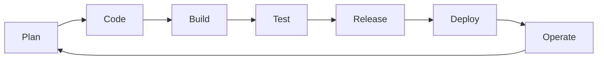
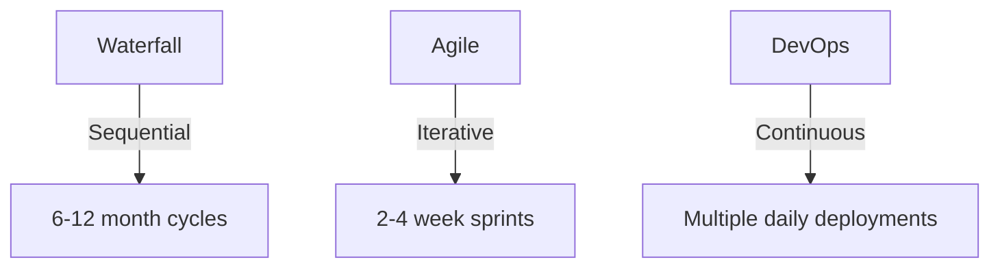
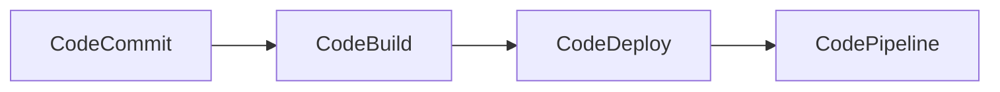

# AWS re/Start - DevOps and Continuous Integration

Below is an enhanced markdown document covering all content from the DevOps and Continuous Integration module, with detailed explanations, practical examples, and additional insights.

---

## Module Overview
**Title**: DevOps and Continuous Integration  
**Subtitle**: Python Fundamentals  
**Presenter**: [Name]  
**Date**: [Date]  
**Copyright**: © 2020, Amazon Web Services, Inc. or its affiliates. All rights reserved.

---

## Learning Objectives
By the end of this module, you will learn how to:
1. Define DevOps and its core principles
2. Identify goals and challenges of DevOps
3. Describe DevOps culture and organizational impact
4. Explain CI/CD pipelines and automation
5. Recognize key DevOps tools and practices

---

## Introduction to DevOps

### Definition
DevOps is a **cultural and technical movement** that:
- Bridges development (Dev) and operations (Ops)
- Emphasizes **automation** across the software lifecycle
- Implements **continuous feedback loops**

**Lifecycle Stages**:


### Core Principles (CALMS Framework)
| Principle | Description | Example |
|-----------|-------------|---------|
| **Culture** | Shared responsibility | Devs and Ops in same team |
| **Automation** | Eliminate manual work | CI/CD pipelines |
| **Lean** | Reduce waste | Remove unused resources |
| **Measurement** | Quantitative feedback | Deployment frequency metrics |
| **Sharing** | Collective knowledge | Internal wikis, post-mortems |

---

## DevOps Culture

### Key Cultural Aspects
1. **System Thinking**  
   - Focus on entire workflow (not silos)
   - Example: Monitor both app performance AND deployment success

2. **Feedback Loops**  
   - Fast failure detection → Quick remediation
   - Tools: Monitoring (Prometheus), Logging (ELK stack)

3. **Learning Culture**  
   - Blameless post-mortems  
   - Example: Document outages as learning opportunities

### Organizational Culture Types
| Type | Characteristics | DevOps Fit |
|------|----------------|-----------|
| Collaborative | Team-oriented | Excellent |
| Adhocratic | Innovative | Good for experimentation |
| Market | Results-driven | Needs balance |
| Hierarchical | Process-heavy | Challenging |

---

## Waterfall vs Agile vs DevOps

### Comparison


**Transition Example**:
```python
# Waterfall - Single release
def deploy_waterfall():
    analyze()
    design()
    code_for_6_months()
    test_for_2_months()
    deploy()

# DevOps - Continuous
def deploy_devops():
    while True:
        code_in_small_chunks()
        auto_test()
        if tests_pass:
            deploy_to_prod()
```

---

## CI/CD Pipeline

### Continuous Integration (CI)
**Purpose**: Merge code changes frequently with automated verification

**Workflow**:
1. Developer pushes code → Triggers build
2. Run unit/integration tests
3. Static code analysis (SonarQube)
4. Generate artifacts if successful

**Example Tools**:
- Jenkins
- GitHub Actions
- AWS CodeBuild

### Continuous Delivery (CD)
**Purpose**: Always have deployable code

**Key Practices**:
- Blue/green deployments
- Canary releases
- Infrastructure as Code (IaC)

**AWS Toolchain**:


---

## Automation in DevOps

### Types of Automation
| Type | Purpose | Tools |
|------|---------|-------|
| Build | Compile & package | Maven, Gradle |
| Test | Validate functionality | Selenium, pytest |
| Deployment | Release to environments | Ansible, Terraform |
| Monitoring | Observe systems | CloudWatch, Datadog |

### Automation Risks
1. **Over-Automation**  
   - Problem: Automating creative tasks (e.g., architecture design)  
   - Solution: Reserve for repetitive tasks (testing, deployments)

2. **Under-Automation**  
   - Problem: Manual processes slow releases  
   - Solution: Automate build/test/deploy phases

3. **Bad Automation**  
   - Problem: Flaky tests or broken pipelines  
   - Solution: Regular pipeline maintenance

**Example Anti-Pattern**:
```python
# Bad: Automated but unreliable
def auto_deploy():
    if random() > 0.5:  # 50% failure rate
        raise Exception("Flaky deployment")
        
# Good: Robust automation
def reliable_deploy():
    run_smoke_tests()
    validate_infra()
    execute_rollback_plan_if_needed()
```

---

## Practical Implementation

### Sample CI Pipeline (GitHub Actions)
```yaml
name: Python CI

on: [push]

jobs:
  build:
    runs-on: ubuntu-latest
    steps:
    - uses: actions/checkout@v2
    - name: Set up Python
      uses: actions/setup-python@v2
    - name: Install dependencies
      run: pip install -r requirements.txt
    - name: Lint with pylint
      run: pylint src/
    - name: Test with pytest
      run: pytest tests/
```

### Infrastructure as Code Example (Terraform)
```hcl
resource "aws_instance" "web" {
  ami           = "ami-123456"
  instance_type = "t2.micro"

  tags = {
    Name = "DevOpsDemo"
  }
}
```

---

## Checkpoint Questions & Answers

1. **What areas does DevOps bridge?**  
   DevOps bridges software development, IT operations, and quality assurance (QA).

2. **Name three automation risks**  
   - Over-automation (reducing creativity)  
   - Under-automation (missing efficiency gains)  
   - Bad automation (implementing flawed processes)

3. **What's the difference between CI and CD?**  
   - CI focuses on integrating code changes frequently with automated testing  
   - CD extends CI to ensure the codebase is always in a deployable state  

---

## Key Takeaways

1. **Cultural Transformation**  
   - DevOps requires breaking down silos between Dev and Ops  
   - Metrics should measure system performance, not individual blame  

2. **Automation Balance**  
   ```mermaid
   pie
   title Automation Focus Areas
   "Build/Test" : 45
   "Deployment" : 35
   "Monitoring" : 20
   ```

3. **CI/CD Benefits**  
   - Faster time-to-market  
   - Higher quality software  
   - More reliable releases  

4. **AWS DevOps Tools**  
   | Service | Purpose |
   |---------|---------|
   | CodeCommit | Git repository |
   | CodeBuild | Build service |
   | CodeDeploy | Deployment automation |
   | CodePipeline | End-to-end CI/CD |

---

This enhanced guide combines original content with:
- Visual workflow diagrams
- Practical code examples
- Real-world tool references
- Risk mitigation strategies
- AWS-specific implementations

The additional explanations and examples provide concrete context for applying DevOps principles in Python projects and cloud environments.